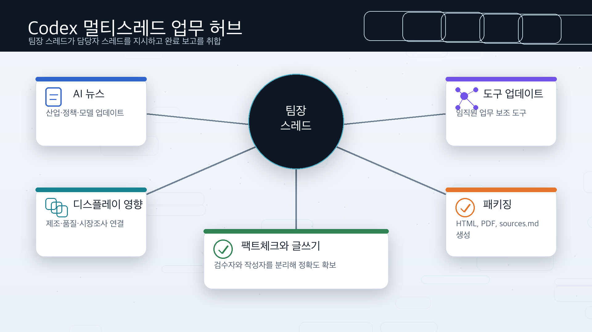
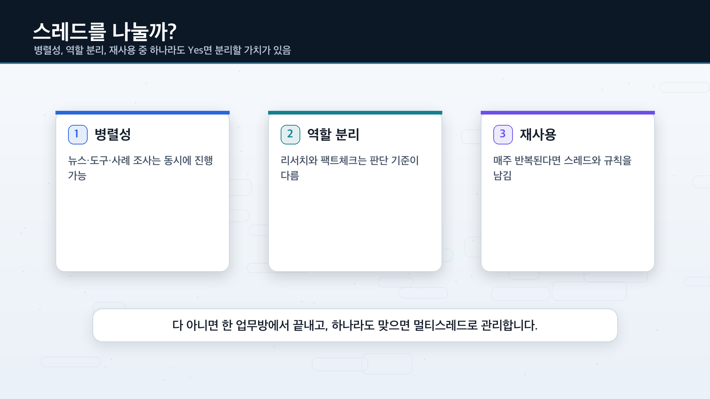
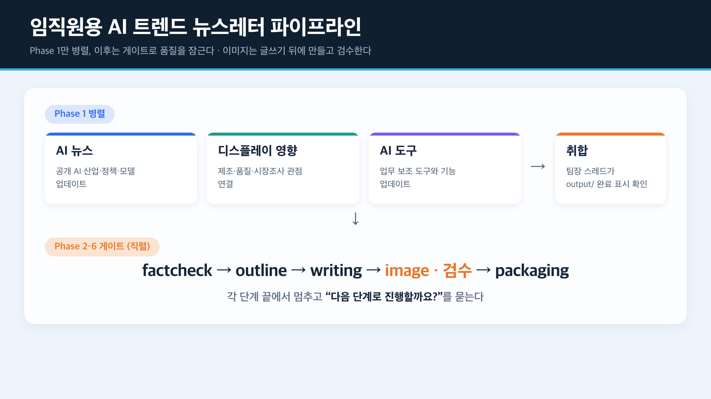
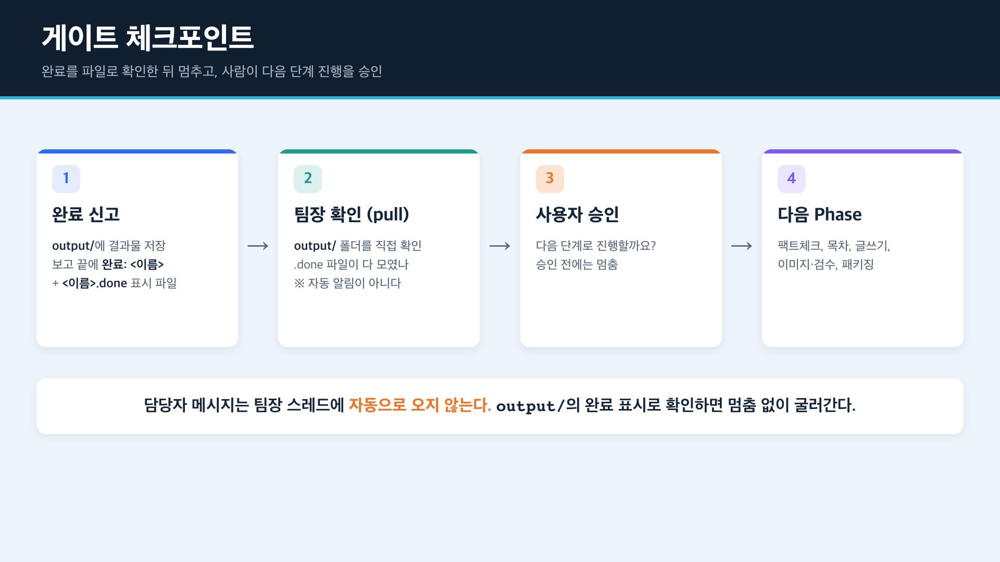

# 코덱스로 멀티스레드 활용하기 — 삼성디스플레이 임직원용 AI 트렌드 뉴스레터 운영법


코덱스(Codex)나 ChatGPT 채팅 하나에 리서치·글쓰기·검토를 다 몰아넣다 보면, 대화가 길어질수록 느려지고 맥락이 섞입니다. 이 가이드는 코덱스를 **코딩 도구가 아니라 멀티스레드 업무 허브**처럼 쓰는 법을 정리합니다. 한 방에 다 시키는 대신 업무를 **담당자 스레드**로 나누고, 팀장 스레드가 **지시 → 동시에 작업 → 완료 보고 취합 → 후속 작업 요청**으로 굴립니다.

원본의 “코덱스로 AI 사무실 차리기” 흐름은 유지하되, 제목과 예시를 삼성디스플레이 교육에 맞춰 바꿨습니다. 실습 산출물은 공개 자료 기반 **삼성디스플레이 임직원용 AI 트렌드 뉴스레터** 1회분입니다.

> 주의: 화면·메뉴·기능(스레드 자동 생성, 서브에이전트, 백그라운드 세션 등)과 산출물 패키징 방식(HTML/PDF 등)은 플랜과 버전에 따라 다를 수 있습니다. 최신 버전에서 직접 확인하며 따라와 주세요.

| 이 가이드가 해결하는 것 | 내용 |
|---|---|
| 어떤 문제를 푸나 | 한 채팅에 다 시켜서 느리고 맥락이 섞이는 문제 |
| 어떻게 푸나 | 업무를 담당자 스레드로 나누고 팀장 스레드가 총괄 |
| 누구를 위한 가이드인가 | 삼성디스플레이 임직원 중 리서치, 보고, 기획, 교육자료 제작을 반복하는 사람 |
| 무엇을 만들어 보나 | 공개 자료 기반 AI 트렌드 뉴스레터 1회분 |
| 코딩이 필요한가 | 아니요. 새 업무방을 만들고 한국어 지시문을 붙여넣는 것부터 시작 |

---

## 목차

- [1. 개념 — 코덱스를 멀티스레드 업무 허브로 보기](#1-개념--코덱스를-멀티스레드-업무-허브로-보기)
- [2. 한 업무방 vs 서브에이전트 vs 팀장 스레드](#2-한-업무방-vs-서브에이전트-vs-팀장-스레드)
- [3. 스레드를 나눌까? 판단 기준 3가지](#3-스레드를-나눌까-판단-기준-3가지)
- [4. 사전 준비](#4-사전-준비)
- [5. 실습 — 임직원용 AI 트렌드 뉴스레터 한 편 만들기](#5-실습--임직원용-ai-트렌드-뉴스레터-한-편-만들기)
- [6. 매주 반복이면 — AGENTS.md로 저장](#6-매주-반복이면--agentsmd로-저장)
- [7. 한계 / 주의사항](#7-한계--주의사항)
- [8. 참고 자료](#8-참고-자료)

---

## 1. 개념 — 코덱스를 멀티스레드 업무 허브로 보기

핵심은 딱 하나, **층을 나눠서 일을 시키는 것**입니다. 맨 위에 팀장 스레드(총괄 데스크)가 있고, 그 아래 실제로 일하는 **담당자 스레드**들이 있습니다. 팀장 스레드는 직접 리서치하거나 글을 쓰지 않고, 지시·보고 취합·진행 결정만 합니다.



용어가 낯설어도 업무 조직 말로 바꾸면 쉽습니다.

| 코덱스 용어 | 업무 비유 | 한 줄 설명 |
|---|---|---|
| thread(스레드) | 팀장 스레드 / 담당자 스레드 | 각 방은 자기 대화 맥락을 따로 유지하며 맡은 일을 처리 |
| 병렬 작업 | 담당자 여러 명 동시 근무 | 서로 안 기다려도 되는 일은 같이 시작 |
| 서브에이전트 | 스레드 안의 보조 작업자 | 한 스레드의 일이 무거우면 더 작게 쪼개 처리 |
| 백그라운드 세션 | 오래 걸리는 일 따로 돌리기 | 시간이 걸리는 리서치나 렌더링을 뒤에서 진행 |
| 완료 보고 취합 | 보고 모으기 | 업무가 끝난 내용을 모아 다음 결정을 함 |

> 전체 흐름은 한 바퀴입니다: **지시 → 병렬 작업 → 보고 취합 → 후속 작업 요청.**

> **완료는 저절로 알려지지 않습니다.** 코덱스에서 한 담당자 스레드의 메시지는 팀장 스레드로 자동 전달되지 않습니다. 팀장 스레드가 가만히 있는다고 "○○ 완료" 보고가 떠오르지 않습니다. 그래서 담당자는 결과물을 `output/` 폴더에 저장하고, 보고 끝에 `완료: <스레드이름>` 한 줄과 빈 표시 파일 `output/<스레드이름>.done`을 남깁니다. 그리고 **운영자(여러분)가 그 완료를 팀장 스레드에 전해 주거나, 팀장 스레드가 게이트에서 `output/` 폴더를 직접 확인**해야 다음 단계로 넘어갑니다. 이 "완료를 어떻게 아는가"가 멀티스레드에서 가장 자주 막히는 지점입니다.

---

## 2. 한 업무방 vs 서브에이전트 vs 팀장 스레드

비슷해 보이지만 결이 다릅니다. 짧은 일은 한 방으로 충분하지만, 길어지고 역할이 갈리는 일은 팀장 스레드 구조가 안정적입니다.

| 구분 | (A) 한 업무방에 다 넣기 | (B) 서브에이전트만 병렬 | (C) 팀장 스레드 + 담당자 스레드 |
|---|---|---|---|
| 비유 | 한 사람이 한 책상에서 전부 | 한 작업을 잘게 쪼개 동시에 뿌리고 끝 | 팀장이 담당자 스레드를 지시·취합·후속 |
| 맥락 | 길어지면 다 섞임 | 각자 격리되나 합치는 건 결국 나 | 작업은 스레드별 격리 + 총괄은 팀장 스레드 한 곳 |
| 지속성 | 한 스레드에 의존 | 보통 한 번 쓰고 끝 | 스레드가 남아 이어가고 고정·보관 |
| 적합 상황 | 짧은 단일 작업 | 단발 병렬 처리 | 반복되는 뉴스레터, 보고서, 교육자료, 조사 업무 |

> (C)의 핵심은 **격리와 한눈에 보기**를 동시에 얻는다는 점입니다.

---

## 3. 스레드를 나눌까? 판단 기준 3가지

무조건 스레드를 여러 개 켜는 게 잘하는 게 아닙니다. **짧고 단순한 일은 한 업무방이 제일 빠릅니다.** 나누는 기준은 “스레드 수”가 아니라 “맥락을 나눌 가치가 있나”입니다.



| 기준 | 질문 | 나누면 좋은 이유 |
|---|---|---|
| 1. 병렬성 | 동시에 돌릴 수 있나? | 뉴스, 도구, 사례 조사는 서로 기다릴 필요가 없음 |
| 2. 역할 분리 | 역할·판단 기준이 다른가? | 초안 작성과 팩트체크는 기준이 다름 |
| 3. 재사용 | 나중에 다시 이어갈 일인가? | 매주 뉴스레터라면 스레드와 규칙을 남기는 편이 좋음 |

> 셋 중 하나라도 Yes면 스레드를 나눌 가치가 있습니다. 다 아니면 그냥 한 업무방에서 하세요.

---

## 4. 사전 준비

| 준비물 | 내용 |
|---|---|
| 코덱스 앱 | 데스크톱 앱 기준. 공식 안내: https://developers.openai.com/codex/app |
| 플랜·버전 확인 | 스레드·백그라운드·서브에이전트 동선은 플랜/버전마다 다를 수 있음 |
| 코딩 지식 | 불필요. 새 업무방을 만들고 한국어 지시문을 붙여넣는 것부터 |
| 가장 중요한 것 | **역할을 먼저 정하는 것** — 이 스레드는 팀장, 이 스레드는 리서치 |
| 자료 범위 | 공개 자료만 사용. 내부자료, 고객 정보, 미공개 기술, 수율, 원가, 로드맵 제외 |

> 외부 발송·결재·권한 변경 같은 위험 작업은 이 가이드의 데모 범위 밖입니다. 자동화하더라도 사람이 확인하는 단계를 꼭 두세요.

---

## 5. 실습 — 임직원용 AI 트렌드 뉴스레터 한 편 만들기

뉴스레터로 예를 드는 이유는 콘텐츠 업무가 **여러 단계를 거치는 일**이기 때문입니다. 자료조사 → 사실확인 → 목차 → 글 → 이미지 → 패키징의 구조는 기술 동향 브리핑, 주간 리포트, 제안서에도 그대로 적용됩니다.



### 5-1. 팀장 스레드 만들고 메인 지시문 한 번에 넣기

새 업무방을 하나 열어 **팀장 스레드**로 정합니다. 짧은 역할 문장만 주지 말고, 프로젝트 전체를 어떻게 굴릴지 적은 **메인 지시문**을 한 번에 넣습니다.

```text
너는 이 프로젝트의 '팀장 스레드'(총괄 데스크)야.
직접 리서치하거나 글을 쓰지 마. 일은 담당자 스레드에 나눠 맡기고, 너는 지시·보고 취합·다음 단계 진행 결정만 한다.

[프로젝트]
- 폴더: sdc-ai-trend-newsletter
- 결과물: "삼성디스플레이 임직원용 AI 트렌드 뉴스레터" 1회분 (HTML, 가능하면 PDF도)
- 독자: 제조기술, 품질, 기획, 구매, 마케팅, 경영지원 등 삼성디스플레이 임직원
- 언어: 전부 한국어
- 자료 범위: 공개 자료만 사용. 내부자료, 고객 정보, 미공개 기술, 수율, 원가, 로드맵은 사용하지 않음

[담당자 스레드 구성 — 가능하면 네가 직접 방을 만들고 아래 이름을 붙여줘]
1) research-ai-news        : 이번 주 AI 산업·정책·모델 업데이트
2) research-display-impact : 디스플레이 제조/품질/공급망/시장조사 업무에 영향을 줄 AI 사례
3) research-tools          : 임직원이 업무 보조로 검토할 만한 AI 도구·기능 업데이트
4) factcheck               : 위 리서치 주장들의 사실 검증 (의심하는 검수자)
5) outline                 : 뉴스레터 목차·섹션 구조
6) writing                 : 확정된 목차로 본문 작성
7) image                   : 확정된 본문에 근거한 섹션별·헤더 이미지 생성
8) image-review            : 생성된 이미지가 본문·메시지에 맞는지 판정하는 독립 검수자(작성자와 다른 스레드)
9) packaging               : 최종 HTML 생성 (DESIGN.md 반영)

[진행 순서와 게이트 — 이게 제일 중요해]
- Phase 1 (병렬): research-ai-news / research-display-impact / research-tools 세 스레드를 동시에 시작해. 서로 기다리지 마.
- Phase 2 (게이트): Phase 1 세 스레드의 완료 표시(output/<이름>.done)가 다 생긴 뒤에만 factcheck 시작.
- Phase 3 (게이트): factcheck 통과한 자료로만 outline 시작.
- Phase 4 (게이트): outline이 확정된 뒤 writing 시작.
- Phase 5 (게이트): writing 본문이 확정된 뒤에 image 시작. 본문이 없는 상태에서 이미지를 먼저 만들지 마(내용에 근거하지 않은 장식 이미지가 나온다). image가 나오면 image-review가 본문과 대조해 적합성을 판정하고, 부적합하면 다시 만들거나 "이미지 없음"으로 둔다.
- Phase 6 (게이트): writing 본문과 검수를 통과한 image가 둘 다 나온 뒤에만 packaging 시작.

[완료 신고 규칙 — 핵심]
- 각 스레드는 '결론 먼저, 근거 나중' 순서로, 핵심 3줄 + 다음 단계 1줄로 보고.
- 작업물은 md, png, pdf, html 등 적합한 형태로 생성하여 output/에 저장.
- 끝나면 ① 결과물을 output/에 저장하고 ② 보고 맨 끝 줄에 `완료: <스레드이름>`을 적고 ③ 빈 표시 파일 output/<스레드이름>.done 을 만든다. 진행 중간 상태는 보고하지 마.
- 단, 막혀서 더 못 갈 때, 사실 판단이 필요할 때, 사용자 확인이 필요할 때만 예외로 바로 알려줘.

[팀장 스레드의 완료 확인 — 중요]
- 코덱스에서 담당자 스레드의 메시지는 너(팀장 스레드)에게 자동으로 전달되지 않는다. "완료 보고가 알아서 올라오겠지"라고 기다리지 마.
- 한 Phase를 넘기기 전에, 너는 output/ 폴더를 직접 다시 확인해서 그 Phase 담당자들의 output/<이름>.done 파일이 모두 생겼는지 본다. 운영자가 "○○ 완료"라고 전해 주면 그것도 완료 신호로 받는다.
- 진행 중에 담당자 스레드를 수시로 들여다보며 "다 됐어?"라고 보채지 마. 대신 게이트에서 output/의 완료 표시 파일로 확인하고, 다 모이면 Phase 단위로 묶어 요약해.
- 표시 파일이 없는데 오래 멈춰 있으면, 운영자에게 "○○ 스레드가 완료됐는지 확인해 달라"고 요청한다.

[이미지 규칙]
- image 스레드는 확정된 본문을 읽고, 이미지 한 장마다 (대상 섹션 / 그 이미지가 전달할 핵심 메시지 하나 / 넣지 말 것: 지어낸 수치·차트·로고·미검증 텍스트)를 정해 만든다.
- 본문에 없는 내용을 이미지로 지어내지 말고, 장식용 일반 이미지도 만들지 마. 의미 있는 이미지를 만들 수 없는 섹션은 "이미지 없음"으로 둔다.
- image-review 스레드(작성자와 다른 스레드)가 각 이미지를 본문과 대조해 관련성·정확성·정보성을 판정하고, 통과한 것만 packaging에 넘긴다.

[멈춤과 확인]
- 한 Phase가 끝나면 절대 바로 다음 Phase로 넘어가지 마.
- 매 Phase 종료 시: (1) 그 Phase 결과를 요약 보고하고, (2) "다음 단계로 진행할까요?"라고 나에게 물어보고, (3) 내가 "진행"이라고 답하기 전에는 멈춰 있어.
- 사실이 불확실하면 지어내지 말고 '확인 필요'로 표시해.

준비됐으면 작업을 바로 시작하지 말고, 먼저 Phase 1 계획만 보여준 뒤 내 "진행" 신호를 기다려.
```

> 이 한 덩어리 안에 스레드 구성·이름, 무엇을 동시에 하고 무엇을 기다릴지, 언제 보고할지, 매 단계 멈추고 확인할지가 다 들어 있습니다.

### 5-2. Phase 1 — 리서치 스레드 3개를 동시에

자료 조사 세 갈래는 서로 안 기다려도 되니 동시에 돌립니다. 여기가 오늘 가장 먼저 체감할 수 있는 병렬 구간입니다.

| 담당자 스레드 | 맡는 일 |
|---|---|
| `research-ai-news` | 이번 주 AI 산업·정책·모델 업데이트 |
| `research-display-impact` | 디스플레이 업무에 영향을 줄 AI 사례 |
| `research-tools` | 임직원이 검토할 만한 AI 도구·기능 업데이트 |

각 리서치 스레드에 붙여넣을 지시문 예시는 다음과 같습니다.

```text
너는 삼성디스플레이 임직원용 AI 트렌드 뉴스레터의 리서치 담당자야.
공개 자료만 사용해서 이번 주 중요한 항목 5개를 찾아줘.

성공 기준:
- 각 항목은 제목, 한 줄 요약, 임직원 업무 영향, 출처 링크를 포함
- 내부자료, 고객 정보, 미공개 기술, 수율, 원가, 로드맵은 사용하지 않음
- 확인이 약한 내용은 '확인 필요'로 표시

출력:
- 핵심 3줄 요약
- 후보 항목 표
- factcheck 스레드가 확인해야 할 쟁점
```

### 5-3. 게이트 — 완료 보고를 받은 뒤에만 다음으로

리서치 다음부터는 앞 단계가 끝나야 다음이 시작됩니다. 이 기다려야 하는 지점이 **게이트**입니다.



| Phase | 단계 | 시작 조건(게이트) | 병렬? |
|---|---|---|---|
| 1 | 리서치 (AI뉴스·디스플레이 영향·도구) | 바로 시작 | 병렬 |
| 2 | 팩트체크 | Phase 1 세 스레드 완료 표시(output/<이름>.done) 후 | - |
| 3 | 구성(목차) | 팩트체크 통과 자료로만 | - |
| 4 | 글쓰기 | 목차 확정 후 | - |
| 5 | 이미지 + 적합성 검수 | **글쓰기 본문 확정 후** | - |
| 6 | 패키징(HTML·PDF) | 글·(검수 통과)이미지 둘 다 나온 뒤 | - |

> 그냥 스레드를 여러 개 여는 것과 결정적으로 다른 점은, 단계마다 팀장 스레드가 **완료를 확인한 뒤에만 멈추고, 요약해서 "넘어갈까요?"를 묻는다**는 점입니다.

> 단, 그 "완료"는 저절로 팀장 스레드에 도착하지 않습니다. 담당자가 `output/`에 결과물과 `완료: <이름>`·표시 파일을 남기면, **팀장 스레드가 `output/`를 직접 확인하거나 운영자가 완료를 전달해 줄 때** 비로소 게이트가 열립니다. 이미지도 글이 확정된 뒤 만들고, 다른 스레드가 본문과 맞는지 검수한 것만 싣습니다.

### 후속 작업 요청 예시

```text
초안 보니까 디스플레이 제조 현장과 연결되는 부분이 약해.
research-display-impact 스레드에서 공개 사례 기반으로 제조/품질/설비보전 관점의 적용 아이디어 3개를 더 보강해줘.
보강되면 factcheck 스레드가 출처와 표현 수위를 확인하고, writing 스레드 본문 2번 섹션에도 반영해줘.
팀장 스레드는 완료 보고를 취합해서 다음 단계 진행 여부를 물어봐줘.
```

---

## 6. 매주 반복이면 — AGENTS.md로 저장

매주 같은 뉴스레터를 만든다면, 위 긴 지시문을 매번 붙여넣는 대신 프로젝트 폴더 루트에 `AGENTS.md`로 저장해두는 관례가 있습니다. 아래는 교육 설명용 견본입니다.

```markdown
# AGENTS.md — `sdc-ai-trend-newsletter` 프로젝트

> 이 폴더에서 작업을 시작하면 아래 규칙을 따른다.
> 한 줄 요약: 팀장 스레드가 담당자 스레드들을 지시하고, 진행 중엔 수시로 감시하지 않으며, 완료 보고가 올라왔을 때만 취합하고 멈춰 사용자 확인을 받는다.

## 1. 프로젝트 목표
- 삼성디스플레이 임직원용 AI 트렌드 뉴스레터 1회분을 제작한다.
- 독자는 제조기술, 품질, 기획, 구매, 마케팅, 경영지원 등 다양한 직무의 임직원이다.
- 모든 산출물과 대화는 한국어로 한다.
- 공개 자료만 사용한다.

## 2. 최종 산출물
- `newsletter/YYYY-MM-DD-sdc-ai-trend-newsletter.html` — 필수
- `newsletter/YYYY-MM-DD-sdc-ai-trend-newsletter.pdf` — 환경에서 PDF 변환이 가능할 때만
- `newsletter/YYYY-MM-DD-sources.md` — 출처 목록(링크 + 한 줄 메모)

## 3. 역할 구조
- 팀장 스레드: 직접 리서치·글쓰기를 하지 않는다. 지시, 완료 보고 취합, 다음 단계 진행 결정만 한다.
- 담당자 스레드:
  | 스레드 이름 | 역할 |
  |---|---|
  | `research-ai-news` | 이번 주 AI 산업·정책·모델 업데이트 |
  | `research-display-impact` | 디스플레이 업무에 영향을 줄 AI 사례 |
  | `research-tools` | 임직원이 검토할 만한 AI 도구·기능 업데이트 |
  | `factcheck` | 리서치 사실 검증 |
  | `outline` | 목차·섹션 구조 설계 |
  | `writing` | 본문 작성 |
  | `image` | 확정 본문에 근거한 섹션별·헤더 이미지 생성 |
  | `image-review` | 생성 이미지의 본문 적합성·정확성 검수(독립) |
  | `packaging` | HTML(+가능하면 PDF) 패키징 |

## 4. 페이즈 게이트
1. Phase 1 (병렬): `research-ai-news` / `research-display-impact` / `research-tools` 동시 시작.
2. Phase 2 (게이트): Phase 1 세 스레드 완료 표시(`output/<이름>.done`) 후 `factcheck`.
3. Phase 3 (게이트): `factcheck`를 통과한 자료로만 `outline`.
4. Phase 4 (게이트): `outline` 확정 후 `writing`.
5. Phase 5 (게이트): `writing` **본문 확정 후** `image` 생성, 이어서 `image-review`가 본문과 대조해 적합성 판정. 부적합하면 재생성 또는 "이미지 없음".
6. Phase 6 (게이트): `writing` 본문과 검수를 통과한 `image`가 둘 다 나온 뒤 `packaging`.

## 5. 멈춤·확인 규칙
- 한 Phase가 끝나면 다음 Phase로 자동으로 넘어가지 않는다.
- **담당자 완료는 자동 전달되지 않는다.** 각 담당자는 결과물을 `output/`(또는 `newsletter/`)에 저장하고, 보고 끝에 `완료: <스레드>`와 표시 파일 `output/<스레드>.done`을 남긴다. 팀장 스레드는 게이트에서 그 파일들을 직접 확인하거나 운영자의 완료 전달을 신호로 삼는다(진행 중 감시는 하지 않는다).
- 매 Phase 종료 시 완료 취합, "다음 단계로 진행할까요?" 질문, 사용자 승인 전 대기.
- 작업을 시작하기 전 그 Phase 계획만 보여주고 사용자 신호를 기다린다.

## 6. 보고 형식
- 모든 보고는 결론 먼저, 근거 나중.
- 각 스레드 보고: 핵심 3줄 + 다음 단계 1줄.
- 완료는 채팅이 아니라 `output/`의 산출물 + `완료: <스레드>` 표시·`.done` 파일로 신고한다.
- 진행 중간 상태는 보고하지 않는다. 단, 막힘/사실 판단/사용자 확인 필요 시 예외.

## 7. 품질·팩트체크 규칙
- 확인되지 않은 수치·주장은 지어내지 않는다.
- `factcheck`를 통과하지 못한 항목은 본문에서 빼거나 표현을 약하게 한다.
- 작성자와 검수자는 다른 스레드로 분리한다.
- 이미지는 확정 본문에 근거해 만들고, 작성자와 다른 스레드(`image-review`)가 본문 적합성·정확성을 검수한다. 의미 없는 장식 이미지는 넣지 않으며, 적합한 이미지가 없으면 "이미지 없음"으로 둔다.
- 과장 광고 톤 금지. 임직원 교육용으로 담백하고 실무적으로 쓴다.
- 어려운 용어는 본문에서 한 번씩 풀어서 설명한다.

## 8. 보안 및 자료 규칙
- 회사 내부자료, 고객 정보, 미공개 기술, 수율, 원가, 로드맵은 사용하지 않는다.
- 외부 발송, 결재, 권한 변경을 임의로 하지 않는다.
- 출처 링크와 확인일을 남긴다.

## 9. 파일 이름 규칙
- 날짜는 `YYYY-MM-DD`(제작일 기준).
- 모든 결과물은 `newsletter/` 폴더 안에 저장한다.
- 산출물 이름은 `sdc-ai-trend-newsletter.*`, 출처는 `sources.md`로 통일한다.
```

---

## 7. 한계 / 주의사항

| 한계 / 함정 | 우회 / 완화 |
|---|---|
| 버튼 한 번에 전부 자동이 아님 | 사람이 팀장 스레드에서 지시하고 단계마다 확인하는 구조로 이해 |
| 팀장 스레드가 담당자 완료를 자동으로 모름 | 담당자는 `output/`에 결과물과 `완료`·`.done` 표시를 남기고, 팀장이 게이트에서 직접 확인하거나 운영자가 전달 |
| 이미지가 본문과 따로 놀거나 의미 없음 | 본문 확정 후 생성 + 다른 스레드가 적합성 검수, 적합한 게 없으면 "이미지 없음" |
| 팀장 스레드가 방을 자동 생성 못 할 수 있음 | 스레드를 직접 만들고 지시문을 붙여넣기 |
| 화면·메뉴·기능이 플랜/버전마다 다름 | 최신 버전에서 직접 확인하며 진행 |
| 스레드를 너무 많이 켜면 관리 피로 | “맥락 나눌 가치” 기준 3가지로 판단 |
| 자동 결과를 그대로 믿으면 위험 | 게이트에서 사람이 검토, factcheck 스레드로 사실 검증 |
| 내부자료를 넣고 싶어짐 | 교육에서는 공개 자료와 가상 시나리오만 사용 |
| 외부 발송·민감정보 | 데모 범위 밖. 발송은 항상 사람 확인 단계 |

---

## 8. 참고 자료

| 자료 | 링크 |
|---|---|
| Codex 앱 공식 문서 | https://developers.openai.com/codex/app |
| Codex 앱 기능 문서 | https://developers.openai.com/codex/app/features |
| Codex 업데이트(체인지로그) | https://developers.openai.com/codex/changelog |
| AGENTS.md 공식 문서 | https://developers.openai.com/codex/guides/agents-md |

> 이 교안은 원본 영상 설명 자료의 운영 흐름을 교육 목적에 맞게 재구성한 것입니다. 코덱스의 기능·화면은 업데이트로 바뀔 수 있으니, 공식 문서를 함께 확인해 주세요.

