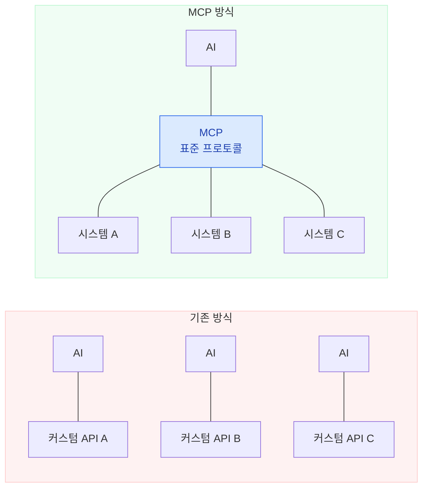
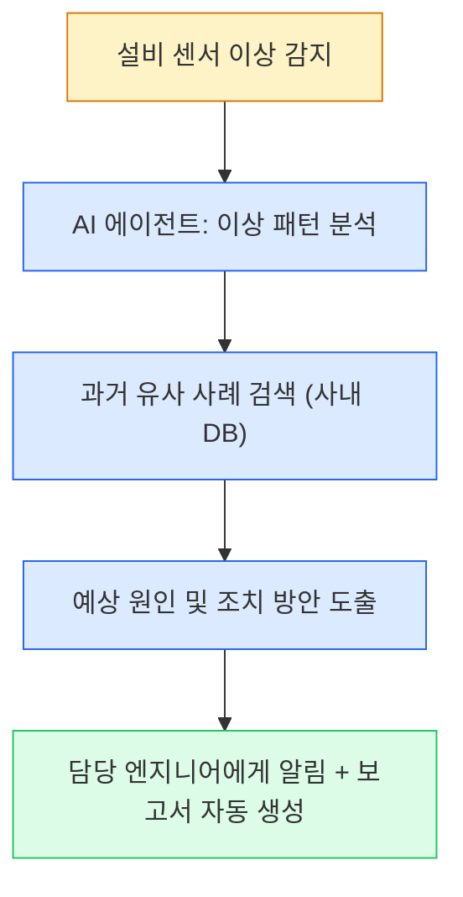
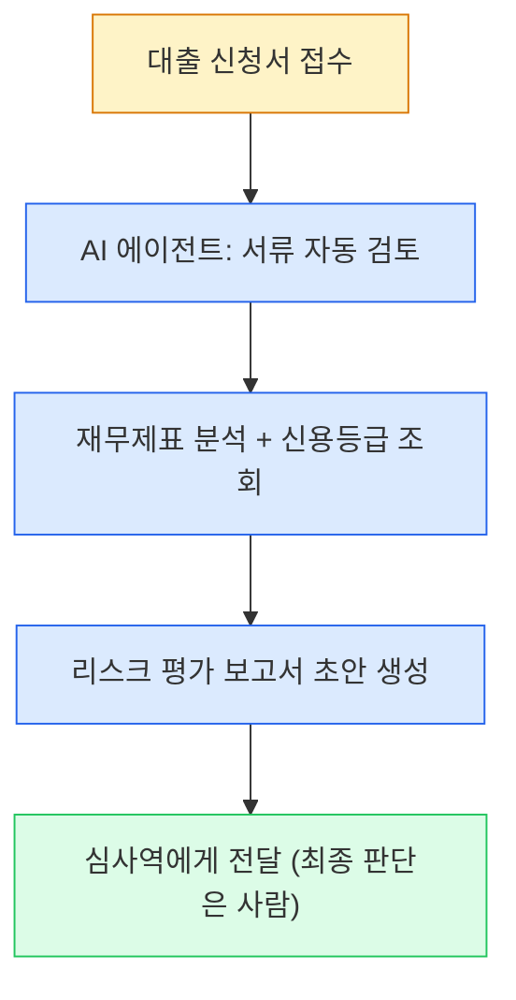
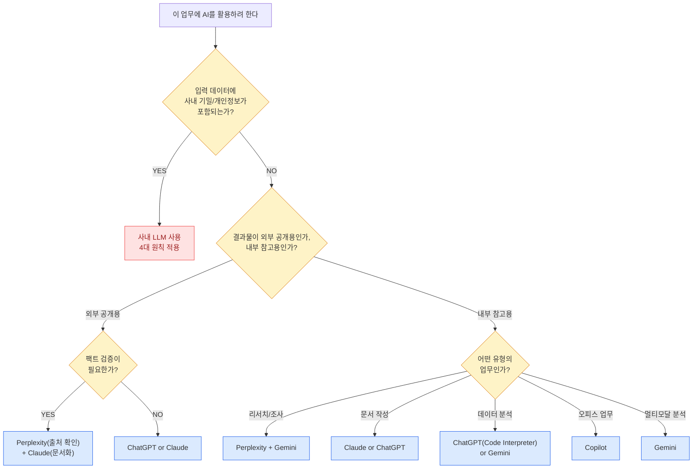

# 모듈 2: AI/LLM 종류별 특성과 활용법

> **대상**: 제조업 및 금융권 직장인
> **학습 시간**: 약 40분
> **핵심 키워드**: LLM 비교, 모델별 최적화, 사내 LLM, AI 에이전트, MCP, 보안 판단

---

## 학습 목표
1. 주요 AI/LLM(ChatGPT, Claude, Gemini, Perplexity, Copilot, 사내 LLM)의 특성과 강점을 구분할 수 있다
2. 업무 목적에 맞는 AI 모델을 선택하고, 모델별 프롬프트 전략을 조정할 수 있다
3. 사내 LLM의 활용 원칙과 보안 판단 기준을 이해하고 적용할 수 있다
4. AI 에이전트와 MCP의 개념을 이해하고, 자동화 워크플로의 가능성을 인식할 수 있다

---

## 1. 주요 AI/LLM 비교표

2025~2026년 현재, 업무에서 활용할 수 있는 주요 AI는 크게 6가지로 분류됩니다. 각각의 특성을 이해하고 **업무 목적에 맞는 모델을 선택하는 것**이 핵심입니다.

### 종합 비교표

| 항목 | ChatGPT (OpenAI) | Claude (Anthropic) | Gemini (Google) | Perplexity | Copilot (Microsoft) | 사내 LLM |
|------|-----------------|-------------------|----------------|------------|--------------------|---------| 
| **최신 모델** | GPT-4o, o3, GPT-5 시리즈 | Claude Sonnet 4, Opus 4 | Gemini 2.5 Pro/Flash | Sonar (Llama 기반) | GPT-4o 기반 | 기업별 상이 |
| **컨텍스트 윈도우** | 128K 토큰 | 200K 토큰 | **1M 토큰** (최대) | 모델별 상이 | 128K 토큰 | 보통 8K~32K |
| **최대 강점** | 폭넓은 기능, 플러그인 생태계 | 긴 문서 분석, 정밀한 지시 준수 | 멀티모달, 대용량 컨텍스트 | 실시간 검색+출처 제공 | M365 통합 | 보안, 사내 데이터 |
| **멀티모달** | 텍스트, 이미지, 음성, 코드 | 텍스트, 이미지, 코드 | 텍스트, 이미지, 음성, **영상** | 텍스트 중심 | 텍스트, 이미지 | 보통 텍스트 중심 |
| **인터넷 검색** | 가능 (웹 브라우징) | 가능 (웹 검색) | 가능 (Google 검색 연동) | **핵심 기능** | 가능 (Bing 연동) | 불가 (폐쇄망) |
| **보안 수준** | 외부 서버 | 외부 서버 | 외부 서버 | 외부 서버 | 외부(Enterprise는 강화) | **사내 서버** |
| **가격대** | 무료~$200/월 | 무료~$100/월 | 무료~$20/월 | 무료~$20/월 | M365 구독 포함 | 사내 운영비 |

> 💡 팁: "어떤 AI가 최고인가"보다 **"이 업무에는 어떤 AI가 적합한가"**를 먼저 생각하세요. 만능 AI는 없습니다.

---

## 2. 모델별 강점과 약점

### ChatGPT — 만능 도구의 대명사

**강점:**
- **가장 폭넓은 기능**: DALL-E(이미지 생성), Code Interpreter(코드 실행), 플러그인, GPTs(맞춤 AI), 음성 대화 등 올인원 플랫폼
- **대화형 반복 개선**: "이 부분 좀 더 자세히", "톤을 바꿔서" 같은 대화를 주고받으며 점진적으로 결과를 다듬는 데 탁월
- **거대 사용자 커뮤니티**: 다양한 활용 사례와 GPTs 마켓플레이스
- 2025년 출시된 **o3 모델**은 복잡한 추론 작업에서 강화된 성능을 보여줌

**약점:**
- 긴 문서를 한 번에 처리할 때 뒤쪽 내용을 놓치는 경향 (128K 제한)
- 복잡한 다단계 지시에서 일부 조건을 누락하는 경우가 있음
- 최신 정보 반영에 시간차 발생 가능

> ⚠ 주의: ChatGPT의 무료 버전은 모델 성능이 제한됩니다. 업무용이라면 Plus 이상을 권장합니다.

### Claude — 정밀한 지시 준수의 전문가

**강점:**
- **200K 토큰 컨텍스트**: 긴 보고서, 계약서, 기술 문서를 통째로 넣어 분석 가능
- **복잡한 지시 정밀 준수**: "5개 항목으로 나누되, 각 항목에 수치 근거를 포함하고, 경영진 톤으로"같은 복합 조건을 정확히 이행
- **가장 자연스러운 문장력**: 보고서, 이메일 등 문서 작성 품질이 높음
- 128K 토큰까지 **한 번에 출력** 가능 — 긴 보고서 초안을 한 번에 생성

**약점:**
- 이미지 생성 기능 없음 (텍스트+이미지 분석은 가능)
- 플러그인/확장 생태계가 ChatGPT 대비 작음
- 실시간 인터넷 검색 기능이 제한적

> 🔑 핵심: "길고 복잡한 문서를 분석하거나, 상세한 조건이 많은 보고서를 작성할 때" Claude가 가장 적합합니다.

### Gemini — 멀티모달의 강자

**강점:**
- **1M 토큰 컨텍스트** (2026년 기준 최대): 방대한 양의 데이터를 한 번에 처리
- **멀티모달 처리**: 텍스트뿐 아니라 이미지, 음성, **영상**까지 이해하고 분석 가능
- **Google 생태계 통합**: Google 검색, Google Workspace(Docs, Sheets, Slides)와 연동
- Gemini 2.5 Pro는 2026년 초 기준 **코딩 벤치마크(SWE-bench) 1위**를 기록

**약점:**
- 한국어 응답 품질이 ChatGPT/Claude 대비 다소 낮은 경우가 있음
- 긴 문서 작성 시 구조화 능력이 Claude 대비 약한 편
- 할루시네이션(그럴듯한 거짓 정보) 발생률이 상대적으로 높은 편

> 💡 팁: **이미지나 영상이 포함된 분석**(예: 설비 사진 판독, 제품 외관 검사, 공정 영상 분석)에는 Gemini가 압도적입니다.

### Perplexity — AI 시대의 검색 엔진

**강점:**
- **실시간 웹 검색 + 출처 제시**: 모든 답변에 출처 URL을 함께 제공 — 팩트체크가 용이
- **Model Council 기능** (2026년): GPT, Claude 등 여러 모델의 답변을 동시에 비교
- **Pro Search**: 심층 리서치 모드로 복잡한 조사 업무 수행
- **SEC 금융 데이터 연동** (2026년): 기업 재무 데이터 직접 조회 가능
- 월 10억 건 이상의 쿼리를 처리하는 검색 특화 AI

**약점:**
- 긴 문서 작성이나 창의적 콘텐츠 생성에는 약함
- 한국어 검색 결과의 품질이 영어 대비 제한적
- 문서 분석이나 대화형 편집 기능이 부족

> 🔑 핵심: **"최신 정보가 필요한 리서치 업무"**에서 Perplexity는 다른 AI와 차원이 다릅니다. 경쟁사 동향 조사, 규제 변경 확인, 기술 트렌드 파악 등.

### Copilot — 오피스 업무의 AI 비서

**강점:**
- **Microsoft 365 완전 통합**: Word, Excel, PowerPoint, Outlook, Teams에서 바로 사용
- **사내 데이터 접근**: SharePoint, OneDrive의 사내 문서를 참조하여 답변 (Enterprise)
- **Work IQ 인텔리전스**: 개인의 이메일, 파일, 미팅 기록을 학습하여 맞춤형 지원
- 2025년 10월부터 M365 Enterprise 사용자에게 **자동 설치** — 별도 가입 불필요

**약점:**
- M365 구독이 전제 조건 — 독립적으로 사용 불가
- 독립적인 깊은 분석보다는 오피스 문서 내 보조 역할에 특화
- 프롬프트 커스터마이징 자유도가 다른 AI 대비 낮음

> 💡 팁: Excel에서 데이터 분석, PowerPoint 초안 생성, Outlook 이메일 요약 등 **일상적 오피스 업무**에서 Copilot이 가장 편리합니다.

### 사내 LLM — 보안이 생명인 업무의 파트너

**강점:**
- **보안 보장**: 데이터가 외부로 나가지 않음 — 민감한 사내 정보를 자유롭게 활용
- **사내 데이터 활용**: 실제 공정 데이터, 매출 정보, 고객 데이터 등을 입력 가능
- **규제 준수**: 금융 규제, 개인정보보호법 등 컴플라이언스 요건 충족

**약점:**
- 모델 크기가 외부 LLM 대비 작아 **추론 능력이 제한적**
- 인터넷 검색 불가 — 최신 정보 반영 불가
- 멀티모달, 코드 실행 등 고급 기능이 없는 경우가 많음

> ⚠ 주의: 사내 LLM은 성능이 낮은 대신 보안이 보장됩니다. **보안이 필요한 업무는 반드시 사내 LLM을 사용**하세요.

---

## 3. 동일 프롬프트, 다른 결과 — 모델별 차이 체감하기

같은 프롬프트를 서로 다른 AI 모델에 넣으면 어떤 차이가 발생할까요? 실제 업무 시나리오로 비교해봅시다.

### 비교 실험 1 — 제조: 수율 저하 원인 분석

**프롬프트:**
```
당신은 반도체 공정 엔지니어입니다.
8인치 Fab3 라인의 3월 수율이 92%에서 89%로 3%p 하락했습니다.
동 기간 포토 레지스트 공급사가 변경(A사→B사)되었고,
에칭 챔버 #3의 PM 후 재가동이 있었습니다.
원인을 단계별로 분석하고, 개선 우선순위를 표로 정리해주세요.
```

| 비교 항목 | ChatGPT | Claude | 사내 LLM |
|----------|---------|--------|---------|
| **분석 구조** | 3가지 원인을 병렬 나열 | 5단계 체계적 분석 (데이터→원인→검증→대책) | 2가지 원인을 간략히 서술 |
| **분석 깊이** | 일반적 수준, 업계 평균 데이터 인용 | 각 원인별 메커니즘까지 상세 설명 | 표면적 분석, 배경 지식 부족 |
| **표 제공** | 기본 비교표 제공 | 영향도×발생확률 매트릭스 + 액션 플랜 표 | 표 없이 서술형 |
| **활용도** | 초안으로 활용 가능 | **보고서에 즉시 활용 가능** | 참고 수준, 추가 작업 필요 |
| **소요 시간** | ~10초 | ~15초 | ~5초 |

> 🔑 핵심: **상세하고 구조화된 분석이 필요한 업무에는 Claude**, 아이디어 브레인스토밍에는 ChatGPT, 민감 데이터 처리에는 사내 LLM이 적합합니다.

### 비교 실험 2 — 금융: 대출 심사 리스크 평가

**프롬프트:**
```
당신은 은행 여신심사 전문가입니다.
중소 제조업체(연매출 500억, 영업이익률 8%, 부채비율 180%)의
시설자금 대출(100억원, 5년) 신청을 심사합니다.
업종 리스크, 재무 리스크, 담보 리스크를 분석하고
종합 의견과 여신 등급을 제시해주세요.
```

| 비교 항목 | ChatGPT | Claude | Gemini |
|----------|---------|--------|--------|
| **분석 프레임** | 3가지 리스크 각각 서술 | 리스크별 정량+정성 분석, 상호영향 교차 분석 | 리스크 나열 + Google 검색 기반 업종 데이터 보강 |
| **여신 등급** | "BB+ 수준으로 판단" (근거 간략) | "BBB- (안정적)" — 등급 판정 근거를 5가지로 제시 | "BBB 전후" — 업종 평균과 비교 데이터 제공 |
| **특이사항** | 대화형으로 추가 질문 가능 | 한 번에 완결된 분석 보고서 | 실시간 제조업 경기 데이터 반영 |
| **활용 적합도** | 초안 검토용 | **심사보고서 즉시 활용** | 업종 리서치 보완용 |

> 💡 팁: 금융 심사처럼 **정밀한 논리 전개**가 필요한 업무에는 Claude가, **최신 시장 데이터**가 필요하면 Gemini나 Perplexity를 병행하세요.

---

## 4. 모델별 프롬프트 최적화 전략

각 AI 모델은 특성이 다르므로, **같은 업무라도 모델에 맞게 프롬프트를 조정**해야 최적의 결과를 얻을 수 있습니다.

### 모델별 프롬프트 전략 비교

| 모델 | 핵심 전략 | 프롬프트 팁 | 피해야 할 것 |
|------|----------|-----------|-------------|
| **ChatGPT** | 대화형 반복 개선 | 첫 질문은 간단히 → 후속 대화로 다듬기. "좀 더 구체적으로", "이 부분을 수정해줘" | 한 번에 너무 복잡한 지시를 넣지 말 것 |
| **Claude** | 상세 지시 일괄 전달 | 역할+맥락+지시+형식+조건을 **한 번에** 전달하면 가장 효과적 | 짧은 단문 연속 대화보다 한 번에 완결된 프롬프트 |
| **Gemini** | 멀티모달 + 검색 활용 | 이미지, 파일을 함께 첨부하여 질문. "최신 데이터를 검색해서 포함해줘" | 텍스트만으로 긴 분석을 요청하는 것 |
| **Perplexity** | 검색 최적화 질문 | 구체적 검색 키워드를 포함한 질문. "2026년 기준", "국내 사례" | 창의적 글쓰기나 긴 문서 작성 |
| **Copilot** | 오피스 문맥 활용 | "이 Excel 데이터를 분석해줘", "이 메일에 답장 초안을 써줘" | M365 외부에서 독립적 분석 요청 |
| **사내 LLM** | 풍부한 맥락 + Few-shot | 맥락을 2배로 상세히, 예시 2~3개 필수, 한 번에 하나씩 | 복합 요청, 외부 지식이 필요한 질문 |

### Before/After 예시 — 모델 특성을 활용한 최적화

**상황:** "OLED 패널 Mura 불량 원인 분석"을 각 모델에 맞게 최적화

**Before — 모든 모델에 동일한 프롬프트**

```
OLED 패널 Mura 불량 원인 분석해줘.
```

→ 모든 모델에서 일반적인 분석만 반환

**After — 모델별 최적화 프롬프트**

**ChatGPT용 (대화형 접근):**
```
OLED 패널에서 Mura 불량이 발생하는 주요 원인 5가지를 알려줘.
```
→ 첫 답변 확인 후:
```
위 원인 중 증착 공정 관련 원인을 더 자세히 설명해줘.
특히 IJP 방식에서 발생하는 Mura의 메커니즘을 중심으로.
```
→ 다시:
```
이걸 팀장 보고용 표로 정리해줘. 원인/메커니즘/대책/우선순위 4컬럼으로.
```

**Claude용 (일괄 상세 지시):**
```
당신은 15년차 OLED 디스플레이 품질 엔지니어입니다.

당사 A3 라인(6세대, IJP 증착)에서 Mura 불량률이 0.5%에서 0.8%로 
상승했습니다. 최근 변동 요인: 잉크 공급사 변경, 노즐 간격 조정, 
클린룸 온도 ±1°C 이탈 이력.

다음 구조로 원인 분석 보고서를 작성해주세요:
1. Mura 유형 분류 (점/선/면 Mura)
2. 변동 요인별 영향도 분석 (상/중/하)
3. 핵심 원인 Top 3 — 발생 메커니즘 포함
4. 단기 대책 + 중장기 개선안
5. 모니터링 지표 및 관리 기준

각 단계의 판단 근거를 명시해주세요.
```

**Gemini용 (멀티모달 활용):**
```
[첨부: Mura 불량 현미경 사진 3장, 공정 데이터 CSV]
첨부한 현미경 이미지에서 Mura 패턴을 분석하고,
CSV 데이터의 공정 조건과 상관관계를 찾아주세요.
최신 OLED Mura 관련 연구 결과도 검색해서 포함해주세요.
```

| 모델 | 최적화 포인트 | 기대 효과 |
|------|-------------|----------|
| ChatGPT | 3단계 대화로 점진적 심화 | 방향을 조정하며 원하는 결과에 수렴 |
| Claude | 한 번에 완결된 상세 프롬프트 | 바로 보고서로 활용 가능한 출력 |
| Gemini | 이미지+데이터 멀티모달 | 시각적 분석과 데이터 분석 동시 수행 |

---

## 5. 사내 LLM 활용 전략

### 왜 사내 LLM인가?

외부 AI(ChatGPT, Claude 등)는 강력하지만, **사내 민감 정보를 입력할 수 없다**는 치명적 한계가 있습니다. 실제 공정 데이터, 고객 개인정보, 재무 데이터, 영업비밀 등은 반드시 사내 LLM에서만 처리해야 합니다.

| 구분 | 외부 AI 사용 가능 | 사내 LLM 필수 |
|------|------------------|-------------|
| **제조** | 일반 기술 트렌드 조사, 공개 논문 요약 | 실제 수율 데이터, 공정 레시피, 설비 파라미터, 불량 데이터 |
| **금융** | 일반 경제 동향, 공개 규제 정보 | 고객 개인정보, 대출 심사 데이터, 내부 리스크 모델, 영업 실적 |

### 사내 LLM 프롬프트 4대 원칙

사내 LLM은 외부 AI보다 모델 크기가 작고 학습 데이터가 제한적입니다. 이를 보완하려면 프롬프트를 더 신경 써서 작성해야 합니다.

| 원칙 | 방법 | 이유 | 예시 |
|------|------|------|------|
| 1️⃣ **더 상세한 맥락** | 외부 AI보다 배경 설명을 2배 풍부하게 | 스스로 추론할 배경 지식이 적음 | "OLED"만 쓰지 말고 "6세대 OLED 패널 IJP 증착 공정"으로 |
| 2️⃣ **Few-shot 적극 활용** | 예시를 2~3개 제공하여 패턴 학습 유도 | 패턴 이해력이 낮을수록 예시가 효과적 | 기존 보고서 1~2개를 예시로 첨부 |
| 3️⃣ **출력 형식 확실히** | 구조를 명확히 잡아줘야 이탈이 적음 | 형식 이탈 시 재작업 비용이 큼 | "아래 표 형식으로만 작성해주세요" |
| 4️⃣ **한 번에 하나씩** | 복합 요청보다 단일 요청이 안정적 | 다중 태스크 처리 시 품질 저하 가능 | 분석→정리→추천을 3번에 나눠 요청 |

> ⚠ 주의: 사내 용어나 약어는 AI가 모를 수 있으니, 처음 등장할 때 반드시 풀어서 설명해주세요.
> 예: VTE(Vacuum Thermal Evaporation), PM(Preventive Maintenance), MFC(Mass Flow Controller)

### 사내 LLM 활용 Before/After

**Before — 외부 AI 스타일로 사내 LLM에 요청**
```
수율 데이터 분석해서 개선안 제시해줘.
```
→ 결과: "수율 개선을 위해서는 공정 최적화, 설비 관리, 품질 모니터링이 필요합니다." (빈약)

**After — 사내 LLM 4대 원칙 적용**
```
[역할] 당신은 반도체 수율 분석 담당자입니다.

[상세 맥락] 
아래는 Fab3 8인치 라인의 3월 공정별 수율 데이터입니다.
- 포토: 98.2% (전월 98.5%)
- 에칭: 96.1% (전월 97.3%) ← 가장 큰 하락
- 증착: 99.1% (전월 99.0%)
- 세정: 97.5% (전월 97.8%)
전체 수율: 89.0% (전월 92.0%)

[지시] 에칭 공정의 수율 하락 원인을 분석해주세요.

[형식] 아래 표로만 작성:
| 원인 후보 | 근거 | 영향도 | 확인 방법 |

[조건] 원인 후보는 3가지만 제시해주세요.
```
→ 결과: 체계적인 3개 원인 분석표 (사내 데이터 기반 구체적 분석)

---

## 6. AI 에이전트 시대 — MCP, Function Calling, 자동화 워크플로

### AI가 "도구를 사용하는" 시대

지금까지 AI는 **질문에 답변하는 도구**였습니다. 하지만 2025~2026년, AI는 단순 답변을 넘어 **스스로 도구를 사용하고 작업을 수행하는 "에이전트(Agent)"**로 진화하고 있습니다.

| 구분 | 기존 AI (챗봇) | AI 에이전트 |
|------|--------------|-----------|
| 역할 | 질문에 답변 | 목표를 달성하기 위해 **스스로 판단하고 행동** |
| 도구 사용 | 불가 | 검색, 코드 실행, API 호출, 파일 생성 등 **도구 직접 사용** |
| 작업 범위 | 1회성 답변 | 다단계 작업을 자율적으로 수행 |
| 예시 | "회의록 요약해줘" | "회의록 요약 → 액션아이템 추출 → 담당자에게 메일 발송 → 캘린더에 후속 미팅 등록" |

### MCP(Model Context Protocol) — AI의 USB-C

**MCP**는 Anthropic이 2024년 11월에 공개한 오픈 표준으로, AI가 외부 시스템(데이터베이스, API, 파일 시스템 등)과 **표준화된 방식으로 연결**되는 프로토콜입니다. 쉽게 말해 **"AI를 위한 USB-C 포트"**입니다.



2026년 현재, MCP는 월간 **9,700만 건 이상의 SDK 다운로드**를 기록하며 사실상의 표준이 되었습니다. OpenAI, Google, Microsoft, Amazon 등 모든 주요 AI 기업이 MCP를 채택했습니다.

> 🔑 핵심: MCP를 이해하면 "AI에게 질문하기"를 넘어 **"AI에게 업무를 맡기기"**가 가능해집니다.

### Function Calling — AI가 함수를 호출한다

Function Calling은 AI가 대화 중에 **필요한 기능(함수)을 자동으로 호출**하는 기술입니다. 사용자가 "서울 날씨 알려줘"라고 하면, AI가 스스로 날씨 API를 호출하고 결과를 정리해서 알려줍니다.

**업무 적용 예시:**

| 산업 | 시나리오 | AI 에이전트 동작 |
|------|---------|----------------|
| **제조** | "어제 A2 라인 불량 현황 알려줘" | MES 데이터베이스 조회 → 불량 유형별 집계 → 차트 생성 → 이상치 알림 |
| **금융** | "김OO 고객의 보험 갱신 안내문 보내줘" | CRM에서 고객 정보 조회 → 보험 만기일 확인 → 맞춤 안내문 생성 → 이메일 발송 |
| **공통** | "이번 주 팀 미팅 잡아줘" | 팀원 캘린더 확인 → 공통 빈 시간 탐색 → 회의실 예약 → 초대 메일 발송 |

### 자동화 워크플로 — 미래의 업무 방식

AI 에이전트를 연결하면, 기존에 수작업으로 하던 복잡한 워크플로를 **자동화**할 수 있습니다.

**제조업 워크플로 예시:**


**금융업 워크플로 예시:**


> 💡 팁: AI 에이전트 시대에도 **최종 의사결정은 사람**이 합니다. AI는 정보 수집, 분석, 초안 생성을 담당하고, 판단과 승인은 반드시 사람이 하는 **"Human-in-the-Loop"** 원칙을 기억하세요.

---

## 7. 보안 판단 플로차트 — 외부 AI vs 사내 LLM 의사결정

업무에서 AI를 사용할 때 **가장 먼저** 판단해야 할 것은 "이 업무에 어떤 AI를 써야 안전한가?"입니다.

### 보안 판단 플로차트



### 보안 판단 체크리스트

AI 사용 전 아래 항목을 반드시 확인하세요.

| 체크 | 항목 | 위반 시 리스크 |
|------|------|-------------|
| ☐ | 입력 데이터에 **개인정보**(이름, 주민번호, 연락처)가 없는가? | 개인정보보호법 위반 |
| ☐ | 입력 데이터에 **영업비밀**(수율, 레시피, 단가)이 없는가? | 영업비밀 유출 |
| ☐ | 입력 데이터에 **미공개 재무정보**가 없는가? | 내부정보 유출, 자본시장법 위반 가능 |
| ☐ | AI 결과물을 **그대로 외부 보고서에 사용**하지 않는가? | 부정확한 정보 유포, 할루시네이션 리스크 |
| ☐ | AI 결과물의 **팩트를 별도로 검증**했는가? | 오류 기반 의사결정 |

> ⚠ 주의: **"잠깐이니까 괜찮겠지"라는 생각이 가장 위험합니다.** 외부 AI에 한 번 입력된 데이터는 학습 데이터로 사용될 수 있습니다. 회사 기밀이 포함된 데이터는 예외 없이 사내 LLM을 사용하세요.

---

## 실습 & 퀴즈

### 퀴즈 1 — 모델 선택

Q. 다음 업무에 가장 적합한 AI 모델은 무엇일까요?

**상황:** 경쟁사 3곳의 최신 OLED 기술 동향을 조사하여 팀 내부 공유 자료를 만들어야 합니다. 사내 기밀은 포함되지 않습니다.

(A) 사내 LLM — 보안이 중요하니까
(B) ChatGPT — 만능이니까
(C) Perplexity — 실시간 검색으로 최신 정보를 출처와 함께 수집
(D) Copilot — 회사에서 제공하니까

**정답**: (C) Perplexity

**해설:** 경쟁사 기술 동향 조사는 **최신 정보 + 출처 확인**이 핵심입니다. Perplexity는 실시간 웹 검색 결과를 출처와 함께 제공하므로 리서치 업무에 가장 적합합니다. 사내 기밀이 포함되지 않으므로 외부 AI 사용이 가능합니다.

---

### 퀴즈 2 — 보안 판단

Q. 다음 중 **반드시 사내 LLM을 사용해야 하는** 업무는 어떤 것일까요?

(A) "반도체 식각 공정의 일반적 원리를 설명해줘"
(B) "우리 Fab3 라인의 3월 수율 데이터를 분석하고 불량 원인을 파악해줘"
(C) "보험 산업의 최신 규제 동향을 정리해줘"
(D) "영어 이메일 문법을 교정해줘"

**정답**: (B)

**해설:** (B)는 자사의 **실제 수율 데이터와 불량 정보**가 포함되므로 영업비밀에 해당합니다. 반드시 사내 LLM을 사용해야 합니다. (A)는 일반 기술 지식, (C)는 공개 규제 정보, (D)는 일반 문법 교정이므로 외부 AI 사용이 가능합니다.

---

### 퀴즈 3 — 프롬프트 최적화

Q. Claude에 가장 적합한 프롬프트 전략은 무엇일까요?

(A) 간단한 질문을 반복하며 대화로 다듬기
(B) 역할+맥락+지시+형식+조건을 한 번에 상세히 전달
(C) 이미지와 파일을 첨부하여 멀티모달 분석 요청
(D) 검색 키워드를 포함한 짧은 질문

**정답**: (B)

**해설:** Claude는 **복잡한 지시를 한 번에 정밀하게 준수**하는 것이 최대 강점입니다. 역할, 맥락, 형식, 조건을 모두 포함한 완결된 프롬프트를 한 번에 전달하면 가장 좋은 결과를 얻을 수 있습니다. (A)는 ChatGPT, (C)는 Gemini, (D)는 Perplexity에 적합한 전략입니다.

---

## 핵심 요약

| 번호 | 핵심 포인트 | 실전 적용 |
|------|-----------|----------|
| 1 | AI 모델마다 강점이 다르다 — 만능 AI는 없다 | 업무 유형에 맞는 모델 선택이 첫 번째 |
| 2 | 같은 프롬프트도 모델별로 최적화해야 한다 | ChatGPT는 대화형, Claude는 일괄 상세, Gemini는 멀티모달 |
| 3 | 보안 판단이 AI 활용의 첫 관문이다 | 사내 기밀 → 사내 LLM / 공개 정보 → 외부 AI |
| 4 | 사내 LLM은 4대 원칙으로 보완한다 | 상세 맥락, Few-shot, 명확한 형식, 단일 요청 |
| 5 | AI 에이전트(MCP)가 업무 자동화를 현실로 만든다 | "질문하기"에서 "업무 맡기기"로 진화 중 |

---

## 다음 모듈 예고

모듈 3에서는 **AI를 활용한 보고서 작성과 리서치 실전**을 다룹니다. 오늘 배운 모델 선택 전략을 바탕으로, 실제로 보고서 구조를 잡고, 섹션별 초안을 작성하고, 팩트체크를 수행하는 전체 워크플로를 실습합니다. 모듈 1의 프롬프트 기법 + 모듈 2의 모델 선택 = 모듈 3의 실전 결과물입니다.
