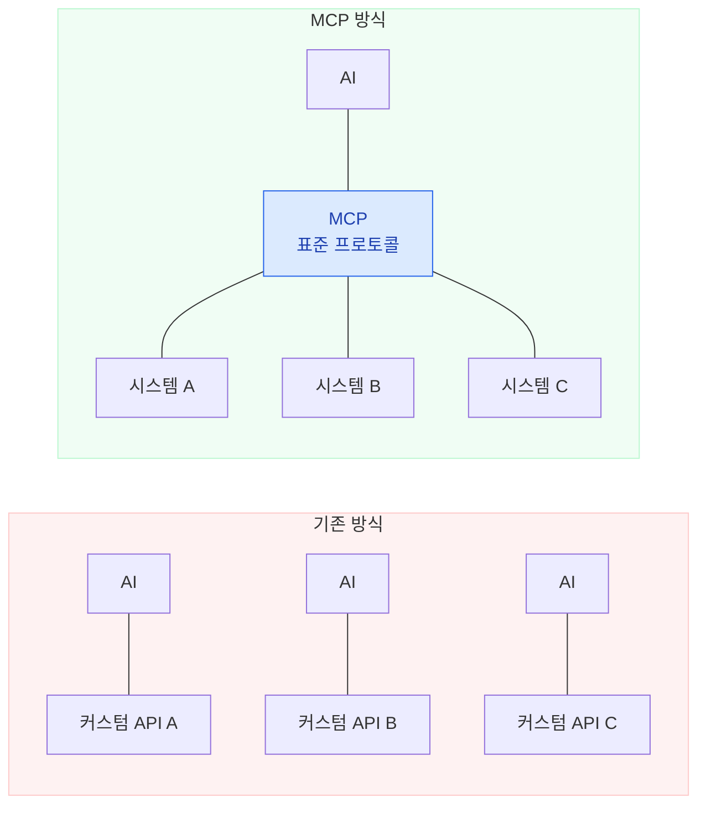
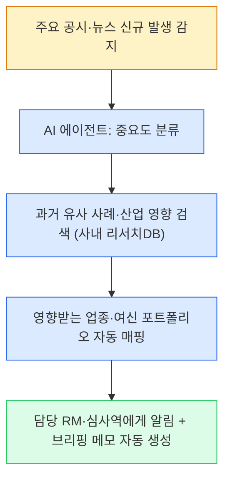
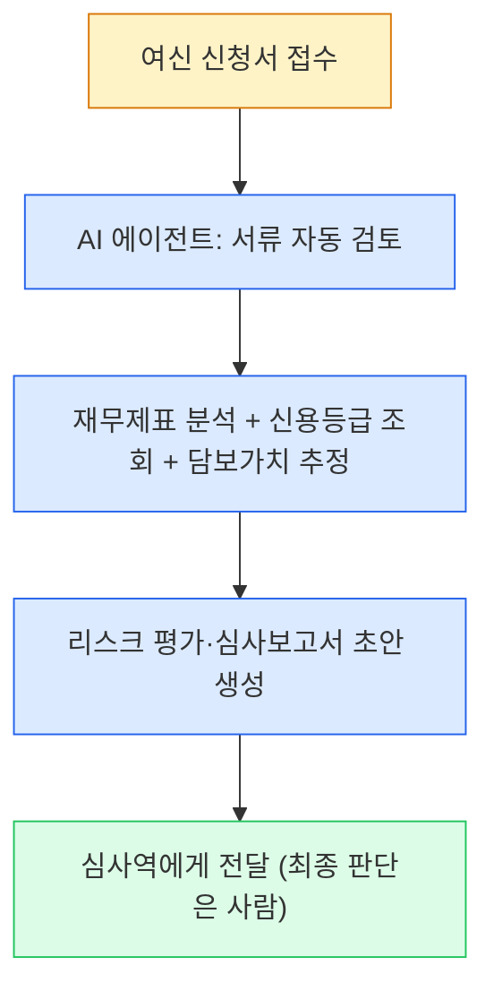

# 모듈 2: AI/LLM 종류별 특성과 활용법

> **대상**: 한국산업은행(KDB) 임직원
> **학습 시간**: 약 40분
> **핵심 키워드**: LLM 비교, 모델별 최적화, 사내 LLM, AI 에이전트, MCP, 보안 판단

---

## 학습 목표
1. 주요 AI/LLM(ChatGPT, Claude, Gemini, Perplexity, Copilot, 사내 LLM)의 특성과 강점을 구분할 수 있다
2. 업무 목적에 맞는 AI 모델을 선택하고, 모델별 프롬프트 전략을 조정할 수 있다
3. 금융권 보안 맥락에서 사내 LLM의 활용 원칙과 보안 판단 기준을 이해하고 적용할 수 있다
4. AI 에이전트와 MCP의 개념을 이해하고, 여신·리서치 자동화 워크플로의 가능성을 인식할 수 있다

---

## 1. 주요 AI/LLM 비교표

2026년 현재, 업무에서 활용할 수 있는 주요 AI는 크게 6가지로 분류됩니다. 각각의 특성을 이해하고 **업무 목적에 맞는 모델을 선택하는 것**이 핵심입니다.

### 종합 비교표

| 항목 | ChatGPT (OpenAI) | Claude (Anthropic) | Gemini (Google) | Perplexity | Copilot (Microsoft) | 사내 LLM |
|------|-----------------|-------------------|----------------|------------|--------------------|---------| 
| **최신 모델** | GPT-4o, o3, GPT-5 시리즈 | Claude Sonnet 4, Opus 4 | Gemini 2.5 Pro/Flash | Sonar (Llama 기반) | GPT-4o 기반 | KDB 내부 모델 |
| **컨텍스트 윈도우** | 128K 토큰 | 200K 토큰 | **1M 토큰** (최대) | 모델별 상이 | 128K 토큰 | 보통 8K~32K |
| **최대 강점** | 폭넓은 기능, 플러그인 생태계 | 긴 문서 분석, 정밀한 지시 준수 | 멀티모달, 대용량 컨텍스트 | 실시간 검색+출처 제공 | M365 통합 | 보안, 사내 데이터 |
| **멀티모달** | 텍스트, 이미지, 음성, 코드 | 텍스트, 이미지, 코드 | 텍스트, 이미지, 음성, **영상** | 텍스트 중심 | 텍스트, 이미지 | 보통 텍스트 중심 |
| **인터넷 검색** | 가능 (웹 브라우징) | 가능 (웹 검색) | 가능 (Google 검색 연동) | **핵심 기능** | 가능 (Bing 연동) | 불가 (폐쇄망) |
| **보안 수준** | 외부 서버 | 외부 서버 | 외부 서버 | 외부 서버 | 외부(Enterprise는 강화) | **행내 서버(폐쇄망)** |
| **가격대** | 무료~$200/월 | 무료~$100/월 | 무료~$20/월 | 무료~$20/월 | M365 구독 포함 | 행내 운영비 |

> 💡 팁: "어떤 AI가 최고인가"보다 **"이 업무에는 어떤 AI가 적합한가"**를 먼저 생각하세요. 만능 AI는 없습니다. 금융권은 특히 **데이터 보안·고객정보보호법·금융권 클라우드 가이드라인** 때문에 도구 선택이 곧 컴플라이언스 판단이 됩니다.

---

## 2. 모델별 강점과 약점

### ChatGPT — 만능 도구의 대명사

**강점:**
- **가장 폭넓은 기능**: DALL-E(이미지 생성), Code Interpreter(코드 실행), 플러그인, GPTs(맞춤 AI), 음성 대화 등 올인원 플랫폼
- **대화형 반복 개선**: "이 부분 좀 더 자세히", "톤을 바꿔서" 같은 대화를 주고받으며 점진적으로 결과를 다듬는 데 탁월
- **거대 사용자 커뮤니티**: 다양한 활용 사례와 GPTs 마켓플레이스
- 2026년 기준 **o3 모델**은 복잡한 추론 작업(예: 다단계 여신 심사 논리 전개)에서 강화된 성능을 보여줌

**약점:**
- 긴 문서를 한 번에 처리할 때 뒤쪽 내용을 놓치는 경향 (128K 제한)
- 복잡한 다단계 지시에서 일부 조건을 누락하는 경우가 있음
- 최신 정보 반영에 시간차 발생 가능

> ⚠ 주의: ChatGPT의 무료 버전은 모델 성능이 제한됩니다. 업무용이라면 Plus 이상을 권장합니다. 단, **고객·여신 정보는 절대 외부 모델에 입력 금지** — 공개 자료 기반 일반 업무에만 사용하세요.

### Claude — 정밀한 지시 준수의 전문가

**강점:**
- **200K 토큰 컨텍스트**: 긴 여신심사보고서, M&A 계약서 초안, 공시자료, 산업분석 리포트를 통째로 넣어 분석 가능
- **복잡한 지시 정밀 준수**: "5개 항목으로 나누되, 각 항목에 재무 수치 근거를 포함하고, 심사위원회 보고 톤으로"같은 복합 조건을 정확히 이행
- **가장 자연스러운 문장력**: 여신심사보고서, 산업분석 메모, 경영진 보고용 이메일 등 문서 작성 품질이 높음
- 128K 토큰까지 **한 번에 출력** 가능 — 긴 보고서 초안을 한 번에 생성

**약점:**
- 이미지 생성 기능 없음 (텍스트+이미지 분석은 가능)
- 플러그인/확장 생태계가 ChatGPT 대비 작음
- 실시간 인터넷 검색 기능이 제한적

> 🔑 핵심: "길고 복잡한 공시자료를 분석하거나, 상세한 조건이 많은 심사보고서를 작성할 때" Claude가 가장 적합합니다.

### Gemini — 멀티모달의 강자

**강점:**
- **1M 토큰 컨텍스트** (2026년 기준 최대): 방대한 양의 DART 공시자료, 유가증권신고서 등을 한 번에 처리
- **멀티모달 처리**: 텍스트뿐 아니라 이미지, 음성, **영상**까지 이해하고 분석 가능 (예: 재무제표 스캔본, PF 사업지 항공사진)
- **Google 생태계 통합**: Google 검색, Google Workspace(Docs, Sheets, Slides)와 연동
- Gemini 2.5 Pro는 2026년 초 기준 **코딩 벤치마크(SWE-bench) 1위**를 기록

**약점:**
- 한국어 응답 품질이 ChatGPT/Claude 대비 다소 낮은 경우가 있음
- 긴 문서 작성 시 구조화 능력이 Claude 대비 약한 편
- 할루시네이션(그럴듯한 거짓 정보) 발생률이 상대적으로 높은 편 — 금리·재무 수치 인용 시 반드시 검증 필요

> 💡 팁: **이미지/영상이 포함된 분석**(예: PF 사업지 현장 사진 판독, 담보 부동산 항공 이미지 분석, IR 발표 영상 요약)에는 Gemini가 압도적입니다.

### Perplexity — AI 시대의 검색 엔진

**강점:**
- **실시간 웹 검색 + 출처 제시**: 모든 답변에 출처 URL을 함께 제공 — 공시·뉴스·규제 조항의 팩트체크가 용이
- **Model Council 기능** (2026년): GPT, Claude 등 여러 모델의 답변을 동시에 비교
- **Pro Search**: 심층 리서치 모드로 산업분석·경쟁사 조사 등 복잡한 조사 업무 수행
- **SEC 금융 데이터 연동** (2026년): 해외 상장사 재무 데이터 직접 조회 가능
- 월 10억 건 이상의 쿼리를 처리하는 검색 특화 AI

**약점:**
- 긴 심사보고서 작성이나 창의적 콘텐츠 생성에는 약함
- 한국어 검색 결과의 품질이 영어 대비 제한적
- 문서 분석이나 대화형 편집 기능이 부족

> 🔑 핵심: **"최신 정보가 필요한 리서치 업무"**에서 Perplexity는 다른 AI와 차원이 다릅니다. 대상 기업 공시 동향, 규제 변경(바젤·IFRS) 확인, 산업 트렌드 파악 등에 활용하세요.

### Copilot — 오피스 업무의 AI 비서

**강점:**
- **Microsoft 365 완전 통합**: Word, Excel, PowerPoint, Outlook, Teams에서 바로 사용
- **사내 데이터 접근**: SharePoint, OneDrive의 사내 문서를 참조하여 답변 (Enterprise, 행내 거버넌스 승인 시)
- **Work IQ 인텔리전스**: 개인의 이메일, 파일, 미팅 기록을 학습하여 맞춤형 지원
- 2026년 기준 M365 Enterprise 사용자에게 **자동 설치** — 별도 가입 불필요

**약점:**
- M365 구독이 전제 조건 — 독립적으로 사용 불가
- 독립적인 깊은 분석보다는 오피스 문서 내 보조 역할에 특화
- 프롬프트 커스터마이징 자유도가 다른 AI 대비 낮음
- 금융권에서는 Enterprise 데이터 경계(데이터 저장 위치·학습 사용 여부)에 대한 사전 검토가 필수

> 💡 팁: Excel에서 재무 데이터 분석, PowerPoint 심사 보고 초안 생성, Outlook 이메일 요약 등 **일상적 오피스 업무**에서 Copilot이 가장 편리합니다.

### 사내 LLM — 금융권 보안의 파트너

**강점:**
- **보안 보장**: 데이터가 외부로 나가지 않음 — 민감한 고객·여신 정보를 자유롭게 활용
- **행내 데이터 활용**: 실제 여신 포트폴리오, 차주 재무정보, 내부 신용등급, 리스크 모델 데이터 등을 입력 가능
- **규제 준수**: 금융소비자보호법, 신용정보법, 개인정보보호법, 금융권 클라우드 가이드라인, 전자금융감독규정 등 컴플라이언스 요건 충족
- 국책은행 특성상 **국가 핵심 정보·정책금융 딜 정보**가 포함된 업무는 외부 유출 자체가 불가 — 사내 LLM이 유일한 선택지

**약점:**
- 모델 크기가 외부 LLM 대비 작아 **추론 능력이 제한적**
- 인터넷 검색 불가 — 최신 시장·금리 정보 반영 불가
- 멀티모달, 코드 실행 등 고급 기능이 없는 경우가 많음

> ⚠ 주의: 사내 LLM은 성능이 낮은 대신 보안이 보장됩니다. **고객정보·여신정보·미공개 기업정보·내부 리스크 모델이 포함된 업무는 반드시 사내 LLM을 사용**하세요.

---

## 3. 동일 프롬프트, 다른 결과 — 모델별 차이 체감하기

같은 프롬프트를 서로 다른 AI 모델에 넣으면 어떤 차이가 발생할까요? 실제 KDB 업무 시나리오로 비교해봅시다.

### 비교 실험 1 — 여신심사: 차주 재무리스크 분석

**프롬프트:**
```
당신은 KDB 기업여신 심사역입니다.
A 중견기업(연매출 1,200억, 영업이익률 6.5%, 부채비율 210%)이
시설자금 300억원(5년, 분할상환)을 신청했습니다.
최근 2년간 매출은 정체, 영업이익률은 1.5%p 하락했으며,
담보는 본사 사옥(감정가 250억, LTV 추정 필요)과 대표이사 연대보증입니다.
재무 리스크 · 업종 리스크 · 담보 리스크를 단계별로 분석하고,
내부 신용등급 구간과 승인 의견을 표로 정리해주세요.
```

| 비교 항목 | ChatGPT | Claude | 사내 LLM |
|----------|---------|--------|---------|
| **분석 구조** | 3가지 리스크를 병렬 나열 | 5단계 체계적 분석 (재무→업종→담보→종합→결론) | 2가지 포인트를 간략히 서술 |
| **분석 깊이** | 일반적 수준, 업계 평균 비율 인용 | 각 리스크별 메커니즘·민감도·완화방안까지 상세 | 표면적 분석, 업종 배경 지식 부족 |
| **표 제공** | 기본 비교표 제공 | 영향도×발생가능성 매트릭스 + 여신등급 판정 근거표 | 표 없이 서술형 |
| **활용도** | 초안으로 활용 가능 | **심사보고서에 즉시 활용 가능** | 참고 수준, 추가 작업 필요(단, 실제 차주 데이터 입력 가능) |
| **소요 시간** | ~10초 | ~15초 | ~5초 |

> 🔑 핵심: **상세하고 구조화된 심사 논리가 필요한 업무에는 Claude**, 아이디어·체크리스트 브레인스토밍에는 ChatGPT, **실제 차주 데이터가 포함된 분석에는 반드시 사내 LLM**이 적합합니다.

### 비교 실험 2 — 산업분석: 2차전지 산업 전망

**프롬프트:**
```
당신은 KDB 산업분석부 수석 애널리스트입니다.
국내 2차전지 산업의 2026년 하반기 전망을 작성합니다.
- 글로벌 수요 둔화(북미 EV 수요 조정)
- 중국 CATL·BYD의 가격 공세
- 국내 3사(LGES, 삼성SDI, SK온)의 증설 계획 재조정
를 반영하여 산업 리스크 · 기회요인 · 여신 정책 시사점을
제시해주세요.
```

| 비교 항목 | ChatGPT | Claude | Gemini |
|----------|---------|--------|--------|
| **분석 프레임** | 리스크·기회 각각 서술 | 요인별 정량+정성 분석, 상호 영향 교차 분석 | 요인 나열 + Google 검색 기반 최신 시장 데이터 보강 |
| **여신 정책 시사점** | "선별적 지원 필요" (근거 간략) | "Tier1 3사 중심 선별 지원, PF·증설자금은 DSCR 재검증" — 판단 근거 5가지 제시 | "증설 속도 조정 기업 우선" — 업종 평균·수요 전망 수치 제공 |
| **특이사항** | 대화형으로 추가 질문 가능 | 한 번에 완결된 산업분석 리포트 | 실시간 완성차·셀 수주 데이터 반영 가능 |
| **활용 적합도** | 초안 검토용 | **산업분석 리포트 즉시 활용** | 시장 데이터 보완용 |

> 💡 팁: 산업분석처럼 **정밀한 논리 전개**가 필요한 업무에는 Claude, **최신 시장 데이터**가 필요하면 Gemini나 Perplexity를 병행하세요. 단, 공시 인용·수치 인용 시에는 Perplexity의 출처 링크로 반드시 교차 검증합니다.

---

## 4. 모델별 프롬프트 최적화 전략

각 AI 모델은 특성이 다르므로, **같은 업무라도 모델에 맞게 프롬프트를 조정**해야 최적의 결과를 얻을 수 있습니다.

### 모델별 프롬프트 전략 비교

| 모델 | 핵심 전략 | 프롬프트 팁 | 피해야 할 것 |
|------|----------|-----------|-------------|
| **ChatGPT** | 대화형 반복 개선 | 첫 질문은 간단히 → 후속 대화로 다듬기. "좀 더 구체적으로", "이 부분을 수정해줘" | 한 번에 너무 복잡한 지시를 넣지 말 것 |
| **Claude** | 상세 지시 일괄 전달 | 역할+맥락+지시+형식+조건을 **한 번에** 전달하면 가장 효과적 | 짧은 단문 연속 대화보다 한 번에 완결된 프롬프트 |
| **Gemini** | 멀티모달 + 검색 활용 | 이미지, 파일(재무제표 스캔본·공시자료)을 함께 첨부하여 질문. "최신 데이터를 검색해서 포함해줘" | 텍스트만으로 긴 분석을 요청하는 것 |
| **Perplexity** | 검색 최적화 질문 | 구체적 검색 키워드를 포함한 질문. "2026년 기준", "국내 공시 기준" | 창의적 글쓰기나 긴 문서 작성 |
| **Copilot** | 오피스 문맥 활용 | "이 Excel 재무 데이터를 분석해줘", "이 메일에 답장 초안을 써줘" | M365 외부에서 독립적 분석 요청 |
| **사내 LLM** | 풍부한 맥락 + Few-shot | 맥락을 2배로 상세히, 예시 2~3개 필수, 한 번에 하나씩 | 복합 요청, 외부 지식이 필요한 질문 |

### Before/After 예시 — 모델 특성을 활용한 최적화

**상황:** "M&A 실사(Due Diligence) 체크리스트 작성"을 각 모델에 맞게 최적화

**Before — 모든 모델에 동일한 프롬프트**

```
M&A 실사 체크리스트 만들어줘.
```

→ 모든 모델에서 일반적인 체크리스트만 반환

**After — 모델별 최적화 프롬프트**

**ChatGPT용 (대화형 접근):**
```
M&A 실사에서 재무 DD 항목 10가지를 알려줘.
```
→ 첫 답변 확인 후:
```
위 항목 중 수익 인식(Revenue Recognition) 관련 항목을 더 자세히 설명해줘.
특히 장기 공급계약·PF 수익 인식의 질적 평가 포인트 중심으로.
```
→ 다시:
```
이걸 IB 딜매니저 보고용 표로 정리해줘. 항목/검증 포인트/요청 자료/위험 등급 4컬럼으로.
```

**Claude용 (일괄 상세 지시):**
```
당신은 KDB 투자금융부 15년차 M&A 딜매니저입니다.

대상 딜: 국내 중견 산업·서비스 복합기업(연결 매출 5,000억, EBITDA 650억) 
인수 건. 인수금융 2,000억 구조화 중. 피인수기업 이슈:
최근 3년 매출 정체, 우발채무 가능성(세무 추징·환경 소송), 
해외 자회사 지분구조 복잡.

다음 구조로 재무·사업·법률·세무 DD 체크리스트를 작성해주세요:
1. DD 영역별 핵심 점검 항목 (각 5~7개)
2. 항목별 요청 자료 리스트
3. 리스크 우선순위 (상/중/하) 및 근거
4. 딜 구조(PSA 조항) 반영 포인트
5. 인수금융 승인심사 시 쟁점 요약

각 판단의 근거를 명시해주세요.
```

**Gemini용 (멀티모달 활용):**
```
[첨부: 피인수기업 최근 3개년 감사보고서 PDF, 주요 계약 조건 요약 이미지]
첨부한 감사보고서에서 주석 사항(우발채무·특수관계자 거래)을 추출하고,
계약 조건 요약 이미지와 교차하여 리스크를 식별해주세요.
최신 동종업계 M&A 실사 이슈 사례도 검색해서 포함해주세요.
```

| 모델 | 최적화 포인트 | 기대 효과 |
|------|-------------|----------|
| ChatGPT | 3단계 대화로 점진적 심화 | 방향을 조정하며 원하는 결과에 수렴 |
| Claude | 한 번에 완결된 상세 프롬프트 | 바로 심사·IC 보고서로 활용 가능한 출력 |
| Gemini | 이미지+데이터 멀티모달 | 공시자료·계약서 시각 자료 동시 분석 |

---

## 5. 금융권 사내 LLM 활용 전략

### 왜 금융권은 사내 LLM이 필수인가?

외부 AI(ChatGPT, Claude 등)는 강력하지만, **고객 정보·여신 정보·미공개 기업 정보·정책금융 딜 정보를 입력할 수 없다**는 치명적 한계가 있습니다. 금융권은 특히 아래 법·규정의 직접 적용을 받습니다.

- **개인정보보호법** — 고객 식별 정보, 신용정보 등
- **신용정보법** — 신용정보의 제3자 제공·해외 이전 제한
- **금융소비자보호법** — 소비자 정보 관리 의무
- **전자금융감독규정 · 금융권 클라우드 이용 가이드라인** — 망분리·데이터 경계
- **자본시장법** — 미공개 중요정보 이용 금지

그 결과, 실제 여신 포트폴리오, 차주 재무정보, 내부 신용등급, M&A 딜 정보, 내부 리스크 모델, 산업분석 사내 원자료 등은 **반드시 사내 LLM에서만 처리**해야 합니다.

| 구분 | 외부 AI 사용 가능 | 사내 LLM 필수 |
|------|------------------|-------------|
| **기업여신 심사** | 일반 업종 전망, 공개된 재무 이론, 공시 기반 분석 프레임 | 실제 차주 재무데이터, 내부 신용등급, 담보 정보, 여신 포트폴리오 |
| **산업분석·리서치** | 공개 산업 통계, 해외 공시, 일반 시장 데이터 | 내부 리서치 원자료, 주니어 애널리스트 작업 노트, 비공개 기업 인터뷰 |
| **PF · IB 딜** | 공개 PF 구조 이론, 해외 사례 요약 | 진행 중 딜의 현금흐름 모델, 가격 조건, 내부 가격 결정 로직 |
| **리스크·컴플라이언스** | 공개 규제 조문, 바젤·IFRS 해설 | 내부 리스크 한도, 내부등급법 파라미터, 감독원 비공개 협의 이력 |

### 사내 LLM 프롬프트 4대 원칙

사내 LLM은 외부 AI보다 모델 크기가 작고 학습 데이터가 제한적입니다. 이를 보완하려면 프롬프트를 더 신경 써서 작성해야 합니다.

| 원칙 | 방법 | 이유 | 예시 |
|------|------|------|------|
| 1️⃣ **더 상세한 맥락** | 외부 AI보다 배경 설명을 2배 풍부하게 | 스스로 추론할 배경 지식이 적음 | "PF"만 쓰지 말고 "국내 해상풍력 PF(500MW, 총사업비 3조, EPC 주도형)"로 |
| 2️⃣ **Few-shot 적극 활용** | 예시를 2~3개 제공하여 패턴 학습 유도 | 패턴 이해력이 낮을수록 예시가 효과적 | 기존 심사보고서 요약 1~2개를 예시로 첨부 |
| 3️⃣ **출력 형식 확실히** | 구조를 명확히 잡아줘야 이탈이 적음 | 형식 이탈 시 재작업 비용이 큼 | "아래 표 형식으로만 작성해주세요" |
| 4️⃣ **한 번에 하나씩** | 복합 요청보다 단일 요청이 안정적 | 다중 태스크 처리 시 품질 저하 가능 | 분석→정리→추천을 3번에 나눠 요청 |

> ⚠ 주의: 금융 실무 용어·내부 약어는 AI가 모를 수 있으니, 처음 등장할 때 반드시 풀어서 설명해주세요.
> 예: DSCR(Debt Service Coverage Ratio), LLCR(Loan Life Coverage Ratio), EAD(Exposure At Default), LGD(Loss Given Default), SLL(Sustainability-Linked Loan)

### 사내 LLM 활용 Before/After

**Before — 외부 AI 스타일로 사내 LLM에 요청**
```
여신 데이터 보고 분석해서 개선안 제시해줘.
```
→ 결과: "여신 포트폴리오 개선을 위해서는 분산 관리, 리스크 모니터링, 산업 다변화가 필요합니다." (빈약)

**After — 사내 LLM 4대 원칙 적용**
```
[역할] 당신은 KDB 기업여신 포트폴리오 분석 담당자입니다.

[상세 맥락] 
아래는 2026년 3월 기준 A 심사부의 업종별 익스포저·연체율 데이터입니다.
- 2차전지·소재: 익스포저 1.2조, 연체율 0.4% (전월 0.3%)
- 조선·해양플랜트: 익스포저 8,500억, 연체율 1.1% (전월 0.9%) ← 가장 큰 악화
- 반도체·장비: 익스포저 9,000억, 연체율 0.2% (전월 0.2%)
- 건설·부동산: 익스포저 6,200억, 연체율 1.8% (전월 1.6%)
전체 익스포저: 3.57조 / 가중 연체율: 0.78% (전월 0.67%)

[지시] 조선·해양플랜트 업종의 연체율 상승 원인을 분석해주세요.

[형식] 아래 표로만 작성:
| 원인 후보 | 근거 | 영향도 | 확인 방법 |

[조건] 원인 후보는 3가지만 제시해주세요.
```
→ 결과: 체계적인 3개 원인 분석표 (실제 포트폴리오 데이터 기반 구체적 분석)

---

## 6. AI 에이전트 시대 — MCP, Function Calling, 자동화 워크플로

### AI가 "도구를 사용하는" 시대

지금까지 AI는 **질문에 답변하는 도구**였습니다. 하지만 2026년 현재, AI는 단순 답변을 넘어 **스스로 도구를 사용하고 작업을 수행하는 "에이전트(Agent)"**로 진화하고 있습니다.

| 구분 | 기존 AI (챗봇) | AI 에이전트 |
|------|--------------|-----------|
| 역할 | 질문에 답변 | 목표를 달성하기 위해 **스스로 판단하고 행동** |
| 도구 사용 | 불가 | 검색, 코드 실행, API 호출, 파일 생성 등 **도구 직접 사용** |
| 작업 범위 | 1회성 답변 | 다단계 작업을 자율적으로 수행 |
| 예시 | "IC 회의록 요약해줘" | "IC 회의록 요약 → 후속 조치 항목 추출 → 담당 심사역에게 메일 발송 → 캘린더에 심사 기한 등록" |

### MCP(Model Context Protocol) — AI의 USB-C

**MCP**는 Anthropic이 2024년 11월에 공개한 오픈 표준으로, AI가 외부 시스템(데이터베이스, API, 파일 시스템 등)과 **표준화된 방식으로 연결**되는 프로토콜입니다. 쉽게 말해 **"AI를 위한 USB-C 포트"**입니다.



2026년 현재, MCP는 월간 **9,700만 건 이상의 SDK 다운로드**를 기록하며 사실상의 표준이 되었습니다. OpenAI, Google, Microsoft, Amazon 등 모든 주요 AI 기업이 MCP를 채택했으며, 금융권에서도 폐쇄망 내부 시스템(여신·리스크·리서치DB)을 **행내 전용 MCP 서버**로 연결하는 시도가 시작되고 있습니다.

> 🔑 핵심: MCP를 이해하면 "AI에게 질문하기"를 넘어 **"AI에게 업무를 맡기기"**가 가능해집니다. 단, 금융권 적용 시에는 **행내 거버넌스 승인·망분리 준수·로그 감사**가 선행되어야 합니다.

### Function Calling — AI가 함수를 호출한다

Function Calling은 AI가 대화 중에 **필요한 기능(함수)을 자동으로 호출**하는 기술입니다. 사용자가 "A사의 최근 공시 요약해줘"라고 하면, AI가 스스로 DART 공시 조회 API를 호출하고 결과를 정리해서 알려줍니다.

**업무 적용 예시 (KDB 맥락):**

| 업무 영역 | 시나리오 | AI 에이전트 동작 |
|----------|---------|----------------|
| **여신심사** | "B 기업의 여신심사 초안 작성해줘" | 내부 차주 DB 조회 → 최근 재무제표 집계 → 신용등급·담보가치 확인 → 심사보고서 초안 생성 |
| **산업분석** | "이번 주 2차전지 시장동향 브리핑" | 뉴스·공시·주가 데이터 수집 → 이벤트 요약 → 리서치 리포트 초안 + 투자포인트 자동 제안 |
| **리스크** | "포트폴리오 이상 탐지" | 여신 포트폴리오 연체율·집중도 모니터링 → 기준 초과 시 리스크 담당자에게 알림 + 초기 분석 메모 |
| **공통** | "이번 주 심사회의 잡아줘" | 팀원 캘린더 확인 → 공통 빈 시간 탐색 → 회의실 예약 → 초대 메일 발송 |

### 자동화 워크플로 — 미래의 업무 방식

AI 에이전트를 연결하면, 기존에 수작업으로 하던 복잡한 워크플로를 **자동화**할 수 있습니다.

**시장동향 수집 에이전트 워크플로 예시:**


**여신심사 자동화 워크플로 예시:**


> 💡 팁: AI 에이전트 시대에도 **최종 의사결정은 사람**이 합니다. AI는 정보 수집, 분석, 초안 생성을 담당하고, 여신·투자 승인 판단은 반드시 심사역·IC가 하는 **"Human-in-the-Loop"** 원칙을 기억하세요. 금융 규제상 **자동화된 최종 의사결정에는 명확한 책임 소재**가 요구됩니다.

---

## 7. 보안 판단 플로차트 — 외부 AI vs 사내 LLM 의사결정

금융권에서 AI를 사용할 때 **가장 먼저** 판단해야 할 것은 "이 업무에 어떤 AI를 써야 안전한가?"입니다. 이 판단이 곧 **개인정보보호법·신용정보법·자본시장법 준수 여부**와 직결됩니다.

### 보안 판단 플로차트


### 보안 판단 체크리스트

AI 사용 전 아래 항목을 반드시 확인하세요.

| 체크 | 항목 | 위반 시 리스크 |
|------|------|-------------|
| ☐ | 입력 데이터에 **고객 개인정보·신용정보**(성명, 주민번호, 계좌, 연락처)가 없는가? | 개인정보보호법·신용정보법 위반 |
| ☐ | 입력 데이터에 **여신·딜 비공개 정보**(차주명, 여신조건, 내부등급)가 없는가? | 내부정보 유출, 고객 비밀유지 의무 위반 |
| ☐ | 입력 데이터에 **미공개 기업 중요정보**가 없는가? | 자본시장법 위반(미공개정보 이용) |
| ☐ | AI 결과물을 **팩트 검증 없이 외부 보고서·공시**에 사용하지 않는가? | 부정확 정보 유포, 할루시네이션 리스크 |
| ☐ | AI 결과물의 **수치·법령·공시 인용을 원문과 대조**했는가? | 오류 기반 의사결정, 규제 리스크 |

> ⚠ 주의: **"잠깐이니까 괜찮겠지"라는 생각이 가장 위험합니다.** 외부 AI에 한 번 입력된 데이터는 학습 데이터로 사용될 수 있습니다. 금융권에서는 단 1건의 고객정보·여신정보 유출도 감독 이슈로 직결되므로, 해당 정보가 포함된 데이터는 예외 없이 사내 LLM을 사용하세요.

---

## 8. MCP — 금융 시스템과 AI 연결

앞서 6장에서 MCP의 개념을 살펴봤다면, 이 장에서는 **KDB 실무 시스템과 MCP를 어떻게 연결할 것인가**를 구체적으로 다룹니다.

### MCP = "AI 세계의 USB 포트"

여신 시스템, DART, Bloomberg, ECOS, 사내 리서치DB — KDB 업무에서 우리가 매일 오가는 데이터 원천은 매우 다양합니다. 예전에는 각 시스템마다 별도 연동을 개발하거나, 사람이 직접 복사-붙여넣기를 해야 AI가 쓸 수 있었습니다. **MCP는 이 과정을 "USB 포트처럼" 표준화**하여, 한 번 연결해두면 AI가 필요할 때마다 해당 시스템에서 데이터를 직접 가져오게 만듭니다.

### 기존 방식 vs MCP 방식 비교 (KDB 맥락)

| 구분 | 기존 방식 | MCP 방식 |
|------|----------|---------|
| **데이터 전달** | 심사역이 DART·사내DB에서 직접 복사-붙여넣기 | AI가 필요한 시점에 자동으로 DART 공시·사내 여신DB 조회 |
| **시스템 연결** | 시스템마다 별도 연동 개발 (여신·리서치·IR) | 표준 MCP 규격으로 한 번에 연결 (사내 여신DB·DART·Bloomberg·ECOS) |
| **실시간성** | 조회 시점의 스냅샷만 활용 | 항상 최신 공시·금리·환율·뉴스에 접근 |
| **활용 범위** | 텍스트 프롬프트 위주 | 여신DB, 공시, 시장 데이터, 캘린더, 사내 메신저까지 확장 |

### KDB 업무 적용 시나리오 3개

**시나리오 1 — 사내 여신DB 기반 포트폴리오 분석 자동화**

"이번 분기 업종별 연체율 추이와 집중도 리스크를 표로 정리해줘"라고 하면, MCP로 연결된 사내 여신DB에서 AI가 직접 업종별 익스포저·연체율·만기 구조를 조회하여 분석 초안을 작성합니다. 리스크관리부·포트폴리오 담당자는 기본 집계 작업 없이 **판단·보고**에 집중할 수 있습니다.

**시나리오 2 — DART + 내부 심사보고서 동시 참조 기업 분석**

"A社 최근 공시 변동사항과 우리 심사부가 과거 작성한 심사보고서 포인트를 비교해줘"라고 요청하면, MCP가 DART에서 최신 공시·사업보고서를 불러오는 동시에 사내 심사 DB에서 과거 심사 이력을 찾아와, AI가 교차 분석한 비교표를 생성합니다. 심사역이 RM 미팅 전 10분만에 핵심 변동사항을 확인할 수 있습니다.

**시나리오 3 — Bloomberg·ECOS 연동 실시간 시장동향 브리핑**

"오늘 미국 국채 10년물과 원/달러 환율, KP물 스프레드 요약해줘"라고 하면, Bloomberg MCP 서버와 한은 ECOS MCP 서버에서 실시간 수치를 가져와 3줄 브리핑과 KDB 여신·채권 포트폴리오에 미치는 영향을 자동으로 정리합니다. 매일 아침 시장 브리핑이 자동화되는 셈입니다.

### 보안 원칙 — 최소 권한 원칙 (Least Privilege)

MCP가 강력해질수록 **권한 관리**가 중요합니다. 금융권에서 MCP를 도입할 때는 아래 원칙을 반드시 지켜야 합니다.

| 원칙 | 구현 방식 | 위반 시 리스크 |
|------|---------|-------------|
| 최소 권한 | 업무 단위로만 접근 권한 부여 (읽기/쓰기 분리) | 과도한 권한은 정보 유출·무단 변경 위험 |
| 정보 분리 | 고객정보·미공개 딜 정보는 **사내 LLM + 사내 MCP**로만 | 외부 LLM 연동 시 신용정보법·자본시장법 위반 |
| 감사 로그 | MCP 호출 이력 전체 로깅·보관 | 감독 대응·사고 조사 시 추적 불가 |
| 승인 체계 | 데이터 범위 변경 시 거버넌스·컴플라이언스 사전 승인 | 망분리·내부통제 규정 위반 |

> ⚠ 주의: **고객정보, 미공개 딜 정보, 내부 리스크 모델 파라미터**는 외부 MCP 서버(ChatGPT·Claude 등)에 절대 연결하지 않습니다. 해당 정보가 다뤄져야 한다면 **행내 전용 MCP 서버 + 사내 LLM** 조합만 허용하는 것이 원칙입니다.

---

## 실습 & 퀴즈

### 퀴즈 1 — 모델 선택

Q. 다음 업무에 가장 적합한 AI 모델은 무엇일까요?

**상황:** 해외 경쟁 국책은행 3곳의 최신 ESG·그린본드 발행 동향을 조사하여 팀 내부 공유 자료를 만들어야 합니다. 사내 기밀·고객정보는 포함되지 않습니다.

(A) 사내 LLM — 보안이 중요하니까
(B) ChatGPT — 만능이니까
(C) Perplexity — 실시간 검색으로 최신 정보를 출처와 함께 수집
(D) Copilot — 회사에서 제공하니까

**정답**: (C) Perplexity

**해설:** 해외 공개 정보 기반 리서치는 **최신 정보 + 출처 확인**이 핵심입니다. Perplexity는 실시간 웹 검색 결과를 출처와 함께 제공하므로 리서치 업무에 가장 적합합니다. 사내 기밀·고객정보가 포함되지 않으므로 외부 AI 사용이 가능합니다.

---

### 퀴즈 2 — 보안 판단

Q. 다음 중 **반드시 사내 LLM을 사용해야 하는** 업무는 어떤 것일까요?

(A) "프로젝트 파이낸스 DSCR 개념과 산정 방법을 설명해줘"
(B) "우리 심사부가 진행 중인 C기업 여신 건의 재무자료·내부등급을 분석하고 리스크를 파악해줘"
(C) "2026년 바젤 III 최종안 규제 변경 내용을 정리해줘"
(D) "영어로 쓴 해외 공시자료를 한글로 번역해줘 (공개 공시)"

**정답**: (B)

**해설:** (B)는 **진행 중인 실제 여신 건의 차주 재무자료·내부 신용등급**이 포함되므로 고객 비밀·영업비밀에 해당합니다. 반드시 사내 LLM을 사용해야 합니다. (A)는 일반 금융 이론, (C)는 공개된 규제 정보, (D)는 공개 공시 번역이므로 외부 AI 사용이 가능합니다.

---

### 퀴즈 3 — 프롬프트 최적화

Q. Claude에 가장 적합한 프롬프트 전략은 무엇일까요?

(A) 간단한 질문을 반복하며 대화로 다듬기
(B) 역할+맥락+지시+형식+조건을 한 번에 상세히 전달
(C) 이미지와 파일을 첨부하여 멀티모달 분석 요청
(D) 검색 키워드를 포함한 짧은 질문

**정답**: (B)

**해설:** Claude는 **복잡한 지시를 한 번에 정밀하게 준수**하는 것이 최대 강점입니다. 역할, 맥락, 형식, 조건을 모두 포함한 완결된 프롬프트를 한 번에 전달하면 가장 좋은 결과를 얻을 수 있습니다. (A)는 ChatGPT, (C)는 Gemini, (D)는 Perplexity에 적합한 전략입니다.

---

## 핵심 요약

| 번호 | 핵심 포인트 | 실전 적용 |
|------|-----------|----------|
| 1 | AI 모델마다 강점이 다르다 — 만능 AI는 없다 | 업무 유형에 맞는 모델 선택이 첫 번째 |
| 2 | 같은 프롬프트도 모델별로 최적화해야 한다 | ChatGPT는 대화형, Claude는 일괄 상세, Gemini는 멀티모달 |
| 3 | 금융권은 보안 판단이 AI 활용의 첫 관문이다 | 고객·여신 정보 → 사내 LLM / 공개 정보 → 외부 AI |
| 4 | 사내 LLM은 4대 원칙으로 보완한다 | 상세 맥락, Few-shot, 명확한 형식, 단일 요청 |
| 5 | AI 에이전트(MCP)가 여신·리서치 자동화를 현실로 만든다 | "질문하기"에서 "업무 맡기기"로 진화 중 (Human-in-the-Loop 필수) |

---

## 다음 모듈 예고

모듈 3에서는 **AI를 활용한 보고서 작성과 리서치 실전**을 다룹니다. 오늘 배운 모델 선택 전략을 바탕으로, 실제로 여신심사·산업분석·시장동향 브리핑의 보고서 구조를 잡고, 섹션별 초안을 작성하고, 팩트체크를 수행하는 전체 워크플로를 실습합니다. 모듈 1의 프롬프트 기법 + 모듈 2의 모델 선택 = 모듈 3의 실전 결과물입니다.
