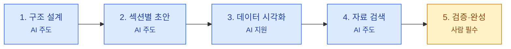

# 모듈 3: 보고서 작성 실전 가이드 — "AI와 함께 보고서를 완성하는 법"

> **대상**: 한국산업은행(KDB) 임직원
> **학습 시간**: 약 40분
> **핵심 키워드**: AI 보고서 워크플로, 프롬프트 템플릿, Few-shot 양식 통일, 데이터 시각화, 반복 보고서 자동화

---

## 학습 목표

1. AI를 활용한 5단계 보고서 작성 워크플로를 이해하고 적용할 수 있다
2. KDB 보고서 유형별(여신 심사·산업 분석·PF 검토 등) 프롬프트 템플릿을 작성하고 활용할 수 있다
3. Few-shot 기법으로 사내 보고서 양식을 AI에 학습시킬 수 있다
4. 반복 보고서를 템플릿으로 저장하고 플랫폼별로 재사용할 수 있다

---

## 1. AI 보고서 작성 워크플로 — 5단계 프로세스

보고서를 AI와 함께 작성할 때는 **한 번에 전부를 요청하는 것이 아니라, 단계별로 나눠서 진행**하는 것이 핵심입니다. 사람이 방향을 잡고, AI가 초안을 만들고, 사람이 최종 검증하는 협업 구조입니다.

### 5단계 워크플로 개요

| 단계 | 작업 | 담당 | 시간 비중 | 핵심 포인트 |
|------|------|------|----------|------------|
| **1단계** | 구조 설계 (목차·골격) | AI 주도 | 15% | 역할+맥락+제약조건으로 목차 생성 |
| **2단계** | 섹션별 초안 작성 | AI 주도 | 20% | Few-shot으로 양식 통일, 섹션별 분리 요청 |
| **3단계** | 데이터 시각화 | AI 지원 | 10% | 표/차트 변환, 인사이트 추출 |
| **4단계** | 자료 검색·법규 조사 | AI 주도 | 25% | Perplexity/Claude/ChatGPT 교차 활용 |
| **5단계** | 검증·수정·완성 | 사람 필수 | 30% | 팩트체크, 사내 판단, 최종 승인 |

> 🔑 **핵심**: AI는 시간을 절약해주는 도구이지, 의사결정을 대신하는 도구가 아닙니다. 1~4단계를 AI가 처리해도 **최종 책임은 항상 사람**에게 있습니다.

### 단계별 AI와 사람의 역할 구분



**총 소요 시간 비교**:
- 기존 방식: 약 8시간 (조사 3h + 구조 1h + 초안 2h + 시각화 1h + 검토 1h)
- AI 협업 방식: 약 2시간 (AI 작업 1h + 사람 검증 1h) → **약 75% 시간 절감**

💡 **팁**: 한 번에 전체 보고서를 쓰라고 요청하지 마세요. "1장 목차를 만들어줘 → 검토 → 1장 내용을 작성해줘 → 검토 → 2장으로 진행" 방식으로 **섹션별로 나눠서 진행**하면 품질이 훨씬 좋습니다.

---

## 2. 보고서 유형별 프롬프트 템플릿

보고서 유형(여신 심사·산업 분석·PF 검토·리스크 평가 등)에 따라 프롬프트 구조가 달라집니다. 아래는 KDB 실무에서 바로 사용할 수 있는 템플릿입니다.

### 2-1. 여신·심사 업무 보고서 템플릿

#### (1) 기업여신 심사 보고서

```
당신은 20년차 KDB 기업여신 심사역입니다.

배경: 당행은 [차주명] 기업으로부터 시설자금 [신청 금액] 원 규모의
신규 여신 신청을 접수했습니다. 담보는 [담보 유형]이며,
업종은 [업종 및 세부 분야]입니다.

요청: "[차주명] 기업여신 심사 보고서"의 목차를 작성해주세요.

출력 조건:
- 마크다운 형식, 3단계 깊이까지
- 반드시 포함할 섹션: 차주 개요, 재무분석(유동성·수익성·안정성·성장성),
  업종 전망, 담보·보증 구조, 신용등급 평가, 종합 의견
- 총 5장 이내로 구성
- 각 섹션에 포함할 핵심 지표(여신잔액, DSCR, 부채비율 등)를 간략히 명시
```

#### (2) 여신 부실 징후 보고서

```
당신은 KDB 리스크관리부 조기경보 담당자입니다.

상황: [차주명]의 최근 분기 실적에서 DSCR이 전분기 대비 [N]%p 하락,
NPL 비율이 기준치 초과 신호를 보이고 있습니다.
관측 기간: [시작일]~[종료일], 대상: [여신 계정/포트폴리오]

아래 구조로 여신 부실 징후 보고서를 작성해주세요:
1. 이슈 개요 (발생 일시, 여신잔액, 영향 범위)
2. 원인 분석 (재무·업황·담보·경영진·외부환경의 5개 관점)
3. 즉시 조치 사항 (이미 시행한 모니터링 강화·보전 조치)
4. 근본 원인 대책 (여신 구조 재조정, 추가 담보, 한도 축소 등)
5. 일정 및 담당자

출력: 마크다운 표 형식, 각 섹션 200자 이내
```

#### (3) 월간 여신 포트폴리오 리뷰 보고서

```
당신은 KDB 여신심사부 포트폴리오 관리 담당자입니다.

대상 포트폴리오: [산업군/지점/상품군 등]
리뷰 주기: 월간, 이번 리뷰 기준월: [YYYY-MM]

아래 양식으로 월간 포트폴리오 리뷰 보고서를 작성해주세요:
1. 핵심 지표 현황 (여신잔액, 신규 승인 건수, NPL 비율, 평균 스프레드)
2. 전월 대비 변동 및 주요 요인
3. 발견된 위험 징후 및 조치 내용
4. 차월 중점 모니터링 항목
5. 첨부: 지표 체크리스트 표

출력: 마크다운 표 포함, 경영진보다는 심사 실무자용 톤으로
```

### 2-2. 산업분석·IB·PF 업무 보고서 템플릿

#### (1) 산업분석 리포트 (예: 2차전지 산업 전망)

```
당신은 KDB 산업분석부 수석 애널리스트입니다. 담당 업종은 2차전지입니다.

분석 대상: 국내 2차전지 산업의 2026년 전망
분석 목적: 당행 여신·투자 의사결정에 활용할 산업 전망 리포트 작성

아래 구조로 산업분석 리포트를 작성해주세요:
1. 산업 개요 (시장 규모, 성장률, Value Chain)
2. 수요·공급 전망 (주요 수요처, 생산능력, 2026년 수급 밸런스)
3. 주요 플레이어 분석 (LG에너지솔루션·삼성SDI·SK온 등 재무/투자 동향)
4. 리스크 요인 (지정학 리스크, 원자재 가격, 정책 리스크)
5. 당행 시사점 (여신·투자 기회와 유의 섹터)

출력: 시장 규모·점유율은 표 또는 차트로, 숫자는 출처와 함께 명시
⚠ 주의: 예측 수치 사용 시 반드시 "추정" 또는 "전망"임을 표기
```

#### (2) PF 프로젝트 타당성 검토 보고서

```
당신은 KDB 프로젝트금융부의 PF 심사역입니다.

검토 대상: [프로젝트명 — 예: ○○ 해상풍력 발전 사업]
총 사업비: [금액] 원, 당행 참여 예정 금액: [금액] 원

아래 구조로 PF 타당성 검토 보고서를 작성해주세요:
1. 사업 개요 및 구조 (SPC, 참여자, 지분 구조)
2. 수익 모델 및 현금흐름 추정 (연도별 매출·비용·FCF)
3. DSCR·LLCR 민감도 분석 (기본/하락/상승 시나리오)
4. 리스크 매트릭스 (건설·운영·정책·환·이자율 리스크)
5. 담보·보증 구조 및 당행 참여 조건 제안

출력: DSCR·LLCR은 연도별 표, 민감도는 시나리오별 표로 제시
⚠ 주의: 수치 가정은 반드시 출처 또는 "전제"로 명시
```

#### (3) 시장 리스크 긴급 보고서

```
당신은 KDB 리스크관리부 시장리스크 담당 전문가입니다.

보고 배경: [FOMC 결정/지정학 사건/환율 급변 등] 발생에 따른
당행 포지션 및 채권 시장 영향을 긴급 보고해야 합니다.

아래 구조로 시장 리스크 긴급 보고서를 작성해주세요:
1. 이벤트 개요 및 시장 반응 (국고채 금리, 크레딧 스프레드, 환율 변동)
2. 당행 포지션 영향 분석 (보유 채권 평가손익, 자금조달 비용 변화)
3. 시나리오 분석 (기본/스트레스/최악 각 시나리오별 손익 추정)
4. 대응 방안 및 우선순위 (헤지, 포지션 조정, 자금조달 계획)
5. 경영진 권고사항

출력: 리스크 매트릭스(영향도 x 발생확률) 표 포함
```

---

## 3. Few-shot으로 사내 양식 통일하기

### Few-shot이란?

Few-shot은 AI에게 **"이런 형태로 만들어줘"라는 예시를 1~3개 보여주는 기법**입니다. KDB 사내 보고서에는 고유한 양식, 문체, 용어가 있는데, 이것을 AI가 자동으로 알 수는 없습니다. 기존에 작성된 보고서를 예시로 보여주면, AI가 그 패턴을 따라갑니다.

### Few-shot 적용 프롬프트 구조

```
[기존 보고서 예시]
아래는 우리 팀에서 작성한 기존 여신 심사 보고서의 서론입니다:
---
(여기에 기존 보고서 서론 텍스트를 붙여넣기)
---

[새 보고서 요청]
위 예시와 동일한 문체, 단락 구성, 전문성 수준으로
"[신규 차주명] 기업여신 심사 보고서"의 서론(1.1~1.2절)을 작성해주세요.

포함할 내용:
- 차주 개요 및 업종 포지션
- 여신 신청 배경 (시설자금/운영자금, 금액, 담보 구조)
- 본 심사 보고서의 분석 범위와 목적
```

### Before/After 예시 1 — 기업여신 심사 보고서 (관통 시나리오)

**상황**: 2차전지 소재 기업 [A사]에 대한 시설자금 여신 심사 보고서를 작성해야 합니다. 기존에 팀에서 작성한 심사 보고서 양식이 있습니다.

**Before — Few-shot 없이 바로 요청**

```
A사 기업여신 심사 보고서 서론을 작성해줘.
```

**AI 결과:**
> 1. 서론
>
> 2차전지 산업은 전기차 시장의 성장과 함께 차세대 핵심 산업으로 주목받고 있습니다. 최근 전해액·양극재 등 소재 분야의 투자가 확대되면서 관련 기업의 자금 수요가 증가하고 있습니다...

→ **문제점**: 일반적인 교과서 톤. 당행 심사 보고서 양식과 전혀 맞지 않음.

**After — Few-shot으로 사내 양식을 학습시킨 프롬프트**

```
당신은 20년차 KDB 기업여신 심사역입니다.

[기존 보고서 예시 — 서론]
"1.1 차주 개요
차주 A사(신용등급 BBB0, 내부등급 K-5)는 양극재 전문 중견기업으로,
2026년 3월 기준 여신잔액 850억 원(당행 기준), 연결 매출 4,200억 원,
영업이익률 8.7%를 시현하고 있다. 주요 전방 고객사는 국내 대형 셀
업체 3곳이며, 2026~2027년 증설 수요에 대응하기 위한 Capex 확대
국면에 있다.

1.2 신청 개요 및 심사 목적
본건은 A사의 2공장 증설을 위한 시설자금 [600억] 원 신규 여신
신청으로, 담보는 신설 공장 부지·건물 및 기계장치(담보가액 [720억] 원)
이다. 본 심사 보고서는 재무·업종·담보·경영진의 4개 관점에서 여신
적정성을 검토하여 여신위원회 상정을 위한 의사결정 근거를 제공한다."

[새 보고서 요청]
위 예시와 동일한 문체(심사 보고서체, 개조식), 단락 구성, 전문성 수준으로
"B사 기업여신 심사 보고서"의 서론(1.1~1.2절)을 작성해주세요.

포함할 내용:
- 차주 B사 개요 (2차전지 분리막 전문, 매출 2,800억 원, 영업이익률 6.2%)
- 신청 개요 (운영자금 300억, 담보: 매출채권 양도담보)
- 분석 범위: 재무성, 업종성, 담보성, 경영진 리스크
```

**AI 결과:**
> 1.1 차주 개요
>
> 차주 B사(신용등급 BBB-, 내부등급 K-6)는 2차전지용 분리막 전문
> 중견기업으로, 2026년 3월 기준 여신잔액 420억 원(당행 기준),
> 연결 매출 2,800억 원, 영업이익률 6.2%를 시현하고 있다. 주요
> 전방 고객사는 국내 셀 업체 2곳 및 해외 완성차 업체 1곳이며,
> 원재료 가격 변동과 전방 수요 둔화에 따른 수익성 압박이 관찰된다.
>
> 1.2 신청 개요 및 심사 목적
>
> 본건은 B사의 운영자금 [300억] 원 신규 여신 신청으로, 담보는
> 주요 고객사 매출채권 양도담보(담보가액 [360억] 원)이다. 본
> 심사 보고서는 재무·업종·담보·경영진의 4개 관점에서 여신
> 적정성을 검토하여...

→ **개선 효과**: 사내 보고서 톤(심사 보고서체, 개조식), 구체적 수치 표현, 분석 구조가 기존 양식과 일관됨.

| 개선 요소 | 적용 내용 | 효과 |
|----------|----------|------|
| Few-shot 예시 | 기존 심사 보고서 서론을 예시로 제공 | 문체·양식 자동 통일 |
| 역할 지정 | 20년차 기업여신 심사역 | 전문성 수준 유지 |
| 구체적 지시 | 포함 내용 3가지 명시 | 누락 방지 |

💡 **팁**: 파일 업로드 기능을 활용하세요. ChatGPT, Claude, Gemini 모두 PDF나 Word 파일을 직접 업로드할 수 있습니다. 기존 심사 보고서를 통째로 첨부하면 텍스트를 복사·붙여넣기할 필요 없이 AI가 양식을 학습합니다. 단, 민감 정보가 포함된 보고서는 반드시 **사내 LLM** 환경에서 사용하세요.

---

## 4. 데이터 시각화 — 숫자를 설득력 있는 표와 차트로

### 4-1. AI로 표/차트 변환하기

보고서에서 가장 시간이 많이 걸리는 작업 중 하나가 **데이터를 보기 좋은 표와 차트로 정리**하는 것입니다. AI에게 원본 데이터를 주면서 시각화를 요청하면 빠르게 처리할 수 있습니다.

**데이터 시각화 프롬프트 예시**:

```
아래는 KDB 산업별 여신 포트폴리오 비교 데이터입니다 (2026년 3월 기준).

| 항목 | 2차전지 | 반도체 |
|------|--------|--------|
| 여신잔액 | 4.2조 원 | 6.8조 원 |
| 신규 승인 건수(YTD) | 28건 | 41건 |
| 평균 스프레드 | 135bp | 98bp |
| NPL 비율 | 0.8% | 0.4% |

요청:
1. 산업 간 격차(금액, %p, bp) 열을 추가한 비교표로 재구성해주세요
2. 핵심 인사이트를 3줄로 요약해주세요
3. 경영진 보고용 PPT 슬라이드 1장 분량 요약문을 작성해주세요
   - 제목, 핵심 수치 3개, 결론 1문장 형식
```

### 4-2. 플랫폼별 데이터 시각화 방법

| 플랫폼 | 데이터 입력 방식 | 차트 생성 | 특징 |
|--------|---------------|----------|------|
| **ChatGPT** (Plus 이상) | Excel/CSV 파일 업로드 | Code Interpreter로 직접 차트 이미지 생성 | Python 기반, 다양한 차트 유형 |
| **Claude** (Pro 이상) | PDF/Excel 업로드 또는 텍스트 붙여넣기 | Artifacts로 인터랙티브 차트 생성 | React 기반, 실시간 수정 가능 |
| **Gemini** (Advanced) | Google Sheets 연동 또는 파일 업로드 | Google Sheets에서 바로 차트 생성 | Google 생태계 연동 강점 |
| **사내 LLM** | 텍스트 붙여넣기 | 환경에 따라 상이 (코드 생성 후 수동 실행) | 민감 데이터 사용 가능 |

> 💡 **팁**: Claude의 Artifacts 기능은 HTML/JavaScript 기반 인터랙티브 차트를 실시간으로 생성합니다. "이 데이터로 막대 차트를 만들어줘"라고 요청하면 바로 시각적 결과물을 확인하고, 색상·레이블 등을 채팅으로 수정할 수 있습니다. (2026년 기준)

---

## 5. Before/After 예시 2 — 산업분석 리포트 (반도체 산업 전망)

**상황**: KDB 산업분석부에서 국내 반도체 산업의 2026년 전망과 당행 시사점을 담은 산업분석 리포트를 작성해야 합니다.

**Before — 막연한 요청**

```
반도체 산업 전망 리포트 써줘.
```

**AI 결과:**
> 반도체 산업은 IT·전기차·AI 수요에 힘입어 중요한 산업으로 자리 잡고 있습니다. 주요 분석 항목으로는 시장 규모, 성장률, 주요 플레이어 등이 있습니다. 일반적으로 반도체 산업을 분석할 때는...

→ **문제점**: 일반론만 나열. 구체적 수치·플레이어 비교 없음. 의사결정에 쓸 수 없음.

**After — 역할+구조+조건을 갖춘 프롬프트**

```
당신은 KDB 산업분석부 수석 애널리스트(10년차, 반도체 담당)입니다.

배경: 당행 여신·투자 의사결정에 활용할 "2026년 국내 반도체 산업 전망"
리포트를 작성해야 합니다. 주된 독자는 여신심사부와 투자금융부
심사역입니다.

아래 구조로 산업분석 리포트를 작성해주세요:

1. 산업 개요 (표 형식)
   - 2026년 시장 규모, 2027년 전망, CAGR, Value Chain 구조
2. 수요·공급 전망 (표 형식)
   - 세그먼트별(메모리/파운드리/팹리스) 수요 동인
   - 주요 Capex 계획 및 증설 일정
3. 주요 플레이어 재무·투자 동향 (삼성전자, SK하이닉스 등)
4. 리스크 요인 SWOT 분석
5. 당행 시사점 (여신·투자 중점 섹터 3가지 이상)

조건:
- 비교표에는 "당행 우선 고려" 항목을 강조 표시
- 수치 사용 시 반드시 출처와 "추정/전망" 여부 표기
- 결론에 여신심사·투자금융부용 요약 1문단 포함
```

**AI 결과:**
> **1. 산업 개요**
>
> | 항목 | 2026년 | 2027년 전망 | CAGR |
> |------|--------|------------|------|
> | 국내 반도체 시장 규모 | [예시 수치] | [예시 수치] | [예시]% |
> | Capex 규모 | [예시 수치] | [예시 수치] **[당행 우선 고려]** | — |
> | ...
>
> **4. SWOT 분석**
>
> | 구분 | 내용 |
> |------|------|
> | 강점(S) | 메모리 글로벌 점유율 1위, 선단 기술 경쟁력 |
> | 약점(W) | 파운드리 경쟁력, 팹리스 생태계 취약 |
> | ...

→ **개선 효과**: 실무에서 바로 사용할 수 있는 산업분석 리포트 구조. 표, SWOT, 당행 시사점까지 포함.

| 개선 요소 | 적용 내용 | 효과 |
|----------|----------|------|
| 역할 지정 | 10년차 산업분석 수석 애널리스트 | 업계 전문 용어 자연스러운 사용 |
| 구체적 분석 대상 | 2026년 국내 반도체 산업 특정 | 일반론이 아닌 실질적 분석 |
| 출력 구조 지정 | 5개 섹션 + 표 형식 요구 | 리포트 양식에 맞는 출력 |
| 조건 명시 | "당행 우선 고려 강조", "출처 표기" | 실무 활용도 및 정확성 향상 |

⚠ **주의**: AI가 생성한 산업 수치·시장 규모는 학습 데이터 기준이므로 **DART·산업연구원·KDB 미래전략연구소 등 1차 자료와 반드시 대조**해야 합니다. 시장 규모, 성장률, 기업 재무 수치는 특히 검증이 필요합니다.

---

## 6. 반복 보고서 자동화 — 일일/주간/월간 보고 템플릿

### 핵심 원칙

매일, 매주, 매월 비슷한 형식으로 반복되는 보고서가 있다면(예: 일일 금리 동향 브리핑, 주간 IR 회의 요약, 월간 여신 포트폴리오 리뷰), **역할(Role) + 형식(Format)은 한 번만 작성해 저장하고, 매번 데이터(Data)만 교체**하는 방식으로 자동화할 수 있습니다.

### 반복 보고서 프롬프트 구조

```
[역할]
당신은 ○○ 부서의 ○○ 보고서 작성 전문가입니다.

[보고서 형식]
1. 이번 회차 핵심 요약 (3줄 이내)
2. 부서/포트폴리오별 실적표 (목표 / 실적 / 달성률 또는 전기 대비)
3. 주요 이슈 및 조치 현황
4. 다음 회차 계획
5. 특이사항 및 건의

[이번 회차 데이터]
(여기에 이번 회차 수치를 붙여넣으세요)

위 데이터를 기반으로 보고서 형식에 맞춰 초안을 작성해주세요.
```

> 💡 **팁**: 다음 회차에는 **[이번 회차 데이터]** 부분만 바꿔서 붙여넣으면 됩니다. 역할과 형식은 그대로 재사용합니다.

### Before/After 예시 3 — 일일 시장동향 브리핑 자동화

**상황**: 매일 아침 본부장에게 제출하는 "일일 시장동향 브리핑"을 작성해야 합니다. 매번 비슷한 구조인데 1시간 이상 소요됩니다.

**Before — 매번 처음부터 작성**

```
오늘 시장동향 브리핑 작성해줘.
- 국고채 3년 2.95%
- 크레딧 스프레드 소폭 확대
- 신규 여신 승인 3건
```

**AI 결과:**
> 오늘의 시장동향을 보고드립니다. 국고채 3년 금리는 2.95%입니다. 크레딧 스프레드는 소폭 확대되었습니다. 신규 여신 승인은 3건입니다.

→ **문제점**: 단순 나열. 보고서 양식 없음. 인사이트 없음.

**After — 템플릿 기반 자동화 프롬프트**

```
당신은 KDB 자금시장부의 일일 시장동향 브리핑 작성 전문가입니다.
보고 대상은 자금시장본부장이며, 간결하면서도 핵심을 짚는 브리핑을
작성합니다.

[보고서 형식]
1. 핵심 요약 (3줄: 금리/스프레드/당행 영향)
2. 주요 금리·스프레드 표 (국고채 3Y/5Y/10Y, 회사채 AA-·BBB+ 스프레드, 전일 대비)
3. 해외 시장 주요 이벤트 (FOMC·ECB·BOJ, 미 국채 금리)
4. 당행 포지션·자금조달 영향 (보유 채권 평가, 예정 발행·조달 영향)
5. 금일 중점 관리 항목 및 향후 일정

[금일 데이터]
- 국고채 3Y: 2.95% (전일 2.91%, +4bp)
- 국고채 5Y: 3.08% (전일 3.05%, +3bp)
- 국고채 10Y: 3.22% (전일 3.20%, +2bp)
- 회사채 AA- 스프레드: 62bp (전일 60bp, +2bp)
- 회사채 BBB+ 스프레드: 185bp (전일 178bp, +7bp)
- 전일 FOMC 회의록 공개, 매파적 기조 재확인
- 당행 예정: 내주 월요일 1,500억 원 산금채 발행
- 금일 신규 여신 승인 3건(총 450억 원), 평균 스프레드 128bp

위 데이터를 기반으로 보고서 형식에 맞춰 초안을 작성해주세요.
전일 대비 변동(bp·%)을 명확히 표시하고, 당행 영향은 정량적으로
제시해주세요.
```

**AI 결과:**
> **1. 핵심 요약**
> - (금리) 국고채 3Y +4bp 상승(2.95%), FOMC 매파 기조 재확인에 따른 전반적 금리 상승 압력
> - (스프레드) BBB+ 스프레드 +7bp 확대로 크레딧 리스크 민감도 재부각, AA-는 +2bp 소폭 확대
> - (당행) 내주 산금채 1,500억 발행 예정 — 금리 상승 국면에서 조달비용 약 [예시]bp 상승 가능
>
> **2. 주요 금리·스프레드**
>
> | 항목 | 금일 | 전일 | 변동 |
> |------|------|------|------|
> | 국고채 3Y | 2.95% | 2.91% | ▲ +4bp |
> | 국고채 5Y | 3.08% | 3.05% | ▲ +3bp |
> | 국고채 10Y | 3.22% | 3.20% | ▲ +2bp |
> | 회사채 AA- 스프레드 | 62bp | 60bp | ▲ +2bp |
> | 회사채 BBB+ 스프레드 | 185bp | 178bp | ▲ +7bp |
> ...

→ **개선 효과**: 매일 데이터만 바꿔 넣으면 일관된 양식의 브리핑이 자동 생성됨. 전일 대비 분석, 당행 영향 해석까지 자동 처리.

| 개선 요소 | 적용 내용 | 효과 |
|----------|----------|------|
| 역할+보고 대상 명시 | 자금시장본부장 대상 브리핑 | 적절한 보고 수준과 톤 |
| 형식 고정 | 5개 섹션 구조 저장 | 매일 일관된 양식 |
| 데이터만 교체 | 금일 수치만 변경 | 작성 시간 1시간 → 10분 |
| 분석 지시 | 전일 대비 bp 환산, 당행 영향 정량화 | 자동 인사이트 추출 |

> 💡 **팁**: 같은 구조를 **주간 IR 회의 요약**("금주 주요 딜 파이프라인 상태 + 차주 회의 안건")이나 **월간 여신 포트폴리오 리뷰**("월말 기준 여신잔액·NPL·신규 승인 건수 + 전월 대비")에도 그대로 재활용할 수 있습니다.

---

## 7. 플랫폼별 저장/재사용 방법

보고서 템플릿을 한 번 만들어두면, 각 플랫폼의 기능을 활용하여 반복 재사용할 수 있습니다.

### 플랫폼별 비교

| 항목 | ChatGPT | Gemini | Claude | 사내 LLM |
|------|---------|--------|--------|----------|
| **템플릿 저장** | Projects 지침 | Gems | Projects 지침 | 시스템 프롬프트 |
| **팀 공유** | 가능 (Team 플랜) | 가능 (Workspace) | 가능 (Team/Enterprise) | 관리자 설정 |
| **외부 자료 조사** | Deep Research | Deep Research | Research 버튼 | 제한적 |
| **파일 첨부** | PDF/스프레드시트 | Drive/PDF | PDF/문서 | 환경에 따라 상이 |
| **결과물 저장** | PDF/DOCX 다운로드 | Google 문서 내보내기 | 마크다운 복사 | 환경에 따라 상이 |

### ChatGPT — Projects 기능 활용

1. 좌측 사이드바에서 **"새 프로젝트"** 생성
2. 프로젝트 설정(⚙)에서 **"지침(Instructions)"** 입력란에 역할과 보고서 형식을 저장
3. 이후 해당 프로젝트 채팅창에서 **데이터만 붙여넣고 전송**
4. 같은 프로젝트 내 대화는 맥락이 이어지므로, "지난주와 동일한 형식으로"라는 지시도 가능

> 💡 **팁**: Deep Research 기능(+ 버튼 → Deep Research)을 함께 쓰면 외부 최신 자료 조사까지 한 번에 처리됩니다. (2026년 기준, ChatGPT o3 모델 기반으로 5~30분간 자동 리서치 수행)

### Gemini — Gems 기능 활용

1. gemini.google.com → 좌측 사이드바 **"Gem 만들기"** 클릭
2. 이름(예: "일일 시장동향 브리핑 작성기")과 지침(역할 + 보고서 형식)을 입력하고 저장
3. 이후 해당 Gem을 열어 **데이터만 붙여넣으면** 동일한 형식으로 보고서 생성
4. Google Drive 파일/PDF를 직접 첨부해 데이터로 활용 가능
5. 결과물은 **"Google 문서로 내보내기"** 1클릭으로 저장

> 💡 **팁**: Google Workspace를 사용 중이라면 Google Docs에서 Gemini 사이드바를 열어 작성 중인 문서에 바로 삽입할 수도 있습니다.

### Claude — Projects 기능 활용

1. claude.ai → 좌측 사이드바 **"새 프로젝트"** 생성
2. 프로젝트 **"지침(Custom Instructions)"**에 역할과 보고서 형식 저장
3. 프로젝트에 참고 문서(지난 보고서 샘플, 양식 파일)를 **지식(Knowledge)**으로 업로드
4. 이후 채팅에서 이번 회차 데이터만 붙여넣으면, 저장된 형식을 적용해 초안 생성
5. Team/Enterprise 플랜에서는 프로젝트를 팀원과 공유 가능 — **팀 전체가 동일한 양식 사용**

> 💡 **팁**: Research 버튼을 활성화하면 외부 최신 자료를 함께 조사해 보고서에 반영합니다. Max, Team, Enterprise 플랜에서 사용 가능합니다. (2026년 기준)

### 사내 LLM — 시스템 프롬프트 활용

1. 관리자 또는 담당자에게 **"보고서 작성용 시스템 프롬프트 등록"** 요청
2. 개인 사용이라면 메모장/Notion 등에 프롬프트 템플릿을 저장해두고 복사·붙여넣기로 재사용
3. 일부 사내 LLM은 **"프롬프트 라이브러리"** 메뉴 제공 — 자주 쓰는 템플릿을 등록해두면 한 번에 불러오기 가능

> 💡 **팁**: 사내 LLM은 외부 인터넷이 차단된 대신, **실제 차주 재무·여신 잔액·내부 신용등급 등 민감 데이터를 자유롭게 붙여넣을 수 있습니다.** 민감한 차주 정보·내부 지표가 포함된 보고서는 반드시 사내 LLM을 사용하세요.

---

## 실습 & 퀴즈

### 퀴즈 1 — 보고서 작성 워크플로

Q. AI 보고서 작성 5단계 워크플로에서 **사람이 반드시 직접 수행해야 하는 단계**는?

(A) 구조 설계 (목차 작성)
(B) 섹션별 초안 작성
(C) 데이터 시각화
(D) 검증·수정·최종 판단

**정답**: (D) 검증·수정·최종 판단 — AI가 1~4단계를 빠르게 처리할 수 있지만, 팩트 검증과 최종 판단은 반드시 사람이 수행해야 합니다. AI 초안을 검증 없이 제출하면 부정확한 정보가 포함될 위험이 있습니다.

### 퀴즈 2 — Few-shot 활용

Q. Few-shot 기법의 핵심 목적은?

(A) AI의 학습 데이터를 업데이트하기 위해
(B) 기존 보고서 양식을 AI에 학습시켜 일관된 출력을 얻기 위해
(C) AI가 더 빠르게 응답하도록 하기 위해
(D) 프롬프트 글자 수를 줄이기 위해

**정답**: (B) 기존 보고서 양식을 AI에 학습시켜 일관된 출력을 얻기 위해 — Few-shot은 예시를 보여주는 기법으로, 사내 보고서의 문체·구조·용어를 AI가 따라하도록 만들어 양식 통일에 효과적입니다.

---

## 핵심 요약

| 번호 | 핵심 포인트 | 실전 적용 |
|------|-----------|----------|
| 1 | 보고서는 5단계로 쪼개서 AI와 협업 | 구조→초안→시각화→검색→검증 순서로 진행 |
| 2 | Few-shot으로 사내 양식을 통일 | 기존 보고서를 예시로 첨부하면 문체·구조 자동 학습 |
| 3 | 데이터 시각화는 플랫폼 특성 활용 | ChatGPT=차트 이미지, Claude=Artifacts, Gemini=Sheets 연동 |
| 4 | 반복 보고서는 템플릿으로 자동화 | 역할+형식 저장 → 데이터만 교체 → 작성 시간 80% 절감 |
| 5 | 최종 검증은 반드시 사람이 수행 | 숫자, 법률·규제 조항, 고유명사는 원문 대조 필수 |

---

## 다음 모듈 예고

> 모듈 3에서 보고서 작성 워크플로를 익혔다면, **모듈 4: 리서치와 자료 검색**에서는 보고서에 들어갈 **전문 자료를 빠르고 정확하게 찾는 방법**을 배웁니다. Perplexity, ChatGPT Deep Research, Claude Research 등 AI 검색 도구를 목적에 맞게 선택하고, DART·FnGuide·Bloomberg·KIS Value·한은 ECOS·산업연구원·KDB 리포트 등 금융 전문자료와의 교차 검증 워크플로로 신뢰도를 확보하는 전략을 실습합니다.
