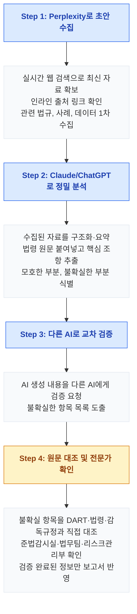

# 모듈 4: 리서치와 자료 검색 — "AI로 전문 자료를 빠르고 정확하게 찾는 법"

> **대상**: 한국산업은행(KDB) 임직원
> **학습 시간**: 약 35분
> **핵심 키워드**: AI 검색 전략, 교차 검증, 법률/규제 검색, Perplexity, Deep Research, 할루시네이션 방지

---

## 학습 목표

1. AI 검색 도구별 강점과 약점을 이해하고 목적에 맞게 선택할 수 있다
2. 금융·정책금융 특화 리서치 전략(기업분석·산업분석·시장동향)을 수립하고 실행할 수 있다
3. 법률/규제 검색 시 AI 검색 → 원문 확인 → 전문가 검증의 3단계를 적용할 수 있다
4. 교차 검증 워크플로로 AI 검색 결과의 신뢰도를 확보할 수 있다

---

## 1. AI 검색 전략 — 도구별 강점/약점 비교

### 왜 도구 선택이 중요한가?

전문 자료를 AI로 검색할 때, **어떤 도구를 쓰느냐에 따라 결과의 품질과 신뢰도가 크게 달라집니다.** 모든 AI가 검색에 강한 것은 아닙니다. 각 도구의 특성을 이해하고 목적에 맞게 골라 써야 합니다.

> 🔑 **핵심**: AI 검색은 "시작점"이지 "결론"이 아닙니다. 특히 법률, 수치, 조항 번호, 재무 데이터는 반드시 원문(DART·법령·감독규정)과 대조하세요.

### AI 검색 도구 비교표 (2026년 기준)

| 도구 | 핵심 강점 | 검색 전략 | 한계 | 비용 |
|------|----------|----------|------|------|
| **Perplexity** | 실시간 웹 검색 + 인라인 출처 링크, SimpleQA 정확도 93.9% | 최신 금융 뉴스, 금리/환율 동향, 해외 규제 검색. "출처를 표시하고 원문 링크를 포함해줘" 명시 | 법령·감독규정 원문보다 해석이 섞일 수 있음. 긴 사업보고서 분석은 약함 | 무료/Pro $20/월 |
| **ChatGPT Deep Research** | o3 모델 기반 멀티스텝 리서치, 수백 개 소스 자동 분석 | 산업분석 리포트, 글로벌 시장 조사, 해외 규제·정책 심층 분석 | 5~30분 소요. 실시간 속보에는 Perplexity보다 느림 | Plus $20/월 이상 |
| **Claude Research** | 261개 이상 소스 고속 처리, 긴 문서 정밀 분석, 복잡한 조건 준수 | 여신 약정서·투자설명서·사업보고서 원문을 붙여넣고 핵심 조항 추출. 긴 계약서/감독규정 분석 | Max($100/월) 이상 필요. 웹 검색은 Research 모드 한정 | Pro $20/월, Max $100/월 |
| **Gemini Deep Research** | Google 검색 직접 연동, 최신 뉴스/보도자료 강점, Google 생태계 통합 | 최신 규제 변경 사항, 금융당국·한은 보도자료, Google Scholar 금융 논문 탐색 | 긴 법령 문서 상세 분석보다 요약에 집중 | Advanced $20/월 |

### 상황별 도구 선택 가이드

| 검색 목적 | 1순위 도구 | 2순위 도구 | 이유 |
|----------|----------|----------|------|
| 최신 금융 뉴스/시장 이벤트 | Perplexity | Gemini | 실시간 웹 검색 + 출처 링크 |
| 산업분석 심층 보고서 작성 | ChatGPT Deep Research | Claude Research | 수백 개 소스 자동 종합 분석 |
| 감독규정·법령 원문 정밀 분석 | Claude | ChatGPT | 긴 문서 분석 + 조건 준수 능력 |
| 학술 논문(NBER, SSRN) 탐색 | Gemini | Perplexity | Google Scholar 연동 |
| 빠른 팩트체크(금리·환율·지표) | Perplexity | Gemini | 출처 링크로 즉시 원문 확인 |
| 여신 약정서/투자설명서 비교 | Claude | ChatGPT | 긴 문서 비교 분석에 최적화 |

💡 **팁**: 하나의 도구만 고집하지 마세요. **목적에 따라 2~3개 도구를 조합**하면 검색 품질과 신뢰도가 크게 올라갑니다. 예를 들어 "Perplexity로 최신 시장 동향 수집 → Claude로 감독규정 정밀 분석 → DART 원문 대조"가 효과적입니다.

---

## 2. 금융·정책금융 자료 빠르게 찾기

### 2-1. 금감원 전자공시(DART) 검색

기업여신 심사, 산업분석, M&A 검토 시 **DART(전자공시시스템)** 자료가 필수입니다. AI를 활용하면 방대한 사업보고서·분기보고서·주요사항보고서를 빠르게 요약하고 비교할 수 있습니다.

**프롬프트 예시 — DART 공시 분석 요청**:

```
당신은 기업여신 심사역입니다.

아래는 [대상 기업명]의 2026년 사업보고서에서 발췌한
재무제표와 사업부문 실적 테이블입니다.

(DART에서 복사한 표 데이터를 여기에 붙여넣기)

요청:
1. 전년 동기 대비 주요 지표 변동 분석 (매출·영업이익·부채비율, 표 형식)
2. 유동성·수익성·안정성·성장성 지표에서 주목할 점 3가지
3. 여신심사 의견 작성용 1문단 요약

조건: 수치는 원 데이터를 그대로 인용하고, AI 추론 부분은 "[분석]"으로 표시
```

> ⚠ **주의**: 내부 심사 자료를 AI에 붙여넣을 때는 **기업의 비공개 정보(미공시 계획, 내부 신용등급 등)가 포함되어 있지 않은지 반드시 확인**하세요. 외부 AI에는 **DART 등 공개된 공시 자료만** 입력해야 합니다.

### 2-2. 산업 데이터·시장 데이터 검색 (FnGuide, KIS Value, 한은 ECOS, KIET)

기업·산업 분석에는 정량 데이터 확보가 핵심입니다. **FnGuide, KIS Value, NICE 평가정보, 한국은행 ECOS, 산업연구원(KIET), KDB 미래전략연구소** 등이 주요 출처입니다.

**프롬프트 예시 — 산업 동향 자료 수집**:

```
당신은 산업분석 애널리스트입니다.

주제: 국내 2차전지 산업 2026년 CAPEX 투자 전망
조사 범위: 최근 12개월 보도·공시·정부 정책

아래 항목별로 공식 출처를 함께 정리해주세요:
1. 주요 국내 업체의 CAPEX 계획 (DART 주요사항보고서·IR)
2. 한국은행 ECOS·KIET 산업통계 기준 생산·수출 지표
3. 정부 정책(첨단전략산업법, K-Taxonomy) 관련 최근 발표
4. 해외 경쟁 동향 (Bloomberg, Refinitiv, CEIC 등)
5. 애널리스트 컨센서스와 차이가 큰 포인트

출처 URL을 반드시 표시하고, 추정치는 "[추정]"으로 구분
```

### 2-3. 여신 약정서·투자설명서·인수계약서 해석

여신 약정서, 투자설명서, 인수계약서는 수십~수백 페이지에 달하는 장문 문서입니다. Claude와 같이 **긴 문서 처리에 강한 AI**를 활용하면 효율적입니다.

```
아래는 [딜명] 인수금융 약정서 전문입니다. (PDF 파일 첨부 또는 전문 붙여넣기)

요청:
1. 주요 조건 요약 (금리, 만기, 상환구조, 담보·보증)
2. 재무약정(Covenant) 조항 정리 (DSCR, 부채비율, 이자보상배율)
3. 기한이익상실(EOD) 사유 중 분쟁 가능성 높은 조항 3가지
4. 유사 딜(참고 약정서) 대비 차별점
5. 해석이 모호한 부분 표시

조건: 약정서 원문의 조항 번호를 반드시 인용
```

---

## 3. 산업·기업 리서치

### 3-1. 산업 동향 조사 (리서치 리포트, 학술 논문)

정책금융과 기업여신 심사에서는 **산업 전망과 정책 동향** 리서치가 핵심입니다.

**프롬프트 예시 — 산업 전망 리서치**:

```
당신은 산업분석부 수석 애널리스트입니다.

주제: 국내 해상풍력 발전 산업 중장기 전망
조사 범위: 2024~2026년

아래 항목을 조사하여 산업분석 리포트를 작성해주세요:
1. 국내 주요 사업자·EPC·기자재 업체 현황 (프로젝트 단위)
2. 핵심 리스크 요인과 대응 현황 (표 형식)
   - 인허가·계통연계·금융조달·정책 변동
3. 정부 정책·지원제도 변화 (산업부·해수부 보도자료, 그린뉴딜)
4. 해외 벤치마크(영국, 대만, 네덜란드) 사례
5. KDB 관점의 금융 지원 시사점 3가지

출처를 반드시 표시하고(KIET, KDB 미래전략연구소, IEA, IRENA 등),
확인되지 않은 정보는 "[미확인]"으로 표시
```

> 💡 **팁**: 학술·리서치 검색은 AI 결과만으로 완결하지 마세요. **NBER, SSRN, KCI 금융학, 한국금융연구원, IMF WEO, BIS, 산업연구원 리포트**에서 직접 원문을 확인해야 합니다. AI는 논문 제목·저자·페이지를 잘못 생성하는 경우가 많습니다.

### 3-2. 기업 이슈·시장 이벤트 사례 검색

여신 심사·리스크 보고서 작성 시 **유사 업종·유사 기업의 이슈 사례**를 참고하면 리스크 평가의 설득력이 높아집니다.

```
최근 5년간 국내 대기업·중견기업의 회사채 신용등급 하향 사례를
조사해주세요.

각 사례에 대해:
1. 발표 일시 및 기업명·업종
2. 등급 변동 내역 (기존 → 변경, 신평사별)
3. 주요 사유 (재무 악화, 업황, 지배구조, 지배주주 리스크 등)
4. 주가·회사채 스프레드 반응
5. 이후 재무구조 개선·구조조정 진행 현황
6. 출처 (한국신용평가 KIS, NICE신용평가, 금감원 전자공시, 한국거래소 공시)

표 형식으로 정리하고, 투자등급과 투기등급을 구분해주세요.
⚠ 확인되지 않은 등급 변동은 절대 포함하지 마세요.
```

### 3-3. 경쟁사·유사 기업 동향 분석

```
당신은 기업여신 심사역입니다.

주제: [대상 기업명]의 최근 1년간 사업·재무 동향 분석

아래 항목을 조사해주세요:
1. 최근 투자·인수·합병 발표
2. 사업부문별 매출·영업이익 추이 (분기보고서 기준)
3. 주요 고객·공급망 변화
4. 차입구조 및 만기 프로파일 (회사채·CP·은행 차입)
5. 동종업계 비교 시 상대적 강점/약점

출처를 반드시 표시하고, DART·IR·신평사 리포트 기반으로 작성
추측성 내용은 "[추정]"으로 명확히 구분
```

---

## 4. 법률/규제 검색법

### 4-1. 국내 금융 관련 법규

KDB 업무에서 자주 참고하는 법규와 AI 검색 전략입니다.

| 법률 | 주요 검색 포인트 | AI 활용 팁 |
|------|----------------|-----------|
| **자본시장법** | 금융투자상품 규제, 시장질서 교란행위 금지, 공시 의무 | 금융위원회 유권해석·FAQ까지 확인 필요 |
| **여신전문금융업법** | 여전업 인가·영업 규제, 리스·팩토링 규정 | 감독규정·시행세칙까지 3단계 확인 |
| **외국환거래법** | 대외거래 신고·보고, 자본이동 규제 | 기재부·한은 외환 관련 고시 최신본 확인 |
| **금융소비자보호법** | 적합성·적정성 원칙, 설명 의무, 불완전판매 | 2021년 시행 이후 판례·제재사례 축적 중 |
| **한국산업은행법** | KDB 업무 범위·지원 대상·정부 출자 | 개정 이력과 시행령까지 최신 버전 확인 |

### 4-2. 글로벌 금융 규제·감독 관련 기준

| 규제/기준 | 주요 검색 포인트 | AI 활용 팁 |
|----------|----------------|-----------|
| **바젤 III / III.5** | 자본비율, 유동성(LCR/NSFR), 레버리지 비율 | BIS 원문과 금감원 시행안 모두 확인 |
| **IFRS 9 / IFRS 17** | 금융상품 분류·손상(ECL), 보험부채 측정 | 한국회계기준원·금감원 Q&A 병행 확인 |
| **K-Taxonomy / TCFD** | 녹색분류체계, 기후 관련 재무공시 | 환경부·금융위·FSB 가이드라인 교차 확인 |
| **SEC / PRA / ECB** | 미국·영국·유로존 은행 감독 기준 | 해외 원문 검색은 Perplexity·Gemini로 보완 |

감독·정책 기관 출처 우선순위: **금융위원회, 금융감독원, 한국은행, 기획재정부, 금융정보분석원(FIU), FSB, BIS, IMF, SEC, PRA, ECB.**

### 4-3. 법규 검색 3단계 — AI 검색 → 원문 확인 → 전문가 검증

법률/규제 정보는 AI가 가장 많이 **할루시네이션을 일으키는 영역**입니다. 반드시 3단계 검증을 거쳐야 합니다.

```
[3단계 검증 프로세스]

Step 1: AI 검색 (시작점)
→ Perplexity/ChatGPT로 관련 법규 초안 수집
→ "출처 링크를 반드시 포함해줘" 명시
→ 확실하지 않은 부분은 "확인 필요"로 표시 요청

Step 2: 원문 확인 (검증)
→ 국가법령정보센터(law.go.kr)에서 조항 원문 대조
→ 금융위원회(fsc.go.kr), 금융감독원(fss.or.kr), 한국은행, BIS, IMF 등에서 세부 기준 확인
→ AI 요약과 원문 내용이 일치하는지 항목별 체크

Step 3: 전문가 검증 (최종)
→ 준법감시실, 법무팀, 리스크관리부에 최종 확인 요청
→ 보고서에 "검증 완료/미완료" 상태를 명시
→ 여신·투자 의사결정에 영향을 미치는 조항은 반드시 전문가 확인 후 반영
```

> ⚠ **주의**: AI가 "자본시장법 제178조에 따르면..."이라고 구체적으로 인용해도, **실제로 해당 조항 내용이 전혀 다를 수 있습니다.** 구체적 숫자(조항 번호, 자기자본비율, 한도, 과징금)가 나올수록 오히려 더 의심하고 검증 우선순위를 높이세요.

---

## 5. Before/After 예시 1 — 신규 대출 상품의 규제 적용 검토

**상황**: 신규 중견기업 대상 지속가능연계대출(SLL) 상품 출시 전, 적용 법규·감독규정을 조사해야 합니다.

**Before — 막연한 검색 요청**

```
지속가능연계대출 관련 법률 알려줘.
```

**AI 결과:**
> 지속가능연계대출(SLL)은 금융소비자보호법, 여신전문금융업법, K-Taxonomy 등 다양한 규제를 고려해야 합니다. 금융소비자보호법에서는 설명 의무와 적합성 원칙을 규정하고 있으며...

→ **문제점**: 일반적인 설명만 나열. 구체적 조항 없음. 어떤 규제가 우리 상품에 적용되는지 알 수 없음.

**After — 3단계 검증 워크플로 적용**

**Step 1: Perplexity로 관련 법규 초안 수집**

```
국내 은행이 중견기업 대상 지속가능연계대출(SLL, Sustainability-Linked Loan)
상품을 출시하려 합니다. 적용이 예상되는 국내 법규와 글로벌 기준을
정리해주세요.

각 항목에 대해 표 형식으로 작성:
- 법령·가이드라인명 및 정확한 조항 번호(또는 섹션)
- 핵심 규제 내용 (50자 이내)
- SLL 상품에 미치는 구체적 영향
- 원문 확인 가능한 URL (금융위, 금감원, 환경부, ICMA, LMA 등)

⚠ 확실하지 않은 조항은 "확인 필요"로 반드시 표시해주세요.
출처가 없는 정보는 포함하지 마세요.
```

**Step 2: Claude로 감독규정 원문 정밀 분석**

```
아래는 금융감독원 홈페이지에서 복사한 "은행업감독규정" 중
ESG·녹색금융 관련 조항 원문입니다.

(감독규정 원문을 여기에 붙여넣기)

위 원문에서 SLL 상품 설계·리스크 관리·공시와 관련된 조항을
모두 찾아 다음 형식으로 정리해주세요:
- 정확한 조항 번호와 제목
- 해당 조항의 핵심 내용 요약 (150자 이내)
- SLL 출시 시 준수해야 할 구체적 사항
- 위반 시 제재 내용 (시정명령, 기관·임직원 제재 등)

⚠ 원문에 명시되지 않은 내용은 절대 추가하지 마세요.
원문에 근거한 내용만 작성하세요.
```

**Step 3: 검증 결과 정리**

```
[검증 결과 요약]
AI 1차 검색 결과: 관련 조항·가이드라인 6개 제시
→ 원문 대조 결과: 5개 정확, 1개 조항 번호 오류 식별 및 수정
→ 검증된 5개 조항만 보고서 반영
→ 1개는 준법감시실 확인 요청 후 최종 반영 예정

총 소요 시간: AI 검색 5분 + 원문 대조 15분 = 20분
(기존 수동 조사 대비: 3~4시간 → 20분으로 단축)
```

→ **개선 효과**: 구체적 조항까지 빠르게 파악하면서도, 3단계 검증으로 정확성 확보.

| 개선 요소 | 적용 내용 | 효과 |
|----------|----------|------|
| 상품 특정 | SLL(중견기업·지속가능연계) 구체적 상품 정의 | 범용 답변이 아닌 실제 상품 맞춤 결과 |
| 출처 요구 | URL 포함 요청 | 원문 대조 즉시 가능 |
| 불확실성 표시 | "확인 필요" 태그 요청 | AI의 자체 불확실성 인지 활용 |
| 도구 분리 | Perplexity(검색) → Claude(분석) | 각 도구의 강점 극대화 |

---

## 6. Before/After 예시 2 — 해외 PF 딜의 규제·환리스크 검토

**상황**: 동남아 태양광 PF 참여 검토 중, 외국환거래법·바젤 III 관련 규제 준수 여부를 점검해야 합니다.

**Before — 단순 질문**

```
해외 PF 나갈 때 지켜야 할 법률이 뭐야?
```

**AI 결과:**
> 해외 프로젝트파이낸스 참여 시 외국환거래법, 은행법, 바젤 III, 금융소비자보호법 등을 준수해야 합니다. 외국환거래법에서는 대외거래 신고 절차를 규정하고 있으며...

→ **문제점**: 법률 이름 나열 수준. 구체적 체크리스트 없음. 실무 적용 불가.

**After — 역할+구조+검증 요청 결합**

```
당신은 KDB 컴플라이언스·리스크 전문가입니다.

상황: 우리 은행이 동남아 특정국(가상) 태양광 발전 PF에 대주단으로
참여하려 합니다. 참여 전 적용 법규·규제 준수 여부를 검토해야 합니다.

아래 구조로 규제 준수 체크리스트를 작성해주세요:

1. 적용 법규 매핑
   - 법률 → 시행령 → 감독규정 → 세부 지침 단계별 정리
   - 외국환거래법, 한국산업은행법, 은행업감독규정, 바젤 III(신용·국가 리스크) 포함
   - 해외 현지법(프로젝트국) 유의사항은 별도 섹션

2. 준수 항목 체크리스트 (표 형식)
   - 항목명
   - 관련 조항 (법률명 + 조항 번호)
   - 준수 기준 요약
   - 현재 상태 (준수/미확인/미준수)
   - 비고(환리스크·국가리스크·제재 대상국 여부 등)

3. 특히 주의해야 할 사항
   - 외국환거래 신고·보고 의무
   - 국가·환리스크 한도 관리
   - 제재(OFAC, EU, UN) 및 AML·CFT 대응
   - ESG·TCFD 관련 공시

4. 검증 필요 사항
   - 위 체크리스트 중 원문 대조가 필요한 항목 표시
   - 준법감시실/법무팀/리스크관리부 확인 필요 항목 별도 표시

⚠ AI가 제시하는 조항 번호는 검증 전이므로 "검증 필요"를 기본 표시하고,
확신할 수 있는 조항만 "확인됨"으로 표시해주세요.
```

→ **개선 효과**: 법규 매핑부터 체크리스트까지 실무에 즉시 활용 가능한 구조. 검증 필요 항목이 명시되어 후속 작업 우선순위 파악 용이.

| 개선 요소 | 적용 내용 | 효과 |
|----------|----------|------|
| 역할 특정 | KDB 컴플라이언스·리스크 전문가 | 정책금융·국제금융 관점의 답변 |
| 법규 매핑 요청 | 법률→시행령→감독규정 단계 | 규제 체계 전체를 조망 |
| 체크리스트 구조 | 표 형식 + 상태 표시 | 실무 검토 문서로 즉시 활용 |
| 불확실성 관리 | "검증 필요" 기본 표시 요청 | 과신 방지, 검증 우선순위 명확화 |

---

## 7. 교차 검증 워크플로 — 신뢰도 높은 리서치의 비결

### 왜 교차 검증이 필요한가?

AI는 자신 있게 **존재하지 않는 법률 조항을 만들어내거나, 실제와 다른 수치(금리, 스프레드, 재무비율)를 제시**할 수 있습니다. 이것이 할루시네이션(Hallucination)입니다. 단일 AI의 결과를 그대로 신뢰하면 여신·투자·리서치 보고서의 신뢰도가 무너집니다.

> 🔑 **핵심**: 전문가들은 **서로 다른 AI에게 역할을 분담**시킵니다. A 도구로 초안 수집 → B 도구로 정밀 분석 → C 도구로 교차 검증 → 원문(DART, 법령, 감독규정) 대조. 이 방식이 할루시네이션을 효과적으로 걸러냅니다.

### 교차 검증 4단계 워크플로



### 교차 검증 프롬프트 예시

**다른 AI에게 검증을 요청하는 프롬프트**:

```
아래 AI가 생성한 법규 요약문에서 사실과 다를 가능성이 있는
부분을 찾아주세요.

검토 대상:
"자본시장법 제178조에 따르면, 부정거래 금지 규정은 금융투자상품 전반에
적용되며 위반 시 10년 이하의 징역 또는 5억 원 이하의 벌금이 부과됩니다.
또한 여신전문금융업법 제50조는 대주주 신용공여 한도를 자기자본의 1%로
제한하고 있습니다."

검토 방법:
1. 조항 번호(제178조, 제50조)의 실제 내용이 일치하는지 확인
2. 구체적 수치(10년, 5억 원, 1%)가 정확한지 확인
3. 적용 대상 범위가 적절한지 확인
4. 최신 개정으로 바뀌었을 수 있는 부분 표시
5. 불확실한 부분은 확실성 수준(높음/중간/낮음)을 표시
```

**AI 자체 진단 프롬프트** (생성 직후 같은 AI에게 바로 사용):

```
위에서 네가 작성한 법규 내용 중:
1. 조항 번호가 틀릴 가능성이 있는 부분은?
2. 수치(한도, 비율, 벌금, 기간)가 불확실한 부분은?
3. 최신 개정으로 바뀌었을 수 있는 부분은?

각 항목에 확실성 수준(높음/중간/낮음)을 표시해줘.
```

> 💡 **팁**: "자기 진단 요청"은 AI가 스스로 불확실한 부분을 표시하게 하는 기법입니다. 완벽하지는 않지만, **원문 확인 우선순위를 빠르게 파악**하는 데 효과적입니다.

---

## 8. 검색 프롬프트 최적화 — 법률/금융 검색에 특화된 작성법

### 8-1. 법률 검색 프롬프트 최적화 원칙

| 원칙 | 나쁜 예 | 좋은 예 | 이유 |
|------|--------|--------|------|
| **대상·상품 특정** | "금융상품 규제" | "중견기업 대상 SLL(지속가능연계대출) 관련 규제" | 범용 답변 방지 |
| **법률 단계 명시** | "관련 법률" | "법률 → 시행령 → 감독규정 → 세부 지침 단계별" | 규제 체계 전체 조망 |
| **출처 요구** | (별도 언급 없음) | "원문 URL 포함(금융위·금감원·BIS·IMF), 출처 없으면 제외" | 검증 가능성 확보 |
| **불확실성 표시** | (별도 언급 없음) | "확실하지 않으면 '확인 필요' 표시" | 과신 방지 |
| **최신성 확인** | (별도 언급 없음) | "2024년 이후 개정 사항 포함" | 구 법령 인용 방지 |

### 8-2. 금융 리서치 프롬프트 최적화 원칙

| 원칙 | 나쁜 예 | 좋은 예 | 이유 |
|------|--------|--------|------|
| **대상 특정** | "2차전지 산업 동향" | "국내 양극재 업체 3사의 2026년 CAPEX 계획과 주요 고객 믹스" | 검색 범위 좁혀 품질 향상 |
| **비교 기준 명시** | "기업 비교" | "A사/B사/C사의 부채비율, DSCR, 만기 프로파일, 회사채 스프레드 비교" | 비교축 명확화 |
| **데이터 유형 지정** | "자료 찾아줘" | "분기별 매출·영업이익, 회사채 발행액, 신용등급 변동" | 정량적 데이터 확보 |
| **추측/사실 구분** | (별도 언급 없음) | "공시된 사실과 시장 추정을 구분해서 표시" | 정보 신뢰도 관리 |

### 8-3. 검색 효율을 높이는 프롬프트 패턴

**패턴 1: 단계적 검색 (Layered Search)**

```
[1단계 — 전체 조망]
"국내 회사채 시장 관련 규제·공시 분야를 카테고리별로 분류해줘"

[2단계 — 특정 분야 심화]
"위 카테고리 중 '증권신고서·투자설명서 관련 공시 의무'를 상세히 조사해줘"

[3단계 — 구체적 조항 확인]
"자본시장법 중 증권신고서 효력 발생·정정신고 관련 조항만 정리해줘"
```

> 💡 **팁**: 처음부터 세부 사항을 검색하면 빠뜨리는 부분이 생깁니다. **전체 조망 → 분야 심화 → 세부 확인** 순서로 진행하면 누락 없이 체계적으로 조사할 수 있습니다.

**패턴 2: 대비 검색 (Contrastive Search)**

```
"국내 회사채 스프레드 최근 3개월 동향을 조사해줘.
등급별(AA/A/BBB) 스프레드 축소·확대 요인을 장점·단점 관점에서 모두 정리하고,
발행시장 수급·정책 이슈도 함께 언급해줘."
```

**패턴 3: 시간축 검색 (Temporal Search)**

```
"바젤 III(최종) 규제가 2020년 이후 어떻게 국내에 도입·시행되었는지
연도별로 정리해줘. 현재 시행 중인 최신 기준(자본비율, LCR/NSFR,
레버리지비율)과 향후 예정된 규제(Basel III.5 등) 포함."
```

---

## 실습 & 퀴즈

### 퀴즈 1 — AI 검색 도구 선택

Q. 인수금융 약정서 전문(80페이지)을 분석하여 재무약정(Covenant) 조항을 추출해야 합니다. 가장 적합한 도구와 전략은?

(A) Perplexity로 약정서 내용을 검색한다
(B) Claude에 약정서 PDF를 업로드하고 재무약정 조항 추출을 요청한다
(C) ChatGPT에게 "인수금융 약정서 요약해줘"라고 요청한다
(D) Gemini에서 Google 검색으로 약정서 내용을 찾는다

**정답**: (B) Claude에 약정서 PDF를 업로드하고 재무약정 조항 추출을 요청한다 — Claude는 긴 문서 분석과 복잡한 조건 준수에 강점이 있습니다. 80페이지 약정서를 통째로 업로드하고 특정 조건(예: "DSCR·부채비율 관련 Covenant만 추출")으로 분석을 요청하면 가장 정확한 결과를 얻을 수 있습니다.

### 퀴즈 2 — 할루시네이션 대응

Q. AI가 "여신전문금융업법 제50조는 대주주 신용공여 한도를 자기자본의 1%로 제한하고 있습니다"라고 답변했습니다. 올바른 대응은?

(A) AI가 조항 번호까지 구체적으로 제시했으므로 그대로 보고서에 인용한다
(B) 다른 AI에게 같은 질문을 해서 같은 답이 나오면 신뢰한다
(C) 국가법령정보센터(law.go.kr)에서 제50조 원문과 금감원 감독규정을 직접 확인한 후 반영 여부를 결정한다
(D) AI에게 "정말 맞아?"라고 물어봐서 "맞다"고 하면 사용한다

**정답**: (C) 국가법령정보센터·금감원 감독규정에서 원문을 직접 확인한다 — AI가 구체적 조항 번호와 수치(한도, 비율, 벌금)를 제시할수록 오히려 검증 우선순위가 높습니다. 원문 대조 없이는 어떤 AI 답변도 여신·규제 보고서에 사용할 수 없습니다. (B)의 "다른 AI 교차 확인"은 1차 필터로는 유용하지만, 원문 대조를 대체할 수는 없습니다.

### 퀴즈 3 — 산업·기업 리서치

Q. 국내 2차전지 산업 2026년 CAPEX 투자 전망을 조사해야 합니다. 가장 효과적인 AI 활용 전략은?

(A) ChatGPT에게 "2차전지 산업 전망 알려줘"라고 질문한다
(B) Perplexity로 최신 공시·보도자료를 검색하고, Claude에 주요 기업의 사업보고서 PDF를 업로드하여 CAPEX·매출 비교표를 작성한다
(C) Gemini에게 "battery industry outlook"을 검색시키고 결과를 그대로 보고서에 인용한다
(D) 사내 LLM에게 경쟁사 미공시 투자 정보를 물어본다

**정답**: (B) — 금융 리서치는 **수집과 분석을 분리**하는 것이 핵심입니다. Perplexity로 최신 출처가 표시된 공시·보도를 수집하고, Claude에 DART 사업보고서 원문을 업로드하여 정밀 분석하면 깊이 있는 기업·산업 비교가 가능합니다. (A)는 최신 정보가 누락될 수 있고, (C)는 원문 검증이 빠져 있으며, (D)의 사내 LLM은 외부 공시 데이터가 제한적이고 **미공시 정보는 애초에 다루면 안 됩니다**.

---

## 핵심 요약

| 번호 | 핵심 포인트 | 실전 적용 |
|------|-----------|----------|
| 1 | AI 검색 도구마다 강점이 다르다 | Perplexity=실시간 검색, Claude=문서 분석, ChatGPT=심층 리서치, Gemini=Google 연동 |
| 2 | 법률/규제는 3단계 검증 필수 | AI 검색 → 원문 확인(law.go.kr, 금융위, 금감원, BIS) → 준법감시실 검증 |
| 3 | 교차 검증으로 할루시네이션 방지 | 서로 다른 AI에 역할 분담: 수집 → 분석 → 검증 |
| 4 | 검색 프롬프트도 설계가 필요하다 | 대상·상품 특정, 출처 요구, 불확실성 표시 요청 |
| 5 | 검증 시간을 포함해도 전통 방식보다 빠르다 | AI 검색 + 원문 대조 = 기존 수동 조사 대비 50~80% 시간 절감 |

---

## 다음 모듈 예고

> 모듈 4에서 AI 검색과 교차 검증 방법을 익혔다면, **모듈 5: 할루시네이션과 팩트체크**에서는 AI가 만들어내는 **허위 정보의 유형과 패턴**을 깊이 분석하고, KDB 업무별 맞춤 **팩트체크 체계**를 구축하는 방법을 배웁니다. 특히 기업여신 심사의 재무 데이터, 산업분석의 시장 지표, 법규·감독규정 인용에서 할루시네이션이 초래하는 실제 위험 사례와 방지 전략을 실습합니다.
