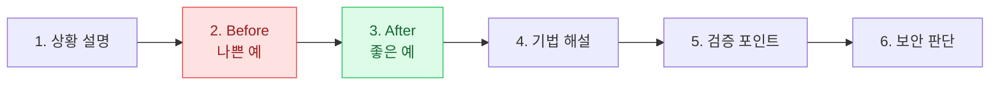

# 모듈 6: 산업별 실전 시나리오

> **대상**: 한국산업은행(KDB) 임직원
> **학습 시간**: 약 50분
> **핵심 키워드**: 실전 시나리오, 프롬프트 설계, 팩트체크 워크플로, 보안 판단, KDB 실무 AI 활용

---

## 학습 목표
1. KDB 임직원의 실제 업무 상황에서 AI를 활용한 문제 해결 워크플로를 설계할 수 있다
2. Before/After 비교를 통해 프롬프트 설계, 할루시네이션 방지, 보안 판단을 통합 적용할 수 있다
3. 각 시나리오의 검증 포인트와 보안 판단 기준을 실무에 즉시 적용할 수 있다

---

## 에이전틱 워크플로우 — AI 팀원 설계

실제 KDB 업무는 "한 번 묻고 한 번 답 받는" 구조로는 해결되지 않습니다. 여신 후보 발굴 → 재무 분석 → 업종 비교 → 심사 메모 작성 → 자체 검토까지 여러 단계가 맞물려 돌아갑니다. 이 한계를 극복하는 방식이 **에이전틱 워크플로우(Agentic Workflow)**입니다.

에이전틱 워크플로우는 AI가 단일 답변이 아니라, **스스로 계획·실행·검증을 반복**하며 다단계 업무를 수행하는 방식입니다. 여러 명의 전문가가 협업하는 팀처럼, 각자 역할을 맡은 AI 에이전트들이 결과를 주고받으며 업무를 완성합니다.

### 단순 프롬프트 vs 에이전틱 워크플로우

| 구분 | 단순 프롬프트 방식 | 에이전틱 워크플로우 방식 |
|------|-----------------|----------------------|
| **동작 방식** | 질문 1개 → 답변 1개 | AI가 계획 → 실행 → 검증을 자동 반복 |
| **사람의 개입** | 매 단계마다 사람이 직접 다음 질문 입력 | AI가 자율적으로 다음 단계 진행, 핵심 판단만 사람이 수행 |
| **적합한 업무** | 단문 요약, 번역, 간단 질의응답 | 복잡한 분석, 다단계 보고서 작성, 종합 리서치 |
| **KDB 예시** | "2차전지 업종 신용리스크 3가지 알려줘" | 여신 후보 추출 → 재무 분석 → 업종 비교 → 심사 메모 → 자체 검토 |

### 에이전트 설계 3단계

에이전트는 "특정 역할을 맡은 AI 팀원"이라고 이해하면 쉽습니다. 설계는 다음 3단계로 이루어집니다.

1. **업무 목표 정의** — 최종 결과물이 무엇인지 명확히 한다. (예: "여신심사의견서 초안 1부")
2. **단계 분해** — 목표 달성에 필요한 작업을 순서대로 나열한다. (예: 재무 → 업종 → 담보 → 종합)
3. **역할 부여** — 각 단계에 가장 적합한 전문가 역할(페르소나)을 배치한다.

### 예시 1 — 여신심사 에이전트 팀 (KDB)

중견 기업 A社 시설자금 500억 신규 여신 심사를 에이전트 팀으로 구성하면 다음과 같습니다.

| 에이전트 | 역할 | 수행 업무 |
|---------|------|---------|
| **재무분석 에이전트** | 재무분석 전문가 (10년) | DART 재무제표 추출·주요 비율 계산(부채비율·DSCR·이자보상배율)·3개년 추이 정리 |
| **업종분석 에이전트** | 산업 애널리스트 (수석) | 해당 업종 사이클·경쟁 구도·주요 매출처 집중도·정책 리스크 분석 |
| **담보평가 에이전트** | 담보평가 전문가 | 감정평가서 핵심 항목 검토·유효담보가치·LTV 산정·담보 유동성 점검 |
| **통합 에이전트** | 20년차 기업여신 심사역 | 위 3개 결과를 심사의견서 양식으로 통합, 등급 후보·여신 조건 초안 작성 |

한 명의 "만능 심사역 AI"에게 모든 걸 맡기는 것보다, **역할별 에이전트가 협업**할 때 각 단계 품질이 훨씬 높아집니다.

### 예시 2 — PF 타당성 에이전트 팀 (KDB)

국내 해상풍력 500MW PF 사전 검토를 에이전트 팀으로 구성하면 다음과 같습니다.

| 에이전트 | 역할 | 수행 업무 |
|---------|------|---------|
| **시장분석 에이전트** | 신재생 산업 리서치 | RPS·REC 정책 동향, 국내외 해상풍력 이용률 벤치마크, 터빈 공급사 동향 수집 |
| **CF모델링 에이전트** | PF 재무 모델러 | 연도별 매출·운영비·EBITDA·CFADS 추정, 원리금 상환 스케줄 작성 |
| **리스크평가 에이전트** | 리스크 관리 전문가 | 정책·건설·운영·금융 리스크 식별 및 민감도 시나리오(REC·이용률·환율·건설비·금리) 도출 |
| **종합 에이전트** | 15년차 PF 심사역 | 위 3개 결과를 타당성 검토 메모로 통합, DSCR/LLCR 요약 + Covenant 충족 여부 + 리스크 매트릭스 작성 |

### 워크플로우 설계 3원칙 — 분해 → 자동화 → 검증

워크플로우가 실제로 작동하려면 아래 3원칙을 지켜야 합니다.

- **분해** — 큰 업무를 입력·출력이 명확한 작은 단계로 쪼갠다. (예: "여신심사의견서 작성" → 재무 → 업종 → 담보 → 등급)
- **자동화** — 앞 단계의 출력이 다음 단계의 입력이 되도록 연결해, 사람이 매번 다음 질문을 입력하지 않아도 흘러가게 한다.
- **검증** — 중간중간 AI 자체 검증 + 사람 확인 단계를 반드시 끼워 넣는다.

### Human-in-the-loop — 사람이 반드시 참여해야 하는 이유

에이전틱 워크플로우가 아무리 정교해도, 최종 판단과 책임은 사람에게 있습니다. 이유는 세 가지입니다.

- **할루시네이션 위험** — AI는 여전히 그럴듯한 거짓 정보를 만들 수 있습니다. 재무 수치·법령 조항·공시 출처는 사람이 원문과 교차 확인해야 합니다.
- **업무 맥락·회사 상황 종합 판단** — KDB 여신 포트폴리오 구성, 정책금융 우선순위, 감독원 협의 상황 같은 "행내 특수 맥락"은 사람만이 종합할 수 있습니다.
- **최종 결과 책임** — 여신·투자·PF 의사결정에 대한 법적·감독상 책임은 심사역·심사위원회·임원에게 있습니다. AI가 책임질 수 없는 영역입니다.

> 🔑 핵심: **"일상 작업은 AI가, 사람은 판단·의사결정에 집중"** — 반복적 집계·초안 작성·자료 비교는 에이전트 팀에 맡기고, 심사역·애널리스트는 판단과 승인에 시간을 쓰는 구조가 에이전틱 워크플로우의 목표입니다.

---

## 시나리오 구성 안내

본 모듈에서는 **KDB 실무 시나리오 3개**(기업여신 심사 / 산업분석 리포트 / 프로젝트파이낸스 검토)를 다룹니다. 각 시나리오는 동일한 6단계 구조를 따릅니다:



> 🔑 핵심: 이 모듈에서 다루는 시나리오는 모듈 1~5에서 배운 모든 기법의 **통합 적용 실습**입니다. 역할 부여, 구조화, CoT, Few-shot, 할루시네이션 방지, 팩트체크를 한 번에 적용합니다.

---

# 시나리오

---

## 시나리오 1: 기업여신 심사 리포트 작성

### 1. 상황 설명

> 당신은 KDB **여신심사부 심사역**입니다. 중견기업 A사(자동차 부품 업종)가 신규 사업장 증설을 위해 **시설자금 500억 원 대출**을 신청했습니다. 최근 3개년 재무제표, 담보(사업용 부지 + 건물 + 기계설비), 업종 동향을 바탕으로 **심사보고서를 2영업일 내에 작성**하여 여신심사위원회에 제출해야 합니다.

**핵심 과제:**
- 최근 3개년 재무제표 분석 (유동성/수익성/안정성/성장성)
- 업종(자동차 부품) 신용리스크 평가
- 담보가치 평가 및 LTV 산정
- 종합 신용등급 의견 및 여신 조건 제안

### 2. Before — 나쁜 예

```
A기업 대출 심사해줘.
재무제표 분석하고 신용등급도 판단해줘.
```

**AI 결과 (문제 있는 응답):**
> **A기업 여신 심사 결과**
>
> A기업은 자동차 부품 업체로 안정적인 매출 구조를 보유하고 있습니다.
>
> - 매출: 약 3,000억 원
> - 영업이익률: 약 7%
> - 부채비율: 약 130%
>
> 종합 평가: 재무건전성이 양호하여 **BBB 등급**으로 평가되며, 500억 원 시설자금 대출은 **승인 가능**합니다.

→ **문제점 진단:**
- 재무 수치가 전부 AI 생성 (실제 A사 재무제표와 무관한 가상 데이터)
- 업종 리스크(완성차 OEM 의존도, 전기차 전환 영향) 분석 전무
- 담보가치 평가 없이 "승인 가능" 결론 (피상적 교과서 답변)
- 신용등급 부여는 신용평가위원회 권한인데 AI가 단정
- 여신 조건(금리, 만기, 약정, 특약) 제안 없음

### 3. After — 좋은 예

```
당신은 KDB 여신심사부 20년차 선임 심사역입니다.
자동차 부품 업종 여신 심사 경험 150건 이상, 산업분석부 파견
경력 3년 보유. 중견기업 시설자금 심사가 전문 영역입니다.

아래 실제 데이터를 기반으로 심사보고서 초안을 작성해주세요.

[사내 시스템에서 추출한 실제 데이터 — 붙여넣기]
- A사 최근 3개년 재무제표 (손익/재무상태/현금흐름)
- 담보 감정평가 요약 (사업용 부지 XX억, 건물 XX억, 기계설비 XX억)
- 업종: 자동차 부품 (Tier 1/2 여부, 주요 매출처)

분석 순서는 아래 CoT(단계별 사고)를 따라주세요:

Step 1 — 재무 분석
  - 수익성(영업이익률, ROE, ROA)
  - 안정성(부채비율, 이자보상배율, 유동비율)
  - 성장성(매출/영업이익 CAGR)
  - 현금흐름(영업CF, FCF, CFADS)
  - 3개년 추이와 경쟁사 벤치마크 필요 항목 표시

Step 2 — 업종 분석
  - 자동차 부품 업종 사이클 국면
  - 전기차 전환 영향 (내연기관 의존도)
  - 주요 매출처 집중도 리스크

Step 3 — 담보 분석
  - 담보별 감정가 및 유효담보가치
  - LTV 산정 (대출금 500억 기준)
  - 담보 유동성 평가

Step 4 — 종합 신용등급 매트릭스
  - 정량(재무) + 정성(업종/경영/담보) 가중치 적용
  - KDB 내부 신용등급 구간 제안 (BB+/BBB-/BBB 등 후보)
  - 최종 등급은 "심사위원회 결정사항"으로 표기

출력 형식:
| 섹션 | 핵심 분석 | 리스크 요인 | 추가 확인 필요 |

출력 조건:
- 과거 심사한 유사 딜 양식(Few-shot으로 제공)을 따라주세요
- 신용등급을 확정하지 말고 "등급 후보"로만 제시
- 여신 조건(금리/만기/약정) 제안 포함
- 모든 수치는 입력된 실제 데이터 기반으로만 계산
- 업종 데이터가 없는 경우 "KIS Value/FnGuide 확인 필요"로 표시
```

**AI 결과 (개선된 응답):**
> **1. 재무 분석 (Step 1)**
>
> | 지표 | FY-2 | FY-1 | FY(2026) | 추이 | 업종 벤치마크 |
> |------|------|------|------|------|-------------|
> | 영업이익률 | 7.2% | 6.8% | 5.9% | ↓ | KIS Value 확인 필요 |
> | 부채비율 | 118% | 128% | 141% | ↑ | KIS Value 확인 필요 |
> | 이자보상배율 | 4.8x | 3.9x | 3.1x | ↓ | 업종 평균 확인 필요 |
> | 영업CF/차입금 | 28% | 22% | 18% | ↓ | — |
>
> ※ 위 수치는 입력된 A사 재무제표 기반 계산값입니다.
>
> **2. 업종 분석 (Step 2)**
>
> | 관점 | 평가 | 리스크 |
> |------|------|--------|
> | 업종 사이클 | 국내 완성차 생산 정체 | 중 |
> | EV 전환 노출도 | 내연기관 부품 비중 확인 필요 | 상 (확인 필요) |
> | 매출처 집중도 | H社 의존도 60% 추정 | 상 |
>
> **3. 담보 분석 (Step 3)**
>
> | 담보 | 감정가 | 유효담보가치(70%) | 비고 |
> |------|--------|------------------|------|
> | 사업용 부지 | 입력 데이터 기준 | 계산값 | 1순위 설정 가능 |
> | 건물 | 입력 데이터 기준 | 계산값 | 화재보험 부보 확인 |
> | 기계설비 | 입력 데이터 기준 | 계산값 | 범용성 낮음, 평가절하 필요 |
> | **LTV** | — | **계산 필요** | 대출 500억 대비 |
>
> **4. 종합 신용등급 매트릭스 (Step 4)**
>
> | 항목 | 가중치 | 점수 | 비고 |
> |------|--------|------|------|
> | 재무(정량) | 50% | 수익성 하락 반영 | — |
> | 업종(정성) | 20% | EV 전환 리스크 | — |
> | 담보 | 20% | LTV 양호 가정 | — |
> | 경영/지배구조 | 10% | 추가 확인 필요 | — |
>
> **등급 후보: BBB- ~ BB+** (최종 등급은 여신심사위원회 결정사항)
>
> **권고 여신 조건 (초안):**
> - 금리: 기준금리 + α (업종·등급 가산 반영)
> - 만기: 7년 (시설투자 회수 기간 감안)
> - 약정: 재무 covenant (부채비율 150% 이하, 이자보상배율 2.5x 이상)
> - 특약: 주요 매출처 이탈 시 기한이익상실 조항 검토

### 4. 기법 해설

| 적용 기법 | 설명 | 효과 |
|----------|------|------|
| **역할 부여** | "KDB 20년차 여신심사부 선임 심사역" | 실무 톤과 분석 깊이 확보 |
| **CoT 유도** | 재무 → 업종 → 담보 → 종합등급 4단계 | 심사 논리의 투명성 |
| **구조화 출력** | 심사의견 / 리스크 / 조건 / 등급 매트릭스 표 | 여신심사위원회 검토 용이 |
| **Few-shot** | 과거 유사 여신 심사 양식 제공 | KDB 사내 포맷 일관성 |
| **등급 확정 금지** | "등급 후보"로만 제시 | 심사위원회 권한 침해 방지 |

### 5. 검증 포인트

- [ ] **DART 재무제표 대조**: 입력된 재무 수치가 DART 공시 재무제표와 일치하는가?
- [ ] **업종 신용등급 추이 확인**: KIS Value, NICE 등 외부 신용평가 업체의 자동차 부품 업종 등급 추이와 부합하는가?
- [ ] **담보 감정평가서**: AI 계산 LTV가 실제 감정평가서 기준과 일치하는가?
- [ ] **경쟁사 벤치마크**: FnGuide/KIS Value에서 동업종 중견기업 재무비율과 비교했는가?
- [ ] **사내 신용평가 모형 대조**: KDB 내부 모형 결과와 AI 분석 결과가 일관되는가?

### 6. 보안 판단

| 판단 항목 | 결과 | 근거 |
|----------|------|------|
| 사내 LLM 사용 필수? | **필수** | 기업명·대표자명·재무·담보·내부 신용등급 등 민감정보 포함 |
| 외부 LLM 사용 가능 구간? | 업종 일반 동향 조사만 (기업명 미포함 조건) | 자동차 부품 산업 공개 리포트 기반 분석은 허용 |
| 주의 사항 | 기업명·대표자명·재무 수치·담보 정보는 **사내 LLM 또는 완전 마스킹 후 외부 LLM** | 신용정보법, 기업 NDA, KDB 정보보호 규정 위반 위험 |

> ⚠ 주의: 여신 심사 보고서는 신용정보의 이용 및 보호에 관한 법률(신용정보법) 적용 대상입니다. 기업 신용정보를 외부 AI에 평문으로 입력하는 행위는 법규 위반 소지가 있으므로, 반드시 사내 LLM 또는 마스킹 처리 후 활용하십시오.

---

## 시나리오 2: 산업분석 리포트 (2차전지 산업 2026년 전망)

### 1. 상황 설명

> 당신은 KDB **산업분석부 수석 애널리스트**입니다. KDB 미래전략연구소와 여신심사부가 공동 요청한 **"2차전지 산업 2026년 전망 리포트"**를 **2주 내**에 작성해야 합니다. 리포트에는 다음이 포함되어야 합니다:
>
> - IRA(미국 인플레이션 감축법) 및 EU CBAM(탄소국경조정제도) 영향
> - 국내 주요 셀 업체(LG에너지솔루션, 삼성SDI, SK온) 설비투자 계획
> - 원자재(리튬, 니켈, 코발트) 가격 리스크
> - KDB 여신·투자 전략 제안 (신규 여신 기준, 기존 포트폴리오 관리)

### 2. Before — 나쁜 예

```
2차전지 산업 분석해줘.
2026년 전망으로.
```

**AI 결과 (문제 있는 응답):**
> **2차전지 산업 2026년 전망**
>
> 2차전지 산업은 전기차 수요 증가로 지속 성장이 예상됩니다.
> - 글로벌 시장 규모: 약 1,500억 달러 (2026년 예상)
> - 성장률: 연평균 20%
> - 주요 기업: LG에너지솔루션, CATL, BYD, 파나소닉 등
>
> IRA는 북미 생산을 촉진하며, CBAM은 EU 수출에 영향을 미칠 것입니다.
> 국내 셀 업체들은 북미 투자를 확대하고 있습니다.

→ **문제점 진단:**
- 시장 규모/성장률 수치가 출처 불명 (할루시네이션 고위험)
- IRA·CBAM의 **구체적 조항과 영향**이 일반론에 그침
- KDB 여신·투자 전략 제안이 전무
- 원자재 리스크 정량 분석 없음
- 공시 자료, 업계 통계 등 **검증 가능 근거 부재**

### 3. After — 좋은 예

**Step 1 — Perplexity로 최신 데이터·출처 수집**

```
2026년 2차전지 산업의 최신 동향을 조사해주세요.
다음 출처 중심으로 정리하고, 모든 정보에 출처 URL을 첨부해주세요.

1. 한국전지산업협회(KBIA) 통계
2. LG에너지솔루션/삼성SDI/SK온 최근 IR 자료 및 사업보고서(DART)
3. BNEF(BloombergNEF) 배터리 전망 리포트
4. IEA Global EV Outlook
5. IRA 세부 조항(30D, 45X) 원문 및 미 재무부 가이드
6. EU CBAM 규정(Regulation 2023/956) 원문

확실하지 않은 정보는 "원문 확인 필요"로 표시하세요.
```

**Step 2 — Claude로 구조화된 리포트 초안 작성**

```
당신은 KDB 산업분석부 수석 애널리스트입니다.
배터리 산업 커버 경력 10년, KDB Monthly 배터리 섹션
담당자. IRA·CBAM 등 글로벌 규제 영향 분석이 전문.

아래 Perplexity로 수집한 데이터를 바탕으로 2차전지 산업
2026년 전망 리포트 초안을 작성해주세요.

[Perplexity 수집 데이터 붙여넣기 — 각 데이터별 출처 포함]

리포트 구성(KDB 산업분석 표준 포맷):

1. Executive Summary (A4 1쪽 분량, 3~5개 핵심 메시지)

2. 산업 현황
   2.1. 글로벌 수요 전망 (출처: BNEF/IEA)
   2.2. 국내 주요 셀 3사 설비투자 계획 (출처: DART 공시)
   2.3. 원자재 가격 동향 (리튬/니켈/코발트, 출처: LME/SMM)

3. 규제 환경 영향 분석
   3.1. IRA 30D(소비자 세액공제) 및 45X(생산 세액공제) 조항별 영향
   3.2. EU CBAM 배터리 포함 여부 및 시행 일정
   3.3. 국내 규제(배터리 자원순환법 등)

4. 리스크 매트릭스
   | 리스크 | 발생 가능성 | 영향도 | KDB 대응 방향 |
   (예: 중국 원자재 공급망 리스크, 북미 FTA 이슈 등)

5. KDB 여신·투자 전략 제안
   5.1. 신규 여신 심사 기준 (업종 가이드)
   5.2. 기존 포트폴리오 관리 (모니터링 포인트)
   5.3. 녹색금융·정책금융 연계 기회

출력 조건:
- 모든 수치에 출처 표기 (각주 또는 본문 인용)
- 확인 불가한 정보는 "추가 확인 필요"로 표시
- IRA·CBAM 조항 번호는 원문 재확인 필수로 명시
- KDB Monthly 어투(중립적·분석적)를 유지
```

**Step 3 — 할루시네이션 검증 3단계**

```
검증 워크플로:

① Perplexity 출처 URL을 하나씩 열어 실제 자료와 대조
   → 특히 IRA 조항 번호, CBAM 시행일, 셀 3사 투자 금액
② DART에서 셀 3사 최신 사업보고서·주요사항보고서 직접 확인
   → 설비투자 규모, CAPEX 계획 원문 대조
③ 산업분석부 선임·팀장 사내 검토
   → KDB 여신 포트폴리오 관점에서 전략 제안 감수

총 소요 시간: Perplexity 수집 2시간 + Claude 초안 2시간
  + 검증 4시간 + 팀 검토 2시간 = 약 10시간
(기존 수동 작성: 40~60시간)
```

### 4. 기법 해설

| 적용 기법 | 설명 | 효과 |
|----------|------|------|
| **리서치용 AI 분리** | Perplexity(출처 포함 검색) + Claude(분석·작성) | 최신성 + 깊이 동시 확보 |
| **역할 부여** | "KDB 수석 애널리스트, KDB Monthly 담당" | 사내 포맷·톤 자연스럽게 반영 |
| **출처 강제** | "모든 수치에 출처 표기" | 팩트체크 용이 |
| **구조화 출력** | KDB 산업분석 표준 5개 섹션 | 산업분석부 기존 포맷과 호환 |
| **검증 3단계** | URL 재확인 → DART 원문 → 팀 검토 | 할루시네이션 3중 필터 |

### 5. 검증 포인트

- [ ] **업계 통계 대조**: 한국전지산업협회(KBIA) 최신 통계와 수치가 일치하는가?
- [ ] **기업 공시 확인**: 셀 3사 사업보고서·주요사항보고서(DART)의 설비투자 금액이 정확한가?
- [ ] **해외 리포트 교차검증**: BNEF, IEA Global EV Outlook의 수요 전망과 일관되는가?
- [ ] **규제 원문 대조**: IRA 30D/45X 조항, EU CBAM Regulation 2023/956 원문 내용과 부합하는가?
- [ ] **원자재 가격**: LME(런던금속거래소) 및 SMM(상해비철) 실시간 데이터와 일치하는가?
- [ ] **KDB 여신 맥락**: 제안된 여신 전략이 KDB 현 포트폴리오 구성과 현실적으로 부합하는가?

### 6. 보안 판단

| 판단 항목 | 결과 | 근거 |
|----------|------|------|
| 사내 LLM 사용 필수? | 부분 필수 | 공개 데이터 수집은 외부 LLM 가능, KDB 여신 포트폴리오·내부 전략은 사내 LLM만 |
| 외부 LLM 사용 가능 구간? | 공개 데이터 수집·구조화 (Perplexity/Claude) | 공시·협회 통계·해외 리포트는 공개 정보 |
| 주의 사항 | KDB **내부 여신 잔액·포트폴리오 구성·미공개 심사 기준**은 **사내 LLM만** 사용 | 여신 포트폴리오 정보는 영업비밀이자 감독 대상 정보 |

> 💡 팁: 산업분석 리포트는 "외부 데이터는 외부 LLM, 내부 전략은 사내 LLM" 원칙을 명확히 분리하면 생산성과 보안을 동시에 확보할 수 있습니다.

---

## 시나리오 3: 프로젝트파이낸스(PF) 타당성 검토

### 1. 상황 설명

> 당신은 KDB **프로젝트금융부 심사역**입니다. 국내 **해상풍력 500MW 프로젝트**의 PF 참여(선순위 대주단) 검토를 지시받았습니다. 주요 조건은 다음과 같습니다:
>
> - 총사업비: 2.5조 원
> - 자본구조: 에쿼티 30% + 부채 70% (PF 총액 1.75조)
> - 수익구조: 20년 PPA(고정가격 전력판매계약) + REC(신재생에너지공급인증서) 판매
> - 주요 리스크: 정부 RPS 정책, 건설·운영 리스크, 수입 터빈 환리스크
>
> **DSCR/LLCR 분석, 정책·건설·운영 리스크 평가**를 종합한 PF 심사보고서를 작성해야 합니다.

### 2. Before — 나쁜 예

```
해상풍력 PF 검토해줘.
DSCR이랑 리스크 정리해줘.
```

**AI 결과 (문제 있는 응답):**
> **해상풍력 PF 검토**
>
> 해상풍력은 정부 정책 지원을 받는 신재생 에너지 사업입니다.
>
> - DSCR: 약 1.3x (양호)
> - LLCR: 약 1.4x (양호)
> - 주요 리스크: 정책 변경, 건설 지연
>
> 전반적으로 수익성이 확보되며, PF 참여 가능합니다.

→ **문제점 진단:**
- DSCR/LLCR 수치가 모델링 없이 AI 생성 (피상적)
- **수익모델 → 현금흐름 → 민감도 → DSCR**이라는 PF 표준 분석 흐름 부재
- RPS 의무비율, REC 가중치 등 **정책 메커니즘 구체 분석 없음**
- 건설/운영 리스크의 계량화 없이 일반론
- 환리스크(수입 터빈 70% 가정 시) 정량 영향 분석 없음

### 3. After — 좋은 예

```
당신은 KDB 프로젝트금융부 15년차 심사역입니다.
신재생에너지 PF(태양광·육상풍력·해상풍력) 딜 클로징 25건,
해외 해상풍력 PF 심사 참여 3건 경력 보유. DSCR/LLCR
민감도 분석과 RPS/REC 정책 해석이 전문 영역입니다.

아래 프로젝트 개요를 Role-play(PF 심사역) 관점에서
CoT(수익모델 → CF → 민감도 → DSCR)로 단계별 분석해주세요.

[프로젝트 개요]
- 위치: 서해 ○○ 해상 500MW
- 총사업비: 2.5조 원
- 자본구조: 에쿼티 30% (7,500억) + 부채 70% (1.75조)
- PF 만기: 건설 3년 + 상환 17년 (총 20년)
- 수익: 20년 PPA 고정가 + REC 판매 (가중치 2.5 가정)
- 차입 금리: 추정 5.5% (고정)
- 운영비: 매출 대비 약 25% (가정 — 벤치마크 확인 필요)
- 터빈: 해외 공급사(유럽) 수입, 사업비의 약 40%

CoT 단계:

Step 1 — 수익모델 분해
  · PPA 매출 (MWh × PPA 단가 × 이용률)
  · REC 매출 (MWh × REC 가중치 × REC 시장가)
  · 이용률 가정: 해상풍력 35~40% (한국에너지공단 벤치마크 확인 필요)

Step 2 — Cash Flow 추정 (20년)
  · 연도별 매출 / 운영비 / EBITDA
  · 원리금 상환 스케줄
  · CFADS(Cash Flow Available for Debt Service) 산출

Step 3 — 민감도 분석
  · REC 시장가 ±20%
  · 이용률 ±3%p
  · 환율(EUR/KRW) ±10% (터빈 수입 가격 변동)
  · 건설비 오버런 ±10%
  · 금리 ±100bp

Step 4 — DSCR / LLCR 산출
  · 연도별 DSCR (CFADS / DS)
  · 최저 DSCR(Minimum DSCR)
  · LLCR (NPV of CFADS / 현재 대출잔액)
  · 대주단 Covenant (통상 Minimum DSCR 1.20x) 충족 여부

Step 5 — 리스크 매트릭스
  | 리스크 분류 | 세부 리스크 | 발생 가능성 | 영향도 | 완화 방안 |
  · 정책(RPS 의무비율 변경, REC 가중치 조정)
  · 건설(공기 지연, EPC 하자보수, 계통연계 지연)
  · 운영(풍황 편차, O&M 비용 증가)
  · 금융(금리 변동, 환율 변동, 보증 구조)

출력 조건:
- 마크다운 표 중심 구조화 출력
- 수치는 "가정 기반 산정"임을 명시
- 벤치마크 필요 항목은 "산업은행 과거 유사 딜 참조 필요" 표기
- 최종 참여 결정은 PF심사위원회 권한임을 면책 명시
```

**AI 결과 (개선된 응답):**
> **Step 1 — 수익모델 분해**
>
> | 매출 원천 | 산식 | 연간 추정 |
> |----------|------|----------|
> | PPA 매출 | 500MW × 8,760h × 37% × PPA단가 | 산출값 (PPA 단가 확인 필요) |
> | REC 매출 | 발전량 × REC 가중치 2.5 × REC 시장가 | 산출값 (REC 시장가 확인 필요) |
>
> ※ 이용률 37%는 해상풍력 벤치마크 범위(35~40%) 중간값 가정.
> 한국에너지공단 풍황자원 평가 자료 확인 필요.
>
> **Step 2 — CFADS 추정 (요약)**
>
> | 항목 | Y1~Y3 (건설) | Y4~Y10 | Y11~Y20 |
> |------|-------------|--------|---------|
> | 매출 | — | 가정 기반 산정 | 가정 기반 산정 |
> | 운영비 | — | 매출 25% | 매출 25% (정비 주기 반영 필요) |
> | EBITDA | — | 산정값 | 산정값 |
> | CFADS | — | 산정값 | 산정값 |
>
> **Step 3 — 민감도 분석**
>
> | 변수 | 시나리오 | Minimum DSCR 영향 |
> |------|---------|-----------------|
> | REC 시장가 | -20% | 유의미한 하락 (수치 산정) |
> | 이용률 | -3%p | 매출 약 -8% |
> | EUR/KRW | +10% | 건설비 오버런 리스크 확대 |
> | 건설비 | +10% | LLCR 직접 악화 |
> | 금리 | +100bp | 상환 부담 증가 |
>
> **Step 4 — DSCR/LLCR**
>
> | 지표 | Base Case | Stress Case | Covenant |
> |------|-----------|-------------|---------|
> | Minimum DSCR | 산정값 | 산정값 | 1.20x |
> | Average DSCR | 산정값 | 산정값 | — |
> | LLCR | 산정값 | 산정값 | 1.30x |
>
> ※ 상기 수치는 입력 가정 기반이며, 실제 심사 시 재무 모델러가 Excel 모델로 재산정 필요.
>
> **Step 5 — 리스크 매트릭스**
>
> | 분류 | 리스크 | 가능성 | 영향도 | 완화 방안 |
> |------|--------|-------|-------|----------|
> | 정책 | RPS 의무비율 축소 | 중 | 상 | 정부 정책 모니터링, 장기 PPA 비중 확대 |
> | 정책 | REC 가중치 하향 조정 | 중 | 중 | 장기 고정가 PPA로 일부 헤지 |
> | 건설 | 터빈 인도 지연 | 중 | 상 | EPC LD(지체상금) 조항, 예비비 10% 확보 |
> | 건설 | 계통연계 지연 | 상 | 상 | 한전 협조 MOU 사전 확보 |
> | 운영 | 풍황 편차 | 중 | 중 | 풍황 보험, 1년 운영 후 covenant 재조정 |
> | 금융 | 터빈 수입 환리스크 | 상 | 중 | FX 선도환 헤지, 건설비 예비 15% |
> | 금융 | 금리 변동 | 중 | 중 | 고정금리 PF 구조 |
>
> ※ 최종 참여 결정은 KDB PF심사위원회 권한이며, 본 분석은 사전 검토용 초안입니다.

### 4. 기법 해설

| 적용 기법 | 설명 | 효과 |
|----------|------|------|
| **Role-play** | "KDB 15년차 PF 심사역, 해상풍력 경력" | 도메인 깊이 확보 |
| **CoT (PF 표준)** | 수익모델 → CF → 민감도 → DSCR 4단계 | PF 심사 논리 흐름 재현 |
| **구조화 출력** | 민감도 매트릭스, 리스크 매트릭스 표 | 심사위원회 검토 용이 |
| **벤치마크 참조 요청** | "산업은행 과거 유사 딜 참조 필요" | 할루시네이션 억제 + 사내 지식 연계 |
| **면책 명시** | "최종 결정은 PF심사위원회" | AI 과잉 판단 방지 |

### 5. 검증 포인트

- [ ] **RPS 의무비율·REC 가중치**: 한국에너지공단 공시(RPS 통계시스템)의 최신 의무비율·가중치와 일치하는가?
- [ ] **이용률 벤치마크**: 국내외 해상풍력 단지 실적(예: 탐라·서남권 등) 이용률과 일관되는가?
- [ ] **유사 PF 딜 DSCR**: KDB 과거 해상풍력·육상풍력 PF 딜의 Minimum DSCR 수준과 비교했는가?
- [ ] **운영비 벤치마크**: 해상풍력 O&M 비용(매출 대비 20~30%)이 업계 벤치마크 범위인가?
- [ ] **환리스크**: EUR/KRW 변동의 사업비 영향이 정확히 반영되었는가? 헤지 구조 현실성?
- [ ] **EPC 계약 구조**: 턴키/분리발주, LD 조항, 완공보증(Completion Guarantee) 확인 여부?

### 6. 보안 판단

| 판단 항목 | 결과 | 근거 |
|----------|------|------|
| 사내 LLM 사용 필수? | **필수** | 프로젝트 사업자명, 입찰 정보, KDB 내부 모델 구조 포함 |
| 외부 LLM 사용 가능 구간? | 시장 공지 **이후**의 일반 해상풍력 동향 조사만 | 공개 정책(RPS, REC 가중치 고시)·협회 통계는 공개 정보 |
| 주의 사항 | **사업자명·입찰 가격·컨소시엄 구성·KDB 참여 의사는 시장 공지 전까지 외부 LLM 사용 금지** | 미공개 중요정보 유출 시 자본시장법 위반(내부자정보), 입찰 담합 의혹 위험 |

> ⚠ 주의: PF 심사 과정에서 생성되는 사업자명·입찰가·대주단 구성 정보는 **시장 공지 전까지 KDB 내부 정보**입니다. 외부 LLM 입력은 물론, 사내에서도 Need-to-know 원칙에 따라 관리하여야 합니다. 재무 모델 결과는 반드시 Excel 기반 정식 모델로 재검증하십시오.

---

## 실습 & 퀴즈

### 퀴즈 1 — 보안 판단

Q. 당신은 KDB 여신심사부 심사역입니다. 중견기업 A사의 여신 심사를 위해 AI를 활용하려 합니다. 다음 중 **외부 AI(ChatGPT, Claude 등)에 입력해도 되는** 정보는?

(A) "A사의 2026년 부채비율은 141%입니다"
(B) "자동차 부품 업종의 일반적인 신용리스크 요인을 설명해주세요"
(C) "A사 대표이사 김○○에 대해 분석해주세요"
(D) "KDB 내부 신용등급 산정 가중치는 재무 50% + 업종 20% 입니다"

**정답**: (B) — 일반적인 업종 리스크 요인은 공개 정보이며, 기업을 특정하지 않으므로 외부 AI 활용 가능. (A)는 기업 재무정보, (C)는 개인정보, (D)는 KDB 내부 심사 기준(영업비밀)에 해당하므로 외부 AI 입력 금지.

### 퀴즈 2 — 할루시네이션 방지

Q. AI가 "IRA 30D 조항에 따르면, 2026년부터 북미 배터리 생산 50% 이상 조건이 70%로 상향됩니다"라고 답변했습니다. 가장 적절한 대응은?

(A) 수치가 구체적이므로 신뢰하고 리포트에 그대로 인용한다
(B) 다른 AI에게 같은 질문을 하여 답변이 일치하면 사용한다
(C) 미 재무부(Treasury) 홈페이지 및 IRA 원문(Public Law 117-169)에서 30D 조항 최신 가이드를 직접 확인한다
(D) AI에게 "이 정보가 정확한지 다시 확인해줘"라고 재질문한다

**정답**: (C) — 규제 조항은 시점에 따라 개정되며, AI가 생성한 조항·수치는 할루시네이션 위험이 매우 높습니다. 반드시 원문 소스(미 재무부, EU Regulation 원문)에서 직접 확인해야 합니다.

---

## 핵심 요약

| 번호 | 핵심 포인트 | KDB 실전 적용 |
|------|-----------|--------------|
| 1 | AI에게 **수치를 만들게 하지 않는다** | "DSCR 산정식만 제공, 실제 수치는 Excel 모델에서" |
| 2 | **구체적 상황**을 제공해야 구체적 답이 나온다 | 기업명·업종·여신금액·담보 구조 상세 입력(사내 LLM) |
| 3 | **CoT로 분석 과정을 투명하게** | "재무 → 업종 → 담보 → 등급" / "수익모델 → CF → 민감도 → DSCR" |
| 4 | **멀티 도구 워크플로**가 정확도를 높인다 | Perplexity(리서치) → Claude(분석) → DART/law.go.kr(검증) → 사내 전문가 |
| 5 | **보안 판단은 모든 시나리오의 필수 단계** | 민감정보 → 사내 LLM / 공개 정보 → 외부 LLM |
| 6 | 법률·규제·공시 정보는 **반드시 원문 확인** | DART, law.go.kr, 금감원, 미 재무부, EU 관보 직접 교차 검증 |

---

## 시나리오별 사용 도구 요약

| 시나리오 | 외부 AI 활용 구간 | 사내 LLM 필수 구간 | 전문가 검증 필요 |
|---------|-----------------|-------------------|----------------|
| 1. 기업여신 심사 | 업종 일반 동향 (기업명 마스킹) | 재무·담보·신용등급 분석 | 여신심사위원회, 심사역 |
| 2. 산업분석 리포트 | 공개 데이터 수집·구조화 | 내부 여신 포트폴리오·심사 기준 연계 | 산업분석부 선임·팀장 |
| 3. PF 타당성 검토 | 시장 공지 후 일반 동향 | 사업자명·입찰 정보·DSCR 모델 | PF심사위원회, 재무 모델러 |

---

## 다음 단계 안내

축하합니다! 모듈 1~6까지의 학습을 완료하셨습니다.

이제 여러분은 다음을 할 수 있습니다:
- 효과적인 프롬프트를 설계하여 AI의 성능을 극대화할 수 있습니다
- AI의 할루시네이션을 탐지하고 팩트체크 워크플로를 적용할 수 있습니다
- KDB 실무 상황(여신 심사, 산업분석, PF 검토)에서 AI를 안전하고 효율적으로 활용할 수 있습니다
- 보안 판단 기준에 따라 사내/외부 AI를 적절히 선택할 수 있습니다

> 🔑 핵심: AI는 도구입니다. 최종 판단과 책임은 항상 사람에게 있습니다. 특히 KDB와 같은 정책금융기관에서는 AI 분석 결과도 심사위원회의 공식 판단을 대체할 수 없으며, 모든 의사결정은 관련 법규(신용정보법, 자본시장법, 금융소비자보호법)와 KDB 내부 규정을 준수해야 합니다.

> ⚠ 면책 안내: 본 교육자료에 포함된 법률·규제·금융 정보는 교육 목적의 예시이며, 실제 업무 적용 시 반드시 국가법령정보센터(law.go.kr), 금융감독원(fss.or.kr), DART(dart.fss.or.kr), 한국은행 ECOS, KDB 미래전략연구소 등 공식 자료와 관련 전문가를 통해 최신 법령 및 규제를 직접 확인하시기 바랍니다.
